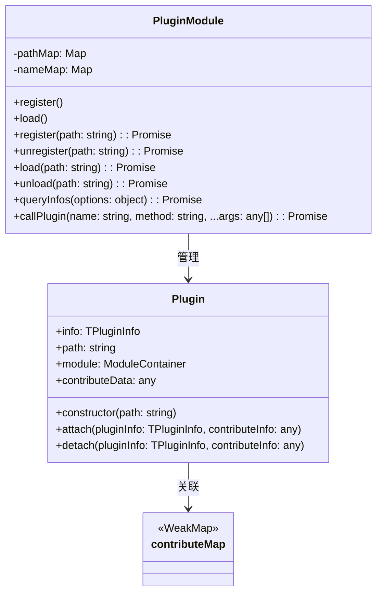
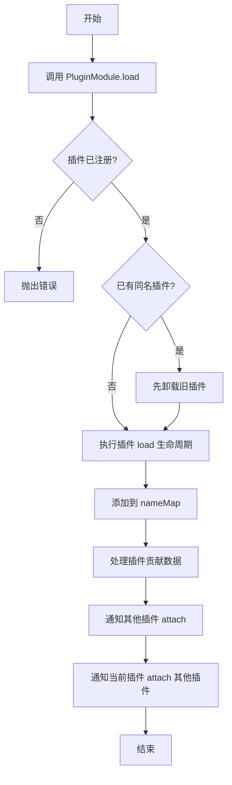
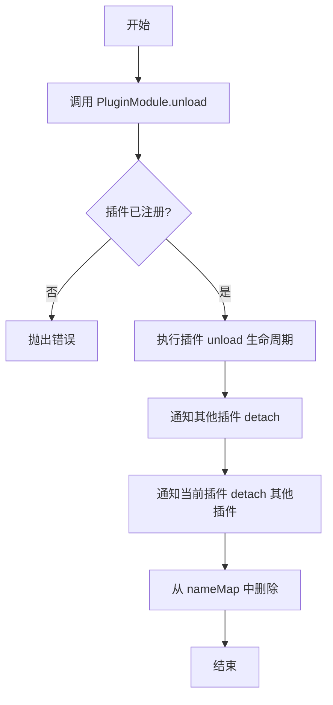

# Plugin 插件设计文档

## 文件信息
- **源文件路径**: `app/source/framework/plugin/`
- **模块名/类名**: `Plugin`
- **功能**: 插件管理模块，负责插件的注册、启动、关闭、生命周期管理和插件间通信

## 模块/类结构图



## 流程图

### 插件启动流程图



### 插件关闭流程图



## 数据结构

### TPluginInfo

```typescript
type TPluginInfo = {
    name: string;
    path: string;
    json: TPluginJSON;
}
```

**说明**: 插件信息结构，包含插件名称、路径和 package.json 配置

## 主要方法

### Plugin.constructor

**功能**: 初始化 Plugin 实例，加载插件配置和入口文件

**参数**:
- `path`: 插件在磁盘上的绝对路径地址

**流程**:
1. 读取插件目录下的 package.json 文件
2. 解析 JSON 内容
3. 根据 main 字段加载插件入口文件
4. 创建 ModuleContainer 实例
5. 记录插件信息

### Plugin.attach

**功能**: 处理插件间的 attach 事件，当其他插件加载时调用

**参数**:
- `pluginInfo`: 加载的插件信息
- `contributeInfo`: 插件贡献的数据

### Plugin.detach

**功能**: 处理插件间的 detach 事件，当其他插件卸载时调用

**参数**:
- `pluginInfo`: 卸载的插件信息
- `contributeInfo`: 插件贡献的数据

### PluginModule.register

**功能**: 注册一个插件

**参数**:
- `path`: 插件在磁盘上的绝对路径地址

**返回值**: `Promise&lt;TPluginInfo&gt;` - 插件信息

**流程**:
1. 创建 Plugin 实例
2. 执行插件 register 生命周期
3. 将插件添加到 pathMap 中

### PluginModule.unregister

**功能**: 反注册一个插件

**参数**:
- `path`: 插件在磁盘上的绝对路径地址

**返回值**: `Promise&lt;TPluginInfo&gt;` - 插件信息

**流程**:
1. 从 pathMap 获取插件
2. 执行插件 unregister 生命周期
3. 从 pathMap 中删除插件

### PluginModule.load

**功能**: 启动一个插件

**参数**:
- `path`: 插件在磁盘上的绝对路径地址

**返回值**: `Promise&lt;TPluginInfo&gt;` - 插件信息

**流程**:
1. 从 pathMap 获取插件
2. 如果已有同名插件，先卸载旧插件
3. 执行插件 load 生命周期
4. 将插件添加到 nameMap 中
5. 处理插件贡献数据，通知相关插件 attach

### PluginModule.unload

**功能**: 关闭一个插件

**参数**:
- `path`: 插件在磁盘上的绝对路径地址

**返回值**: `Promise&lt;TPluginInfo&gt;` - 插件信息

**流程**:
1. 从 pathMap 获取插件
2. 执行插件 unload 生命周期
3. 通知相关插件 detach
4. 从 nameMap 中删除插件

### PluginModule.queryInfos

**功能**: 查询注册的插件信息列表

**参数**:
- `options`: 查询选项
  - `name?: string`: 插件名称

**返回值**: `Promise&lt;TPluginInfo[]&gt;` - 插件信息数组

### PluginModule.callPlugin

**功能**: 调用插件上的方法

**参数**:
- `name`: 插件名称
- `method`: 方法名
- `...args`: 方法参数

**返回值**: `Promise&lt;any&gt;` - 方法返回值

## 依赖关系

- 依赖: `@itharbors/module` - 模块生成工具
- 依赖: `../service/electron` - Electron 服务抽象
- 依赖: `fs/path` - 文件系统和路径处理

## 使用示例

```typescript
import { instance as Plugin } from '@framework/plugin';

// 注册插件
await Plugin.execture('register', '/path/to/plugin');

// 启动插件
await Plugin.execture('load', '/path/to/plugin');

// 调用插件方法
const result = await Plugin.execture('callPlugin', 'plugin-name', 'method-name', arg1, arg2);

// 查询插件信息
const infos = await Plugin.execture('queryInfos', { name: 'plugin-name' });

// 关闭插件
await Plugin.execture('unload', '/path/to/plugin');

// 反注册插件
await Plugin.execture('unregister', '/path/to/plugin');
```

## 注意事项

1. 插件必须包含 package.json 文件，且必须包含 main 字段
2. 同一时间只能有一个同名插件处于加载状态
3. 插件通过 plugin:// 协议可以访问自身目录下的静态资源
4. 插件间通过 contribute 机制进行通信和数据共享
5. 插件生命周期顺序：register → load → unload → unregister
