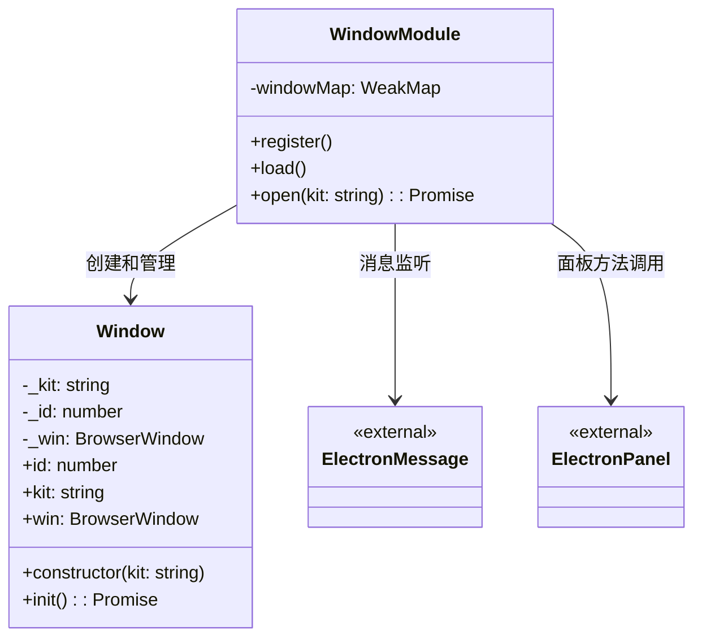
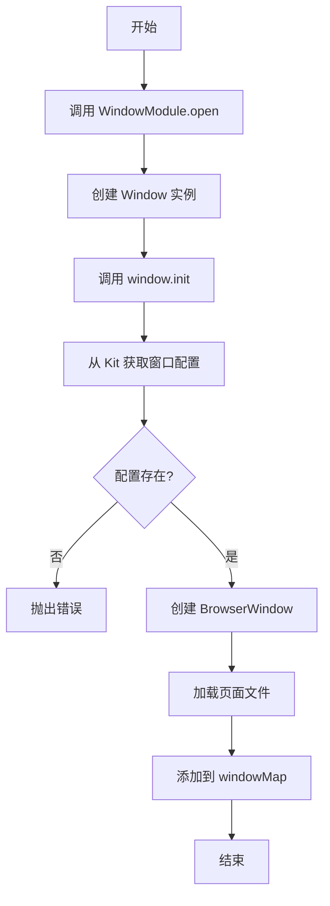

# Window 窗口设计文档

## 文件信息
- **源文件路径**: `app/source/framework/window/`
- **模块名/类名**: `Window`
- **功能**: 窗口管理模块，负责创建和管理应用窗口，处理窗口消息和布局查询

## 模块/类结构图



## 流程图

### 窗口打开流程图



## 主要方法

### Window.constructor

**功能**: 初始化 Window 实例

**参数**:
- `kit`: 套件名称

### Window.init

**功能**: 初始化窗口，创建 BrowserWindow 实例

**流程**:
1. 从 Kit 模块获取窗口配置信息
2. 创建 BrowserWindow 实例，设置窗口大小和 webPreferences
3. 加载指定的页面文件

### WindowModule.open

**功能**: 打开一个窗口

**参数**:
- `kit?: string`: 套件名称，默认为 'default'

**流程**:
1. 创建 Window 实例
2. 调用 window.init() 初始化窗口
3. 将窗口添加到 windowMap 中，建立 WebContents 与 Window 的映射关系

## 消息处理

### plugin:message 消息

**功能**: 处理插件间消息调用

**参数**:
- `plugin`: 插件名称
- `message`: 消息名称
- `...args`: 消息参数

**流程**:
1. 查询消息注册信息
2. 遍历消息的方法列表
3. 如果方法绑定到面板，调用面板方法
4. 否则直接调用插件方法

### window:query-layout 消息

**功能**: 查询窗口的布局配置

**参数**:
- `event`: 事件对象
- `name`: 布局名称

**返回值**: 布局文件路径

**流程**:
1. 从 windowMap 获取对应的 Window 实例
2. 从 Kit 模块获取布局配置

## 依赖关系

- 依赖: `../kit` - 套件模块，用于获取窗口和布局配置
- 依赖: `../plugin` - 插件模块，用于调用插件方法和查询消息
- 依赖: `../service/electron` - Electron 服务抽象，提供窗口创建和管理
- 依赖: `@itharbors/electron-message/browser` - 消息监听
- 依赖: `@itharbors/electron-panel/browser` - 面板方法调用

## 使用示例

```typescript
import { instance as Window } from '@framework/window';

// 打开默认套件窗口
await Window.execture('open');

// 打开指定套件窗口
await Window.execture('open', 'my-kit');
```

## 注意事项

1. 窗口创建依赖 Kit 模块的配置信息
2. 窗口使用 preload 脚本进行安全隔离
3. windowMap 使用 WeakMap 避免内存泄漏
4. 窗口消息通过 electron-message 进行传递
5. 面板方法通过 electron-panel 进行调用
