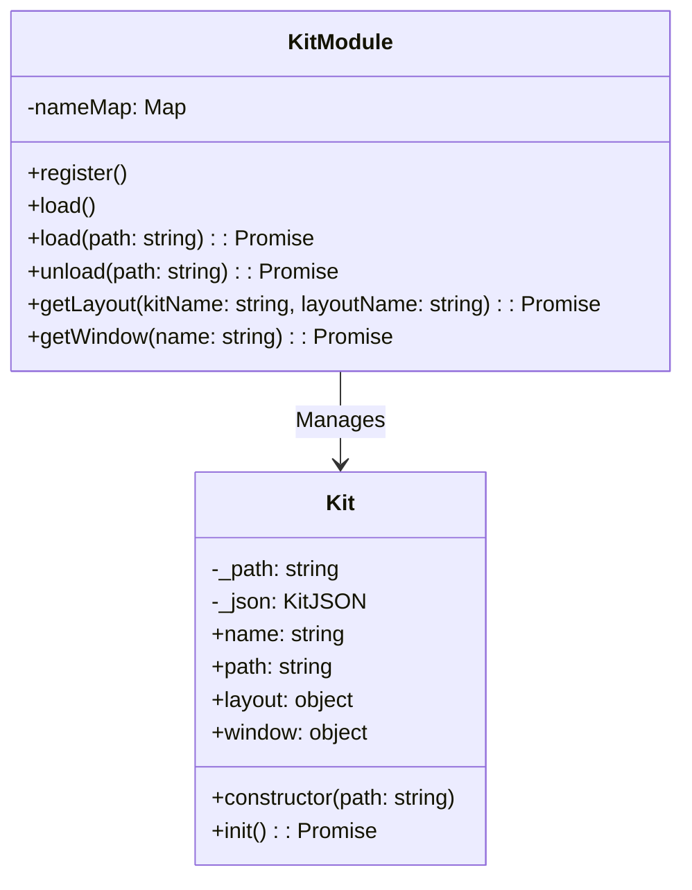
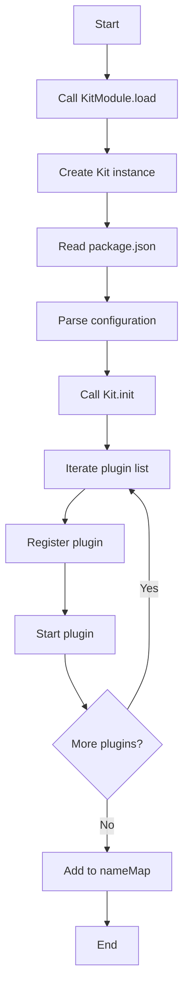

# Kit Design Document

## File Information
- **Source File Path**: `app/source/framework/kit/`
- **Module/Class Name**: `Kit`
- **Function**: A kit is a plugin package used to batch start and close functionally related plugins

## Module/Class Structure Diagram



## Data Structures

### KitJSON

```typescript
type KitJSON = {
    name: string;
    version: string;
    harbors: {
        window: {
            file: string;
            width: number;
            height: number;
        };
        layout: {
            [key: string]: string;
        };
        plugin?: string[];
    };
}
```

**Description**: Kit configuration file structure, defining basic kit information, window configuration, layout configuration, and associated plugin list

## Main Methods

### Kit.constructor

**Function**: Initialize Kit instance, read and parse the kit's package.json configuration file

**Parameters**:
- `path`: Absolute path to the kit on disk

**Process**:
1. Read the package.json file in the kit directory
2. Parse JSON content into a KitJSON object
3. Complete default configuration information
4. Convert relative paths to absolute paths

### Kit.init

**Function**: Initialize the kit, start all plugins associated with the kit

**Process**:
1. Iterate through the plugin list in the kit configuration
2. Execute register operation for each plugin
3. Execute load operation for each plugin

### KitModule.load

**Function**: Load a kit

**Parameters**:
- `path`: Absolute path to the kit on disk

**Process**:
1. Create Kit instance
2. Call kit.init() to initialize the kit
3. Add the kit to nameMap
4. Update the current kit name

### KitModule.unload

**Function**: Unload a kit

**Parameters**:
- `path`: Absolute path to the kit on disk

**Process**:
1. Iterate through nameMap to find the matching kit
2. Remove the kit from nameMap

### KitModule.getLayout

**Function**: Get the layout configuration of the kit

**Parameters**:
- `kitName?: string`: Kit name, default is 'default'
- `layoutName?: string`: Layout name, default is 'default'

**Return Value**: `string` - Absolute path to the layout file

### KitModule.getWindow

**Function**: Get the window configuration of the kit

**Parameters**:
- `name?: string`: Kit name, default is 'default'

**Return Value**: `object` - Window configuration object

## Flowchart

### Kit Loading Flowchart



## Dependencies

- Dependency: `../plugin` - Plugin module, used to manage plugin registration and loading
- Dependency: `@itharbors/module` - Module generation tool

## Usage Example

```typescript
import { instance as Kit } from '@framework/kit';

// Load kit
await Kit.execute('load', '/path/to/kit');

// Get layout configuration
const layoutPath = await Kit.execute('getLayout', 'default', 'default');

// Get window configuration
const windowConfig = await Kit.execute('getWindow', 'default');

// Unload kit
await Kit.execute('unload', '/path/to/kit');
```

## Notes

1. The kit must contain a package.json file with harbors configuration
2. Paths in kit configuration will be automatically converted to absolute paths
3. The kit will batch manage the lifecycle of associated plugins
4. Only one kit with the same name can be active at the same time
