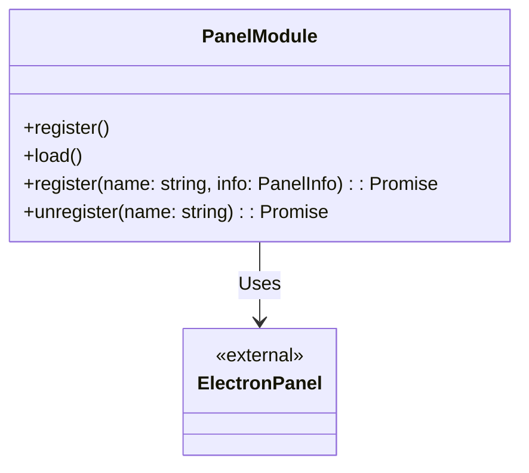

# Panel Design Document

## File Information
- **Source File Path**: `app/source/framework/panel/`
- **Module/Class Name**: `Panel`
- **Function**: Provides panel registration and unregistration functionality, a wrapper module for electron-panel

## Module/Class Structure Diagram



## Main Methods

### PanelModule.register

**Function**: Register a panel

**Parameters**:
- `name`: Panel name
- `info`: Panel configuration information, type of PanelInfo

**Process**:
1. Call the register method from @itharbors/electron-panel/browser
2. Complete panel registration

### PanelModule.unregister

**Function**: Unregister a panel

**Parameters**:
- `name`: Panel name

**Process**:
1. Call the unregister method from @itharbors/electron-panel/browser
2. Complete panel unregistration

## Dependencies

- Dependency: `@itharbors/electron-panel/browser` - Provides core panel registration and unregistration functionality
- Dependency: `@itharbors/module` - Module generation tool

## Usage Example

```typescript
import { instance as Panel } from '@framework/panel';

// Register panel
await Panel.execute('register', 'my-panel', {
    title: 'My Panel',
    width: 400,
    height: 300,
    // Other configurations
});

// Unregister panel
await Panel.execute('unregister', 'my-panel');
```

## Notes

1. This module is a lightweight wrapper around electron-panel
2. For specific panel configuration parameters, please refer to the @itharbors/electron-panel documentation
3. Panel names should be unique
