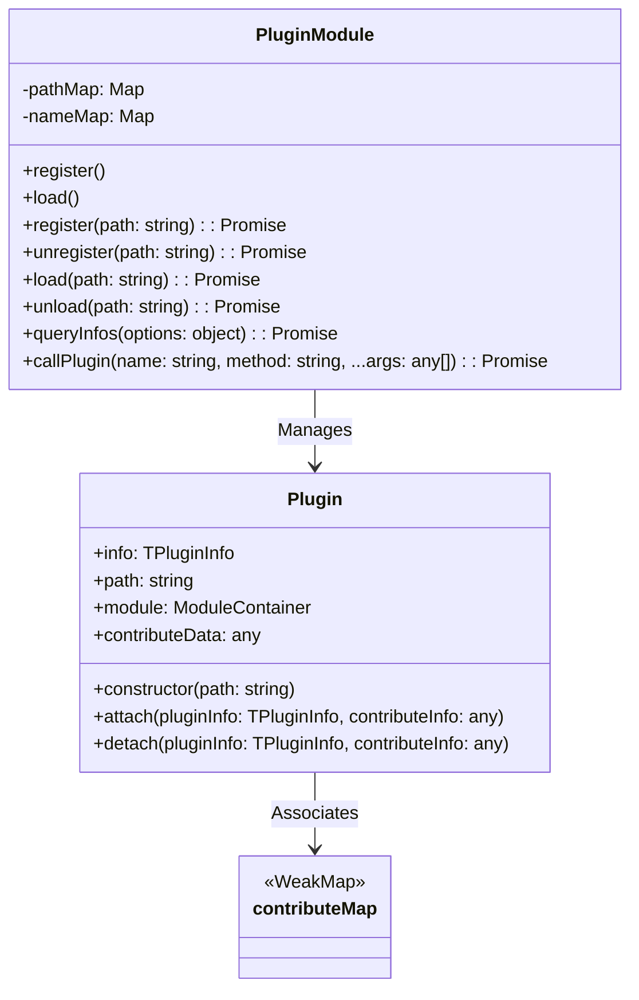
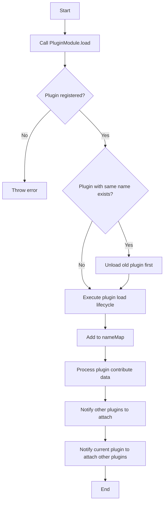
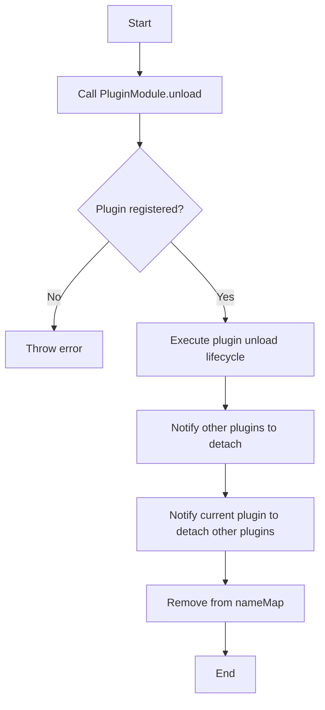

# Plugin Design Document

## File Information
- **Source File Path**: `app/source/framework/plugin/`
- **Module/Class Name**: `Plugin`
- **Function**: Plugin management module, responsible for plugin registration, starting, closing, lifecycle management, and inter-plugin communication

## Module/Class Structure Diagram



## Flowchart

### Plugin Startup Flowchart



### Plugin Shutdown Flowchart



## Data Structures

### TPluginInfo

```typescript
type TPluginInfo = {
    name: string;
    path: string;
    json: TPluginJSON;
}
```

**Description**: Plugin information structure, containing plugin name, path, and package.json configuration

## Main Methods

### Plugin.constructor

**Function**: Initialize Plugin instance, load plugin configuration and entry file

**Parameters**:
- `path`: Absolute path to the plugin on disk

**Process**:
1. Read the package.json file in the plugin directory
2. Parse JSON content
3. Load plugin entry file based on the main field
4. Create ModuleContainer instance
5. Record plugin information

### Plugin.attach

**Function**: Handle attach events between plugins, called when other plugins are loaded

**Parameters**:
- `pluginInfo`: Loaded plugin information
- `contributeInfo`: Data contributed by the plugin

### Plugin.detach

**Function**: Handle detach events between plugins, called when other plugins are unloaded

**Parameters**:
- `pluginInfo`: Unloaded plugin information
- `contributeInfo`: Data contributed by the plugin

### PluginModule.register

**Function**: Register a plugin

**Parameters**:
- `path`: Absolute path to the plugin on disk

**Return Value**: `Promise<TPluginInfo>` - Plugin information

**Process**:
1. Create Plugin instance
2. Execute plugin register lifecycle
3. Add plugin to pathMap

### PluginModule.unregister

**Function**: Unregister a plugin

**Parameters**:
- `path`: Absolute path to the plugin on disk

**Return Value**: `Promise<TPluginInfo>` - Plugin information

**Process**:
1. Get plugin from pathMap
2. Execute plugin unregister lifecycle
3. Remove plugin from pathMap

### PluginModule.load

**Function**: Start a plugin

**Parameters**:
- `path`: Absolute path to the plugin on disk

**Return Value**: `Promise<TPluginInfo>` - Plugin information

**Process**:
1. Get plugin from pathMap
2. If a plugin with the same name exists, unload the old plugin first
3. Execute plugin load lifecycle
4. Add plugin to nameMap
5. Process plugin contribute data, notify related plugins to attach

### PluginModule.unload

**Function**: Close a plugin

**Parameters**:
- `path`: Absolute path to the plugin on disk

**Return Value**: `Promise<TPluginInfo>` - Plugin information

**Process**:
1. Get plugin from pathMap
2. Execute plugin unload lifecycle
3. Notify related plugins to detach
4. Remove plugin from nameMap

### PluginModule.queryInfos

**Function**: Query registered plugin information list

**Parameters**:
- `options`: Query options
  - `name?: string`: Plugin name

**Return Value**: `Promise<TPluginInfo[]>` - Plugin information array

### PluginModule.callPlugin

**Function**: Call a method on a plugin

**Parameters**:
- `name`: Plugin name
- `method`: Method name
- `...args`: Method arguments

**Return Value**: `Promise<any>` - Method return value

## Dependencies

- Dependency: `@itharbors/module` - Module generation tool
- Dependency: `../service/electron` - Electron service abstraction
- Dependency: `fs/path` - File system and path handling

## Usage Example

```typescript
import { instance as Plugin } from '@framework/plugin';

// Register plugin
await Plugin.execute('register', '/path/to/plugin');

// Start plugin
await Plugin.execute('load', '/path/to/plugin');

// Call plugin method
const result = await Plugin.execute('callPlugin', 'plugin-name', 'method-name', arg1, arg2);

// Query plugin information
const infos = await Plugin.execute('queryInfos', { name: 'plugin-name' });

// Close plugin
await Plugin.execute('unload', '/path/to/plugin');

// Unregister plugin
await Plugin.execute('unregister', '/path/to/plugin');
```

## Notes

1. The plugin must contain a package.json file with a main field
2. Only one plugin with the same name can be loaded at the same time
3. Plugins can access static resources in their own directory via the plugin:// protocol
4. Plugins communicate and share data through the contribute mechanism
5. Plugin lifecycle order: register → load → unload → unregister
