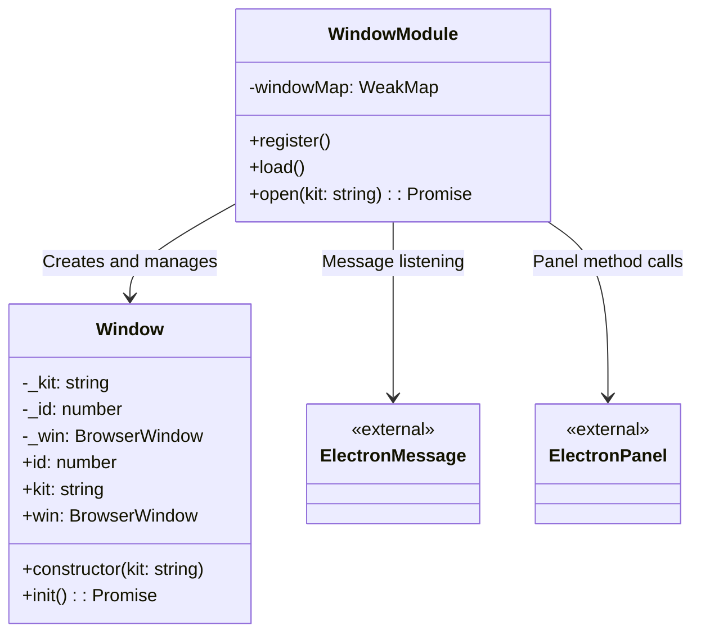
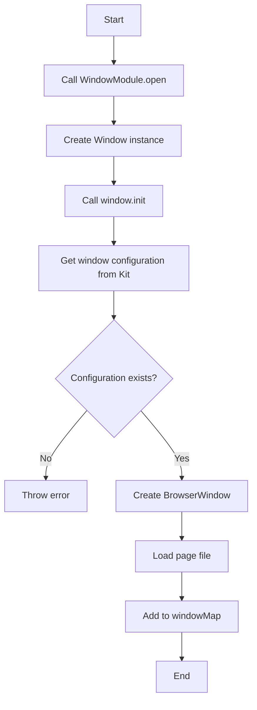

# Window Design Document

## File Information
- **Source File Path**: `app/source/framework/window/`
- **Module/Class Name**: `Window`
- **Function**: Window management module, responsible for creating and managing application windows, handling window messages, and querying layouts

## Module/Class Structure Diagram



## Flowchart

### Window Opening Flowchart



## Main Methods

### Window.constructor

**Function**: Initialize Window instance

**Parameters**:
- `kit`: Kit name

### Window.init

**Function**: Initialize window, create BrowserWindow instance

**Process**:
1. Get window configuration information from Kit module
2. Create BrowserWindow instance, set window size and webPreferences
3. Load the specified page file

### WindowModule.open

**Function**: Open a window

**Parameters**:
- `kit?: string`: Kit name, default is 'default'

**Process**:
1. Create Window instance
2. Call window.init() to initialize the window
3. Add the window to windowMap, establish mapping between WebContents and Window

## Message Handling

### plugin:message Message

**Function**: Handle inter-plugin message calls

**Parameters**:
- `plugin`: Plugin name
- `message`: Message name
- `...args`: Message parameters

**Process**:
1. Query message registration information
2. Iterate through the message's method list
3. If the method is bound to a panel, call the panel method
4. Otherwise, directly call the plugin method

### window:query-layout Message

**Function**: Query window layout configuration

**Parameters**:
- `event`: Event object
- `name`: Layout name

**Return Value**: Layout file path

**Process**:
1. Get the corresponding Window instance from windowMap
2. Get layout configuration from Kit module

## Dependencies

- Dependency: `../kit` - Kit module, used to get window and layout configurations
- Dependency: `../plugin` - Plugin module, used to call plugin methods and query messages
- Dependency: `../service/electron` - Electron service abstraction, provides window creation and management
- Dependency: `@itharbors/electron-message/browser` - Message listening
- Dependency: `@itharbors/electron-panel/browser` - Panel method calls

## Usage Example

```typescript
import { instance as Window } from '@framework/window';

// Open default kit window
await Window.execute('open');

// Open specified kit window
await Window.execute('open', 'my-kit');
```

## Notes

1. Window creation depends on configuration information from the Kit module
2. Windows use preload scripts for security isolation
3. windowMap uses WeakMap to avoid memory leaks
4. Window messages are passed through electron-message
5. Panel methods are called through electron-panel
