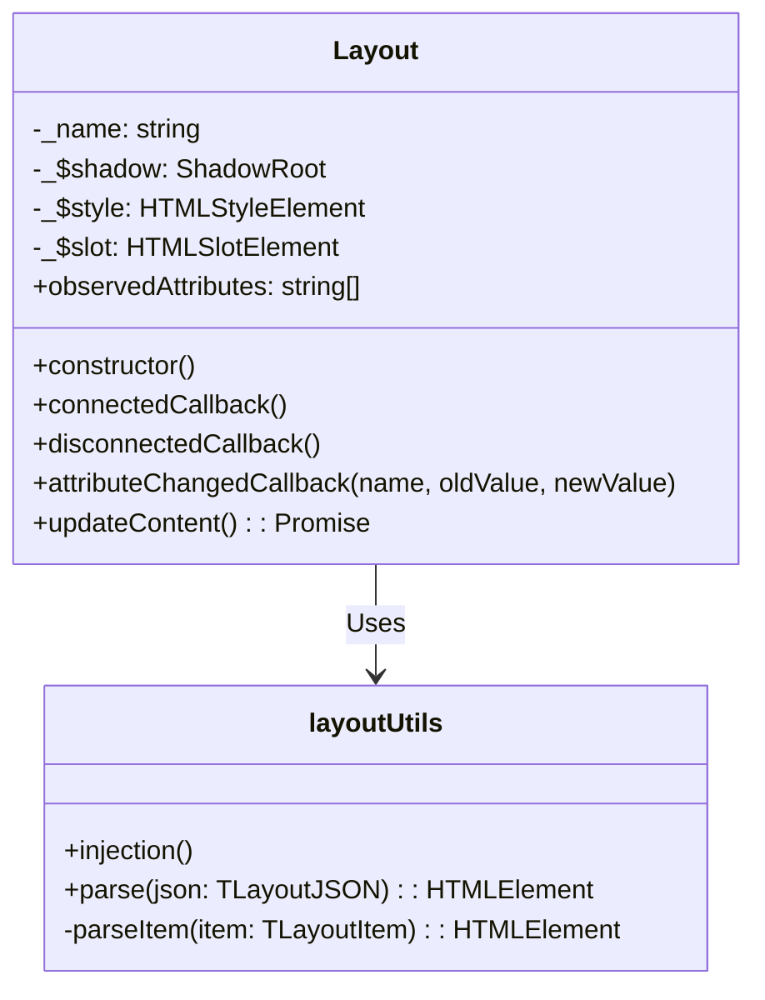
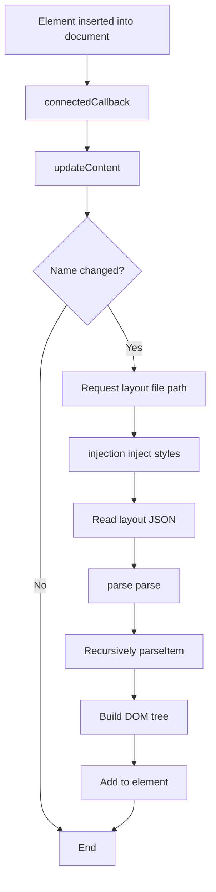

# Layout Design Document

## File Information
- **Source File Path**: `app/source/module/layout/`
- **Module/Class Name**: `Layout`
- **Function**: Layout element implemented based on WebComponent, used for layout restoration, adjustment, and serialization

## Module/Class Structure Diagram



## Data Structures

### TLayoutJSON

```typescript
type TLayoutJSON = {
    ver: string;
    layout: TLayoutItem
};
```

**Description**: Root structure of layout configuration, containing version number and layout items

### TLayoutItem

```typescript
type TLayoutItem = {
    dir: 'horizontal' | 'vertical' | 'none';
    type: 'fixed' | 'variable';
    panel?: string;
    size?: number;
    children?: TLayoutItem[];
};
```

**Description**: Layout item structure, defining layout direction, type, associated panel, and children

## Main Methods

### Layout.constructor

**Function**: Initialize Layout custom element

**Process**:
1. Call parent HTMLElement constructor
2. Create Shadow DOM
3. Create style element and set default styles
4. Create slot element
5. Add style and slot to Shadow DOM

### Layout.connectedCallback

**Function**: Called when the element is inserted into the document

**Process**:
1. Call updateContent() to update content

### Layout.disconnectedCallback

**Function**: Called when the element is removed from the document

**Process**:
1. Get the name attribute of the element
2. Remove the element from the map

### Layout.attributeChangedCallback

**Function**: Called when observed attributes change

**Parameters**:
- `name`: Attribute name
- `oldValue`: Old value
- `newValue`: New value

**Process**:
1. If oldValue is not equal to newValue, call updateContent() to update content

### Layout.updateContent

**Function**: Update element content, load and render layout

**Process**:
1. Get name attribute and set it in the map
2. If name has not changed, return directly
3. Update _name
4. Request main process for layout file path
5. Inject layout styles
6. Read and parse layout JSON file
7. Add parsed DOM element to current element

### injection

**Function**: Inject CSS styles required for layout

**Process**:
1. Check if style element already exists
2. If not, create style element and set id
3. Add layout-related CSS styles
4. Add style element to document.head

### parse

**Function**: Parse layout JSON configuration into DOM element

**Parameters**:
- `json`: Layout JSON configuration

**Return Value**: `HTMLElement` - Parsed DOM element

**Process**:
1. Call parseItem to parse the root layout item

### parseItem

**Function**: Recursively parse a single layout item

**Parameters**:
- `item`: Layout item configuration

**Return Value**: `HTMLElement` - Parsed DOM element

**Process**:
1. Create section element and add layout class
2. Set dir and type attributes
3. If there are children, recursively parse and add
4. If fixed size, set width/height based on parent layout direction
5. If there is a panel, create ui-panel element and set name attribute

## Flowchart

### Layout Loading Flowchart



## Dependencies

- Dependency: `@itharbors/electron-message/renderer` - Used for communication with main process
- Dependency: `electron/ipcRenderer` - Electron IPC renderer process module
- Dependency: `fs` - File system module

## Usage Example

```html
<!-- Using ui-layout element in HTML -->
<ui-layout name="default"></ui-layout>
```

```typescript
import { parse, injection } from '@module/layout/layout';

// Inject styles
injection();

// Parse layout configuration
const layoutConfig = {
    ver: '1.0',
    layout: {
        dir: 'horizontal',
        type: 'variable',
        children: [
            {
                dir: 'none',
                type: 'fixed',
                size: 300,
                panel: 'left-panel'
            },
            {
                dir: 'none',
                type: 'variable',
                panel: 'main-panel'
            }
        ]
    }
};

const $layout = parse(layoutConfig);
document.body.appendChild($layout);
```

## Notes

1. Layout is a custom WebComponent with tag name `ui-layout`
2. Uses Shadow DOM for style isolation
3. Layout configuration is stored and loaded through JSON files
4. Supports horizontal, vertical, and no-direction layouts
5. Supports fixed size and variable size layout items
6. Layout items can nest children or associate with panels
