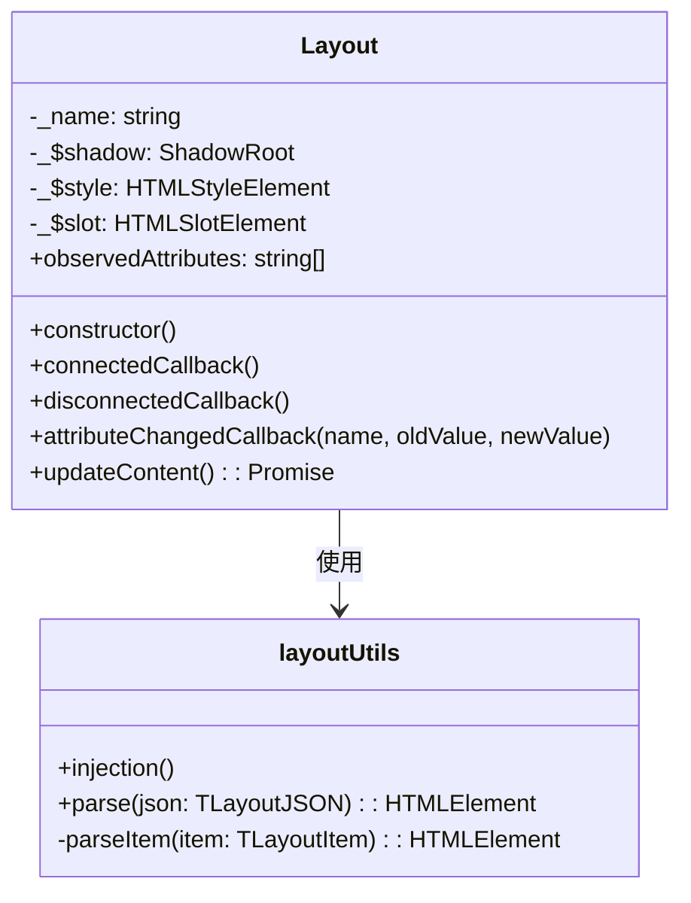
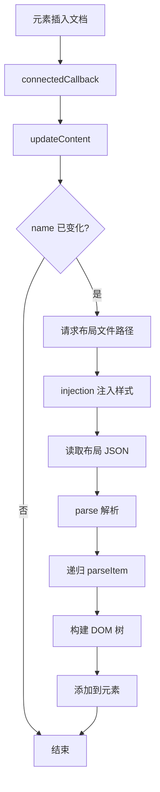

# Layout 布局设计文档

## 文件信息
- **源文件路径**: `app/source/module/layout/`
- **模块名/类名**: `Layout`
- **功能**: 基于 WebComponent 实现的布局元素，用于布局的还原、调整和序列化

## 模块/类结构图



## 数据结构

### TLayoutJSON

```typescript
type TLayoutJSON = {
    ver: string;
    layout: TLayoutItem
};
```

**说明**: 布局配置的根结构，包含版本号和布局项

### TLayoutItem

```typescript
type TLayoutItem = {
    dir: 'horizontal' | 'vertical' | 'none';
    type: 'fixed' | 'variable';
    panel?: string;
    size?: number;
    children?: TLayoutItem[];
};
```

**说明**: 布局项结构，定义了布局的方向、类型、关联面板和子项

## 主要方法

### Layout.constructor

**功能**: 初始化 Layout 自定义元素

**流程**:
1. 调用父类 HTMLElement 构造函数
2. 创建 Shadow DOM
3. 创建 style 元素并设置默认样式
4. 创建 slot 元素
5. 将 style 和 slot 添加到 Shadow DOM 中

### Layout.connectedCallback

**功能**: 当元素被插入到文档中时调用

**流程**:
1. 调用 updateContent() 更新内容

### Layout.disconnectedCallback

**功能**: 当元素从文档中移除时调用

**流程**:
1. 获取元素的 name 属性
2. 从 map 中删除该元素

### Layout.attributeChangedCallback

**功能**: 当观察的属性发生变化时调用

**参数**:
- `name`: 属性名
- `oldValue`: 旧值
- `newValue`: 新值

**流程**:
1. 如果旧值不等于新值，调用 updateContent() 更新内容

### Layout.updateContent

**功能**: 更新元素内容，加载并渲染布局

**流程**:
1. 获取 name 属性并设置到 map 中
2. 如果 name 未变化，直接返回
3. 更新 _name
4. 请求主进程获取布局文件路径
5. 注入布局样式
6. 读取并解析布局 JSON 文件
7. 将解析后的 DOM 元素添加到当前元素

### injection

**功能**: 注入布局所需的 CSS 样式

**流程**:
1. 检查是否已存在样式元素
2. 如果不存在，创建 style 元素并设置 id
3. 添加布局相关的 CSS 样式
4. 将 style 元素添加到 document.head

### parse

**功能**: 解析布局 JSON 配置为 DOM 元素

**参数**:
- `json`: 布局 JSON 配置

**返回值**: `HTMLElement` - 解析后的 DOM 元素

**流程**:
1. 调用 parseItem 解析根布局项

### parseItem

**功能**: 递归解析单个布局项

**参数**:
- `item`: 布局项配置

**返回值**: `HTMLElement` - 解析后的 DOM 元素

**流程**:
1. 创建 section 元素并添加 layout 类
2. 设置 dir 和 type 属性
3. 如果有子项，递归解析并添加
4. 如果是固定大小，根据父布局方向设置宽/高
5. 如果有 panel，创建 ui-panel 元素并设置 name 属性

## 流程图

### 布局加载流程图



## 依赖关系

- 依赖: `@itharbors/electron-message/renderer` - 用于与主进程通信
- 依赖: `electron/ipcRenderer` - Electron IPC 渲染进程模块
- 依赖: `fs` - 文件系统模块

## 使用示例

```html
<!-- 在 HTML 中使用 ui-layout 元素 -->
<ui-layout name="default"></ui-layout>
```

```typescript
import { parse, injection } from '@module/layout/layout';

// 注入样式
injection();

// 解析布局配置
const layoutConfig = {
    ver: '1.0',
    layout: {
        dir: 'horizontal',
        type: 'variable',
        children: [
            {
                dir: 'none',
                type: 'fixed',
                size: 300,
                panel: 'left-panel'
            },
            {
                dir: 'none',
                type: 'variable',
                panel: 'main-panel'
            }
        ]
    }
};

const $layout = parse(layoutConfig);
document.body.appendChild($layout);
```

## 注意事项

1. Layout 是自定义 WebComponent，标签名为 `ui-layout`
2. 使用 Shadow DOM 隔离样式
3. 布局配置通过 JSON 文件存储和加载
4. 支持水平、垂直和无方向布局
5. 支持固定大小和可变大小的布局项
6. 布局项可以嵌套子项或关联面板
