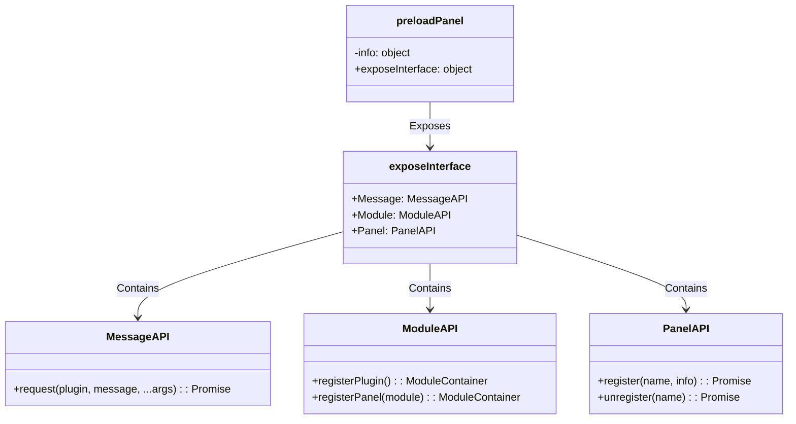

# Preload-Panel Design Document

## File Information
- **Source File Path**: `app/source/module/preload-panel/`
- **Module/Class Name**: `preload-panel`
- **Function**: Panel process preload script, exposing secure API interfaces to the renderer process

## Module/Class Structure Diagram



## Main Functions

### Initialization

**Function**: Listen to init event, initialize panel information

**Parameters**:
- `event`: IPC event object
- `plugin`: Plugin name
- `panel`: Panel name

**Process**:
1. Listen to ipcRenderer's init event
2. Save plugin name to info object

### Exposed API Interfaces

#### Message.request

**Function**: Send message request to main process and wait for response

**Parameters**:
- `plugin`: Target plugin name
- `message`: Message name
- `...args`: Message parameters

**Return Value**: `Promise<any>` - Message return result

**Process**:
1. Call @itharbors/electron-message/renderer's requestMessage
2. Send plugin:message message to main process

#### Module.registerPlugin

**Function**: Register plugin (not supported in panel process)

**Parameters**:
- `module`: Module configuration

**Return Value**: `ModuleContainer`

**Description**: Panel process cannot register plugins, calling will throw an error

#### Module.registerPanel

**Function**: Register panel module

**Parameters**:
- `module`: Panel module configuration

**Return Value**: `ModuleContainer`

**Process**:
1. Call @itharbors/electron-panel/panel's registerPanel

#### Panel.register

**Function**: Register panel (not supported in panel process)

**Parameters**:
- `name`: Panel name
- `info`: Panel information

**Return Value**: `Promise<void>`

**Description**: Panel process cannot register panels, calling will throw an error

#### Panel.unregister

**Function**: Unregister panel (not supported in panel process)

**Parameters**:
- `name`: Panel name

**Return Value**: `Promise<void>`

**Description**: Panel process cannot unregister panels, calling will throw an error

## Dependencies

- Dependency: `@itharbors/electron-message/renderer` - Used for sending messages to main process
- Dependency: `@itharbors/electron-panel/panel` - Used for registering panel modules
- Dependency: `electron/ipcRenderer` - Electron IPC renderer process module

## Usage Example

```typescript
// Using exposed API in panel process

// Send message
const result = await Editor.Message.request('plugin-name', 'message-name', arg1, arg2);

// Register panel module
const panelModule = Editor.Module.registerPanel({
    data() {
        return { /* Panel data */ };
    },
    method: { /* Panel methods */ }
});
```

## Notes

1. This module is a panel process preload script
2. Exposes API interfaces through global.Editor
3. Panel process cannot register plugins or panels
4. Can only communicate with main process through Message.request
5. Panel modules are registered through Module.registerPanel
