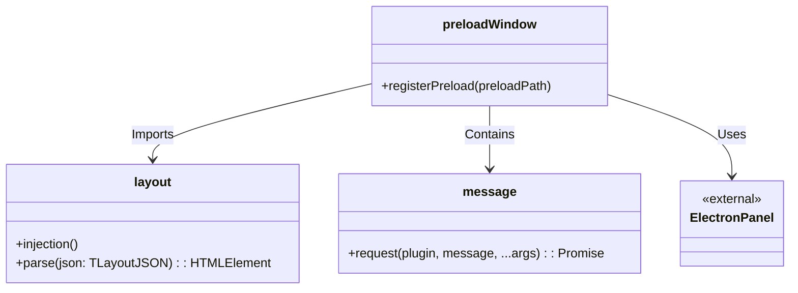
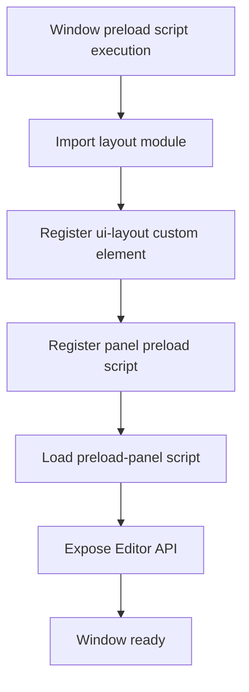

# Preload-Window Design Document

## File Information
- **Source File Path**: `app/source/module/preload-window/`
- **Module/Class Name**: `preload-window`
- **Function**: Window process preload script, registers panel preload script, imports layout module and message communication API

## Module/Class Structure Diagram



## Main Functions

### registerPreload

**Function**: Register panel preload script

**Parameters**:
- `preloadPath`: Absolute path to the panel preload script

**Process**:
1. Call @itharbors/electron-panel/renderer's registerPreload
2. Register preload-panel script path

### Import layout module

**Function**: Import and register layout custom element

**Description**:
- Import '../layout/index' module
- This module registers the ui-layout custom element
- Provides layout parsing and rendering functionality

### message.request

**Function**: Send message request to main process and wait for response

**Parameters**:
- `plugin`: Target plugin name
- `message`: Message name
- `...args`: Message parameters

**Return Value**: `Promise<any>` - Message return result

**Description**:
- Communication API, shields internal implementation
- Designed to be replaceable with any backend in the future (e.g., http + websocket)
- Does not provide listening interface to prevent misuse and leaks
- Listening is unified in framework-managed objects

## Flowchart

### Preload Initialization Flowchart



## Dependencies

- Dependency: `../layout/index` - Layout module, provides ui-layout custom element
- Dependency: `./message` - Message communication module
- Dependency: `@itharbors/electron-panel/renderer` - Used to register panel preload script
- Dependency: `@itharbors/electron-message/renderer` - Used for communication with main process

## Usage Example

```typescript
// This module is a window preload script, executes automatically, no manual calling

// Can directly use ui-layout element in window process
// <ui-layout name="default"></ui-layout>

// Can use message module in window process (if exposed)
// import { request } from '@module/preload-window/message';
// const result = await request('plugin-name', 'message-name', arg1, arg2);
```

## Notes

1. This module is a window process preload script
2. Automatically imports layout module and registers ui-layout element
3. Registers preload-panel script for panel process use
4. Message communication API is designed as an abstraction layer that can replace backends
5. Does not provide direct message listening interface to prevent misuse
