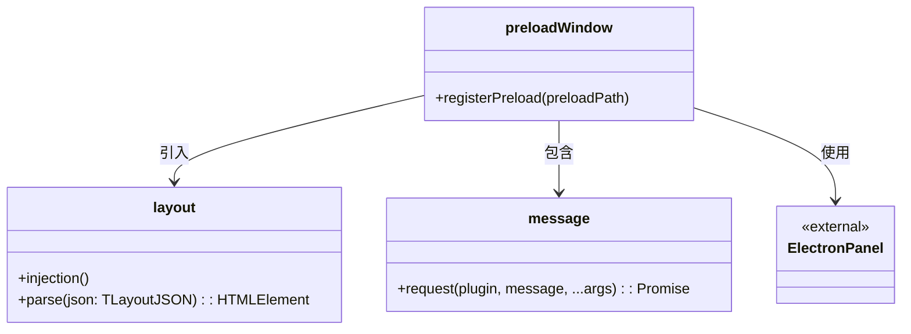
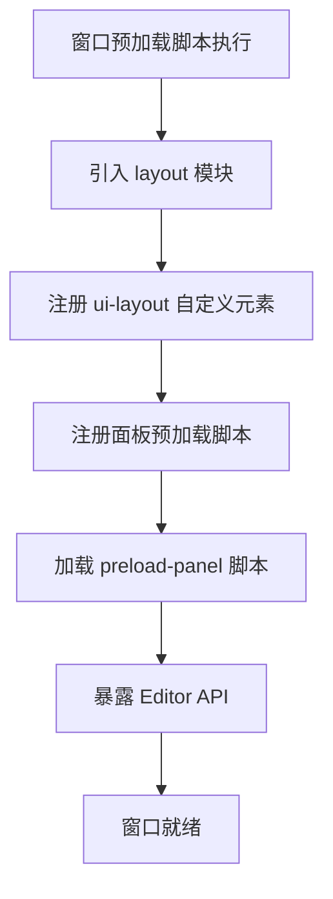

# Preload-Window 窗口预加载设计文档

## 文件信息
- **源文件路径**: `app/source/module/preload-window/`
- **模块名/类名**: `preload-window`
- **功能**: 窗口进程的预加载脚本，注册面板预加载脚本，引入布局模块和消息通讯 API

## 模块/类结构图



## 主要功能

### registerPreload

**功能**: 注册面板预加载脚本

**参数**:
- `preloadPath`: 面板预加载脚本的绝对路径

**流程**:
1. 调用 @itharbors/electron-panel/renderer 的 registerPreload
2. 注册 preload-panel 脚本路径

### 引入 layout 模块

**功能**: 引入并注册布局自定义元素

**说明**:
- 导入 '../layout/index' 模块
- 该模块会注册 ui-layout 自定义元素
- 提供布局的解析和渲染功能

### message.request

**功能**: 发送消息请求到主进程并等待回复

**参数**:
- `plugin`: 目标插件名称
- `message`: 消息名称
- `...args`: 消息参数

**返回值**: `Promise<any>` - 消息返回结果

**说明**:
- 通讯 API，对外屏蔽内部实现
- 目的是未来可以替换成任意的后端（如 http + websocket）
- 不提供监听接口，防止到处乱用导致泄漏
- 监听统一收口到受框架管理的对象上

## 流程图

### 预加载初始化流程图



## 依赖关系

- 依赖: `../layout/index` - 布局模块，提供 ui-layout 自定义元素
- 依赖: `./message` - 消息通讯模块
- 依赖: `@itharbors/electron-panel/renderer` - 用于注册面板预加载脚本
- 依赖: `@itharbors/electron-message/renderer` - 用于与主进程通信

## 使用示例

```typescript
// 该模块是窗口预加载脚本，自动执行，无需手动调用

// 窗口进程中可以直接使用 ui-layout 元素
// <ui-layout name="default"></ui-layout>

// 窗口进程中可以使用 message 模块（如果暴露）
// import { request } from '@module/preload-window/message';
// const result = await request('plugin-name', 'message-name', arg1, arg2);
```

## 注意事项

1. 该模块是窗口进程的预加载脚本
2. 自动引入 layout 模块并注册 ui-layout 元素
3. 注册 preload-panel 脚本供面板进程使用
4. 消息通讯 API 设计为可替换后端的抽象层
5. 不提供直接的消息监听接口，防止滥用
