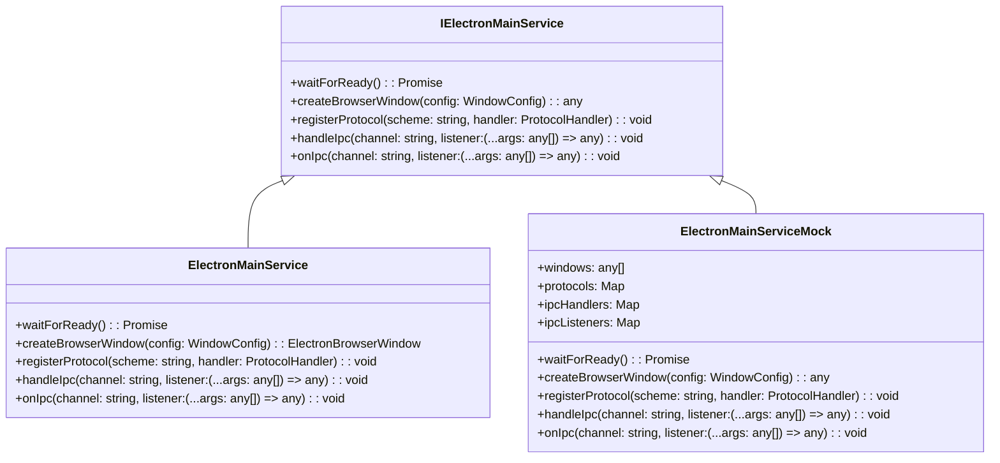
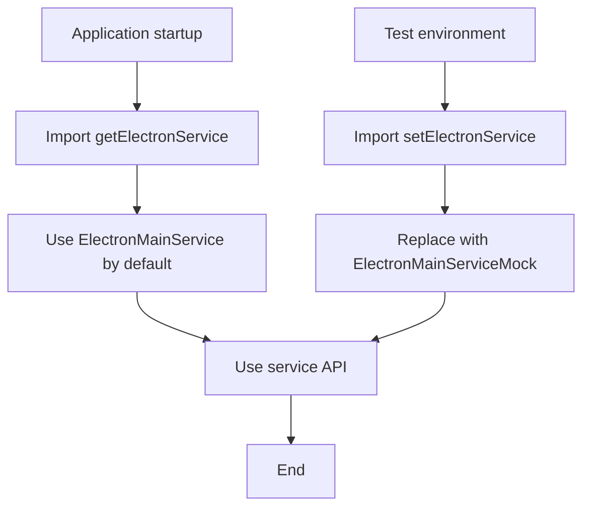

# Electron Service Design Document

## File Information
- **Source File Path**: `app/source/service/electron/`
- **Module/Class Name**: `IElectronMainService`
- **Function**: Electron service abstraction, providing unified Electron API access for the application, supporting production and test environments

## Module/Class Structure Diagram



## Flowchart

### Service Initialization Flow



## Data Structures

### WindowConfig

```typescript
interface WindowConfig {
  width: number;
  height: number;
  file: string;
  nodeIntegration?: boolean;
  contextIsolation?: boolean;
  webviewTag?: boolean;
  preload?: string;
}
```

**Description**: Window configuration interface, containing window size, loaded file path, and WebPreferences configuration

### ProtocolHandler

```typescript
type ProtocolHandler = (request: Request) => Promise<Response> | Response;
```

**Description**: Protocol handler function type, used to handle custom protocol requests

## Main Methods

### waitForReady

**Function**: Wait for Electron application to be ready

**Return Value**: `Promise<void>` - Resolves when the application is ready

**Implementation**:
- Real implementation: Listen to `app.ready` event
- Mock implementation: Directly return `Promise.resolve()`

### createBrowserWindow

**Function**: Create a browser window

**Parameters**:
- `config`: Window configuration object

**Return Value**: Window instance

**Implementation**:
- Real implementation: Create a real `BrowserWindow` instance
- Mock implementation: Create a mock window object with necessary methods

### registerProtocol

**Function**: Register a custom protocol

**Parameters**:
- `scheme`: Protocol name
- `handler`: Protocol handler function

**Implementation**:
- Real implementation: Call `protocol.handle` to register the protocol
- Mock implementation: Store the protocol handler function for testing

### handleIpc

**Function**: Register IPC handler (for `ipcMain.handle`)

**Parameters**:
- `channel`: Channel name
- `listener`: Handler function

**Implementation**:
- Real implementation: Call `ipcMain.handle`
- Mock implementation: Store the handler function for testing

### onIpc

**Function**: Register IPC listener (for `ipcMain.on`)

**Parameters**:
- `channel`: Channel name
- `listener`: Listener function

**Implementation**:
- Real implementation: Call `ipcMain.on`
- Mock implementation: Store the listener function for testing

## Dependencies

- Dependency: `electron` - Provides real Electron API
- Dependency: `../service/electron/electron` - Type definitions and interface

## Usage Example

### Production Environment Usage

```typescript
import { getElectronService } from '../service';

const electronService = getElectronService();

// Wait for application to be ready
await electronService.waitForReady();

// Create window
const win = electronService.createBrowserWindow({
  width: 800,
  height: 600,
  file: 'index.html',
  preload: './preload.js'
});

// Register protocol
electronService.registerProtocol('app', (request) => {
  // Handle protocol request
  return new Response('Hello from app protocol');
});

// Register IPC handler
electronService.handleIpc('get-app-version', () => {
  return '1.0.0';
});
```

### Test Environment Usage

```typescript
import { setElectronService, electronMainServiceMock } from '../service';

// Replace with Mock service
setElectronService(electronMainServiceMock);

// Now all Electron API calls will use Mock implementation
// Can check call status through electronMainServiceMock
console.log('Created windows:', electronMainServiceMock.windows.length);
console.log('Registered protocols:', Array.from(electronMainServiceMock.protocols.keys()));
```

## Notes

1. **Dependency Injection**: The service uses dependency injection pattern, making it easy to replace implementations for testing
2. **Type Safety**: Provides complete TypeScript type definitions
3. **Backward Compatibility**: The service interface design is consistent with Electron API, facilitating migration
4. **Test Friendly**: Mock implementation provides state tracking,便于 test assertions
5. **Extensibility**: Can easily replace with implementations from other desktop frameworks in the future (e.g., Tauri)
