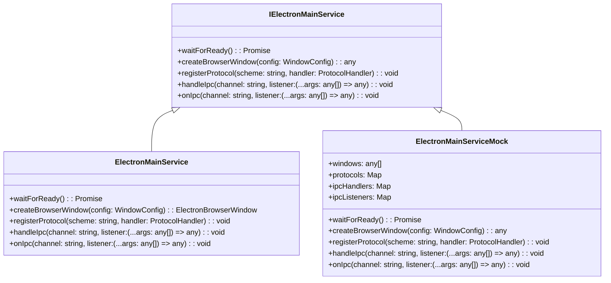
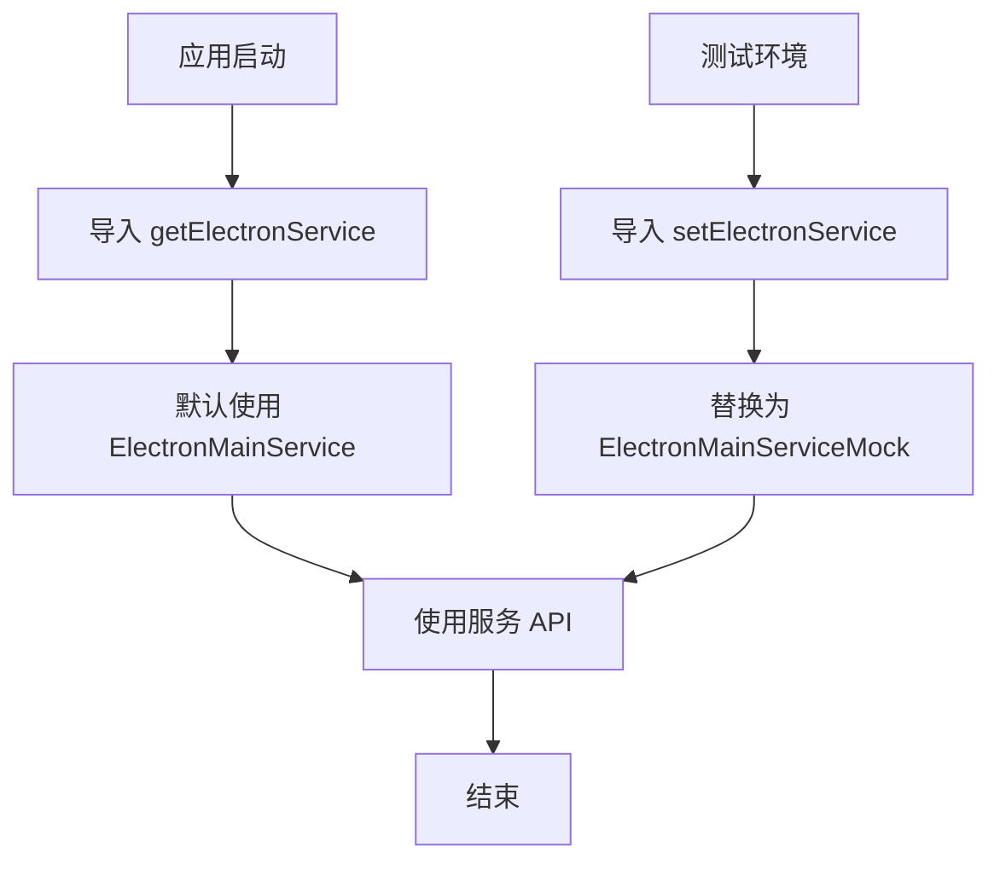

# Electron 服务设计文档

## 文件信息
- **源文件路径**: `app/source/service/electron/`
- **模块名/类名**: `IElectronMainService`
- **功能**: Electron 服务抽象，为应用提供统一的 Electron API 访问，支持生产和测试环境

## 模块/类结构图



## 流程图

### 服务初始化流程



## 数据结构

### WindowConfig

```typescript
interface WindowConfig {
  width: number;
  height: number;
  file: string;
  nodeIntegration?: boolean;
  contextIsolation?: boolean;
  webviewTag?: boolean;
  preload?: string;
}
```

**说明**: 窗口配置接口，包含窗口大小、加载文件路径和 WebPreferences 配置

### ProtocolHandler

```typescript
type ProtocolHandler = (request: Request) => Promise<Response> | Response;
```

**说明**: 协议处理函数类型，用于处理自定义协议请求

## 主要方法

### waitForReady

**功能**: 等待 Electron 应用就绪

**返回值**: `Promise<void>` - 应用就绪时解析

**实现**: 
- 真实实现: 监听 `app.ready` 事件
- Mock 实现: 直接返回 `Promise.resolve()`

### createBrowserWindow

**功能**: 创建浏览器窗口

**参数**:
- `config`: 窗口配置对象

**返回值**: 窗口实例

**实现**:
- 真实实现: 创建真实的 `BrowserWindow` 实例
- Mock 实现: 创建模拟的窗口对象，包含必要的方法

### registerProtocol

**功能**: 注册自定义协议

**参数**:
- `scheme`: 协议名称
- `handler`: 协议处理函数

**实现**:
- 真实实现: 调用 `protocol.handle` 注册协议
- Mock 实现: 存储协议处理函数，用于测试

### handleIpc

**功能**: 注册 IPC 处理函数（用于 `ipcMain.handle`）

**参数**:
- `channel`: 通道名称
- `listener`: 处理函数

**实现**:
- 真实实现: 调用 `ipcMain.handle`
- Mock 实现: 存储处理函数，用于测试

### onIpc

**功能**: 注册 IPC 监听器（用于 `ipcMain.on`）

**参数**:
- `channel`: 通道名称
- `listener`: 监听函数

**实现**:
- 真实实现: 调用 `ipcMain.on`
- Mock 实现: 存储监听函数，用于测试

## 依赖关系

- 依赖: `electron` - 提供真实的 Electron API
- 依赖: `../service/electron/electron` - 类型定义和接口

## 使用示例

### 生产环境使用

```typescript
import { getElectronService } from '../service';

const electronService = getElectronService();

// 等待应用就绪
await electronService.waitForReady();

// 创建窗口
const win = electronService.createBrowserWindow({
  width: 800,
  height: 600,
  file: 'index.html',
  preload: './preload.js'
});

// 注册协议
electronService.registerProtocol('app', (request) => {
  // 处理协议请求
  return new Response('Hello from app protocol');
});

// 注册 IPC 处理
electronService.handleIpc('get-app-version', () => {
  return '1.0.0';
});
```

### 测试环境使用

```typescript
import { setElectronService, electronMainServiceMock } from '../service';

// 替换为 Mock 服务
setElectronService(electronMainServiceMock);

// 现在所有 Electron API 调用都会使用 Mock 实现
// 可以通过 electronMainServiceMock 查看调用情况
console.log('Created windows:', electronMainServiceMock.windows.length);
console.log('Registered protocols:', Array.from(electronMainServiceMock.protocols.keys()));
```

## 注意事项

1. **依赖注入**: 服务使用依赖注入模式，便于测试时替换实现
2. **类型安全**: 提供了完整的 TypeScript 类型定义
3. **向后兼容**: 服务接口设计与 Electron API 保持一致，便于迁移
4. **测试友好**: Mock 实现提供了状态跟踪，便于测试断言
5. **可扩展性**: 未来可以轻松替换为其他桌面框架的实现（如 Tauri）
