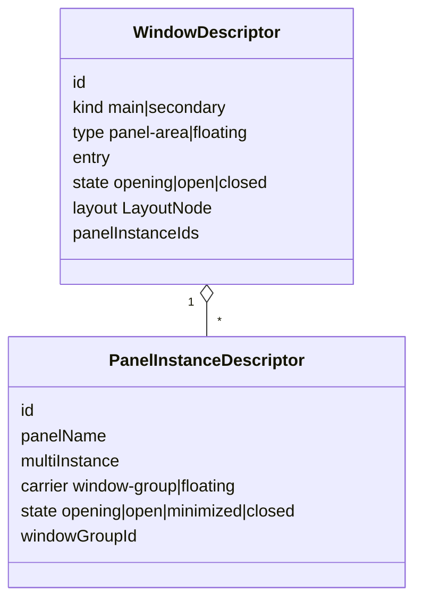

# 布局与窗口模型

ITHARBORS 把“窗口和 Panel 实例的生命周期”与“页面如何渲染布局树”分开：Server 的
WindowManager 持有权威快照，Client 将 `LayoutNode` 转换为可交互的组件模型。

## Server 状态模型



Window 描述承载区域，PanelInstance 描述一次具体打开行为。Panel definition 是插件注册的
类型信息，不等同于实例。

## LayoutNode

`LayoutNode` 是递归联合类型：

| 类型 | 含义 | 关键字段 |
| --- | --- | --- |
| `leaf` | 单个 Panel | `panel`、可选 `panelType` |
| `tab` | 同一 group 中的多个内容 | `children`、`activeIndex` |
| `hsplit` | 水平方向排列 | `children`、`sizes` |
| `vsplit` | 垂直方向排列 | `children`、`sizes` |

示例：

```json
{
  "type": "hsplit",
  "sizes": [240, 1],
  "children": [
    { "type": "leaf", "panel": "@itharbors/plugin-list.default" },
    {
      "type": "tab",
      "activeIndex": 0,
      "children": [
        { "type": "leaf", "panel": "@itharbors/log.default" },
        { "type": "leaf", "panel": "@itharbors/plugin-detail.default" }
      ]
    }
  ]
}
```

Client 将大于 1 的 size 解释为固定像素 `px`，小于等于 1 或缺省值解释为弹性份额
`fr`。这是一项当前实现约定，不是 CSS 字符串解析。

## 从 Server 到 Client

`createEditorLayout` 的映射规则：

- iframe leaf → 含单个 tab 的 group；
- simple leaf → 不带 tab chrome 的 simple panel；
- tab → 一个 group，children 转为 tabs；
- hsplit → direction 为 row 的 split；
- vsplit → direction 为 column 的 split。

生成的 group、tab、panel id 来自布局树路径，用于同一次投影中的定位，不应当作为跨
布局版本的持久业务 ID。

## Window 生命周期

### 主窗口

Kit default layout 至少应提供一个 main window。`kit.applyLayout` 只重排当前 main
window 的 layout，并保留窗口身份。

### 次窗口与打开 Panel

打开新 Panel 时：

1. 单实例 Panel 先复用任何未关闭实例。
2. 新实例与 secondary WindowGroup 同时创建，状态为 `opening`。
3. 窗口加载完成后两者变为 `open`。
4. 关闭最后一个实例时删除 secondary WindowGroup。

如果新浏览器窗口被阻止，Client 请求 Server 将实例改为 `floating`；临时 WindowGroup
被删除，实例由主页面的 FloatingPanelLayer 承载。

## Tab 拖放

Client 的 tab layout 是不可变转换：定位 source、从旧 group 提取、插入或拆分目标，
最后折叠空 group 与单子节点 split。

约束：

- source 与 target 必须属于同一个 session；
- 普通 drop descriptor 必须匹配目标 window 和 group；
- 同 group 中不会接受等价的无变化移动；
- 只有一个 tab 的 group 不能通过拆分自身制造空 group；
- 跨窗口 drop 要求同 session 且 source/target window 不同；
- 无效 payload 或目标返回原布局，不做部分修改。

这些约束避免拖放在两个 session 间泄漏 Panel 状态。

## Resize

`ce-split-pane`、`ce-divider` 与 resizable-split 控制器处理尺寸：

- direction 决定测量宽度或高度；
- 固定项和最小尺寸会限制可分配空间；
- 嵌套 split 可把溢出向祖先传播；
- 交互结束后归一化 flex basis。

当前 resize 主要是 Client 页面状态。需要把用户布局跨刷新保存时，应新增明确的
Server/存储协议，而不是读取任意 DOM 样式作为系统状态。

## 状态不变量

- main window 不因关闭 secondary group 而销毁。
- 一个 PanelInstance 最多属于一个 WindowGroup。
- floating instance 的 `windowGroupId` 为 null。
- 单实例 Panel 的所有未关闭 carrier 共享复用语义。
- Kit 成功切换后使用新 default layout 重建 WindowManager。

## 源码索引

- [Server 布局类型](../../packages/server/src/framework/window/types.ts)
- [WindowManager](../../packages/server/src/framework/window/index.ts)
- [Kit layout 标准化](../../packages/server/src/framework/kit/index.ts)
- [Client layout 类型与转换](../../packages/client/src/layout/tab-layout.ts)
- [Tab drop resolver](../../packages/client/src/layout/tab-drop-resolver.ts)
- [Tab drag controller](../../packages/client/src/layout/tab-drag-controller.ts)
- [Split resize](../../packages/client/src/layout/resizable-split.ts)
- [默认 Kit layout](../../kits/default/layout.json)

关联阅读：[核心运行流程](./runtime-flows.md) · [UI 系统](./ui-system.md)
