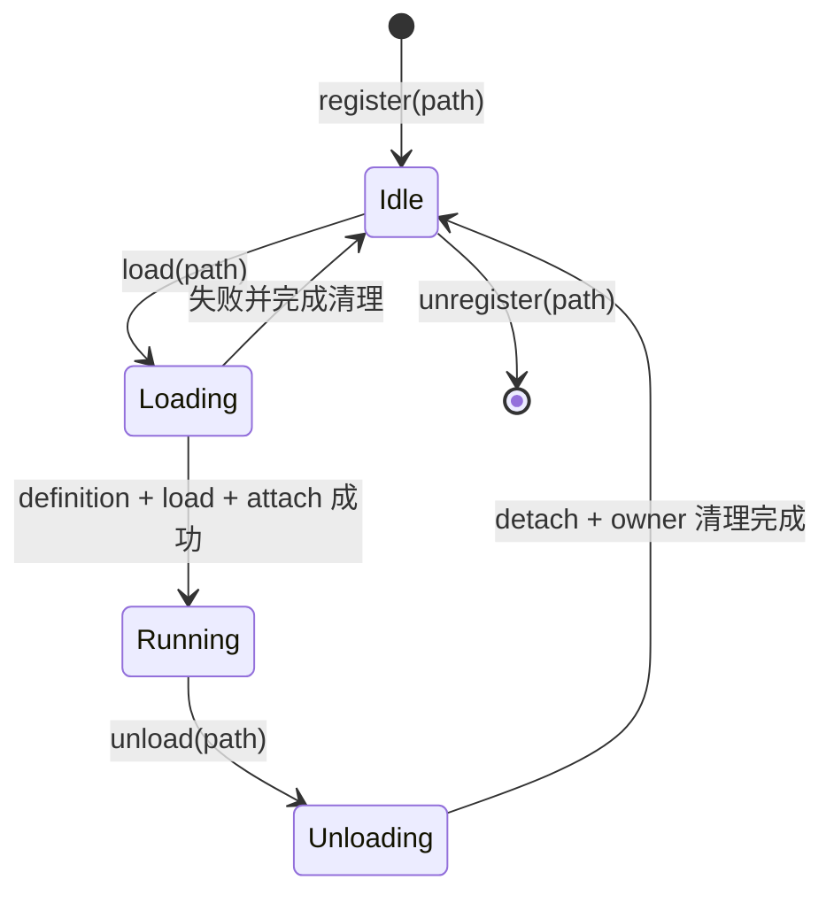

# 插件运行时模型

插件是 ITHARBORS 的主要扩展单元。manifest 静态声明“贡献什么”，main entry 通过
`editor.plugin.define()` 声明“装载时做什么”以及可调用方法。

## 插件目录与 manifest

运行时和构建工具都要求加载 `dist/` 产物：

```text
my-plugin/
├── package.json
├── main/
│   ├── src/index.ts
│   └── dist/index.js
└── panel.example/
    ├── src/
    │   ├── index.html
    │   ├── index.ts
    │   └── index.css
    └── dist/
        ├── index.html
        ├── index.js
        └── index.css
```

最小 manifest：

```json
{
  "name": "@example/my-plugin",
  "type": "module",
  "main": "./main/dist/index.js",
  "ce-editor": {
    "assets": {
      "public": ["./static"]
    },
    "contribute": {
      "panel": {
        "example": {
          "entry": "./panel.example/dist/index.html",
          "title": "Example",
          "multiInstance": false
        }
      },
      "message": {
        "request": {
          "getState": ["getState"]
        },
        "broadcast": {
          "stateChanged": ["panel.refresh"]
        }
      },
      "menu": []
    }
  }
}
```

关键约束：

- `name`、`main` 和 `ce-editor` 必须存在。
- main 必须是插件目录内的 `dist/*.js`、`.mjs` 或 `.cjs` 文件。
- Panel entry 必须是插件目录内的 `dist/index.html` 且文件已生成。
- public asset root 和最终文件解析后的真实路径都必须留在插件目录内。

## 解析与身份

Plugin resolver 只在 assembly 明确给出的目录中枚举一级子目录，并按 package `name`
匹配。它不依赖当前工作目录的隐式 Node resolution。

Session Editor 与进程级 ApplicationRuntime 各自拥有 PluginModule。每个 PluginModule 同时维护：

- path map：已注册的磁盘路径；
- name map：当前已装载并运行的插件名。

同名的新路径被装载时，已有运行实例会先卸载。`kind` 区分 `builtin` 与 `external`，
用于表达装配来源；两者仍走同一 PluginModule。

## 两种运行时作用域

普通 Kit 插件在 Session scope 中加载，可以访问 `sessionId`、Kit、Panel、Window、菜单和消息。
Kit 的 `startup.plugins` 在 application scope 中加载，只能访问：

- `plugin`：定义和调用应用级插件方法；
- `menu`：注册全局菜单贡献；
- `message`：注册或调用仅在 Server 执行的消息；
- `service`：按 owner 注册和查询进程级服务；
- `host`：读取 `desktop` / `web` 运行模式。

application runtime 由白名单直接构造，不先创建完整 Editor 再删字段，因此不会泄漏
`sessionId`、Kit、Panel、Window、Layout 或 Session config。Panel 贡献、`panel.*` 方法和
browser message 在导入插件前即被拒绝。

## 生命周期



### register

读取和校验 package，保存 PluginInfo。它不执行 main，也不产生贡献。

### load

1. 获取所有 Editor 共享的进程级异步加载锁。
2. 为插件创建受限 runtime，保存原有 `globalThis.editor` 后临时注入。
3. 动态导入 main entry；entry 必须且只能调用一次 `editor.plugin.define()`。
4. 在 `finally` 中恢复全局值并释放锁。
5. 在锁外调用新插件的 `lifecycle.load(runtime)`。
6. 让已运行插件通过 `attach(newPlugin, contribute)` 接收新贡献。
7. 让新插件通过 `attach(otherPlugin, contribute)` 接收已有贡献。
8. 全部成功后才进入 Running。

锁只覆盖依赖全局对象的 definition 捕获，不覆盖耗时生命周期。任何一步失败都会继续撤销
已经产生的 attach 和 owner 贡献；原始失败与清理失败同时存在时通过 `AggregateError` 保留。

### unload

1. 进入 Unloading 并调用目标插件自己的 `lifecycle.unload()`。
2. 通知所有其他运行插件 `detach(targetPlugin)`，单个失败不阻止后续清理。
3. 清除 Panel、Message 和 Menu 的 owner 资源。
4. 从 name map 删除实例并回到 Idle；多项失败以 `AggregateError` 返回。

Editor 在 Kit 切换时还会按 owner 清理 Panel、Message 和 Menu 注册，形成第二道清理边界。
ApplicationRuntime 对每个启动插件同样按 owner 清理 service、message 和 menu；一个插件失败
只令应用进入 `degraded`，其他插件继续加载。应用退出时按成功加载顺序的逆序卸载。

### unregister

只删除 path map 中的注册信息。运行中的插件必须先 unload，否则拒绝 unregister。

## 贡献点与所有权

内置插件充当贡献点控制器：

| 控制器 | 接收的贡献 | 运行时结果 |
| --- | --- | --- |
| `@itharbors/panel` | `contribute.panel` | 注册完整名 `pluginName.panelName` 和资源入口 |
| `@itharbors/message` | `contribute.message` | 注册 request/broadcast route |
| `@itharbors/menu` | `contribute.menu` | 归一化菜单树并触发变更 |
| `@itharbors/config` | 配置相关贡献/能力 | 提供分层配置运行时 |

受限 runtime 默认只允许插件以自己的名字注册。只有对应的委托控制器可以代其他插件
持有贡献，例如 `@itharbors/message` 为贡献者注册消息路由。这样 `clearOwner(pluginName)`
才能可靠清理。

## 插件方法与消息

`definition.methods` 可由 Server 中其他插件通过 `callPlugin(name, method, ...args)`
调用。方法不存在时运行时会列出可用方法并失败。

跨 Panel、跨浏览器边界的交互应使用 MessageModule：

- request：唯一的 `plugin:name` 路由，有返回值；
- broadcast：一个 topic 对多个路由，无返回值；
- `location` 为 `server` 或 `browser`；
- `panel.method` 将调用转发到具体 Panel definition 的 methods。

不要把 `callPlugin` 暴露为 Panel 之间的隐式耦合。

## Panel runtime 与资源

Server 返回 Panel HTML 时注入 runtime 脚本，再导入同目录的 `index.js`。Panel 模块
默认导出包含 `mount`、`unmount` 和 methods 的 definition，并通过受限 API 使用：

- `message.request/broadcast`；
- `assets.url(relativePath)`；
- `i18n` 查询、切换与订阅；
- `panel.focus` 和 `openPanel`。

`assets.url` 只能访问 manifest `assets.public` 指定的根目录。源码目录、任意绝对路径
和插件目录外的符号链接目标都不会公开。

## 构建与校验

`scripts/ce-plugin.mjs` 支持：

```bash
node scripts/ce-plugin.mjs build plugins/menu
node scripts/ce-plugin.mjs check plugins/menu
npm run plugins:build
npm run plugins:check
```

`--all` 会发现仓库 `plugins/*` 与 `kits/*/plugins/*` 下包含 `package.json` 的一级目录。
build 清理目标 dist、编译 main/panel 脚本、复制样式和资源，再校验产物；check 只校验
manifest 和现有产物。

## 源码索引

- [PluginModule](../../packages/server/src/framework/plugin/index.ts)
- [ApplicationRuntime](../../packages/server/src/application/runtime.ts)
- [应用启动插件发现](../../packages/server/src/application/catalog.ts)
- [应用服务注册表](../../packages/server/src/application/service-registry.ts)
- [插件类型](../../packages/server/src/framework/plugin/types.ts)
- [插件 resolver](../../packages/server/src/plugin/resolver.ts)
- [Panel 资源与 runtime 注入](../../packages/server/src/routes/panel-asset.ts)
- [MessageModule](../../packages/server/src/framework/message/index.ts)
- [共享插件类型](../../packages/plugin-types/src/plugin.ts)
- [插件构建入口](../../scripts/ce-plugin.mjs)
- [构建发现规则](../../scripts/lib/plugin-build/discover.mjs)
- [manifest/产物校验](../../scripts/lib/plugin-build/validate.mjs)

关联阅读：[插件与 Kit 开发指南](../guides/developing-plugins-and-kits.md) ·
[Kit 与会话模型](./kit-and-session-model.md)
