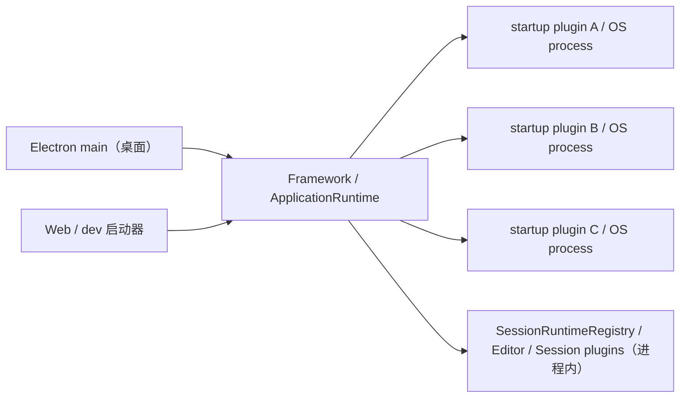
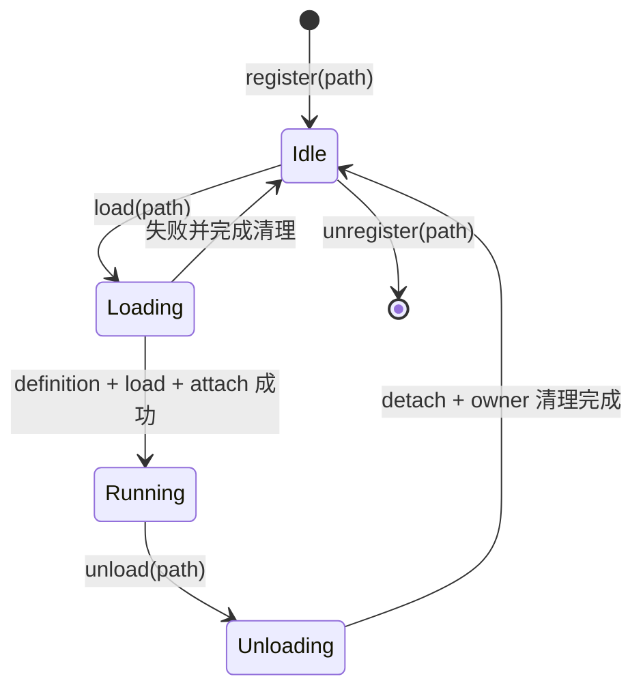
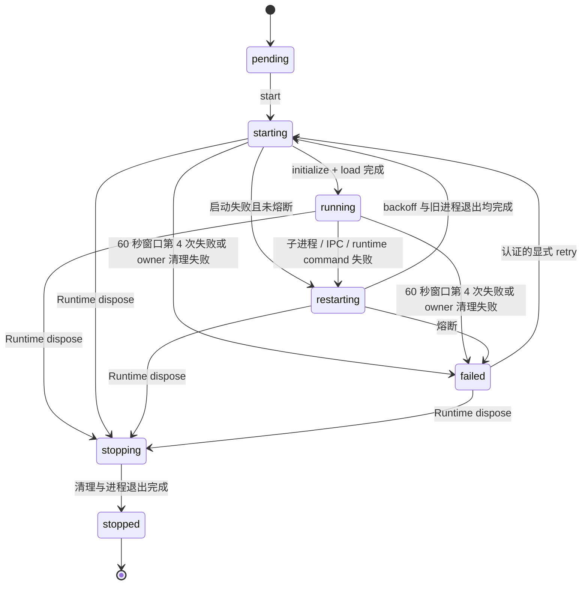

# 插件运行时模型

插件是 ITHARBORS 的主要扩展单元。manifest 静态声明“贡献什么”，main entry 通过
`editor.plugin.define()` 声明“装载时做什么”以及可调用方法。

## 插件目录与 manifest

运行时和构建工具都要求加载 `dist/` 产物：

```text
my-plugin/
├── package.json
├── main/
│   ├── src/index.ts
│   └── dist/index.js
└── panel.example/
    ├── src/
    │   ├── index.html
    │   ├── index.ts
    │   └── index.css
    └── dist/
        ├── index.html
        ├── index.js
        └── index.css
```

最小 manifest：

```json
{
  "name": "@example/my-plugin",
  "type": "module",
  "main": "./main/dist/index.js",
  "ce-editor": {
    "assets": {
      "public": ["./static"]
    },
    "contribute": {
      "panel": {
        "example": {
          "entry": "./panel.example/dist/index.html",
          "title": "Example",
          "multiInstance": false
        }
      },
      "message": {
        "request": {
          "getState": ["getState"]
        },
        "broadcast": {
          "stateChanged": ["panel.refresh"]
        }
      },
      "menu": []
    }
  }
}
```

关键约束：

- `name`、`main` 和 `ce-editor` 必须存在。
- main 必须是插件目录内的 `dist/*.js`、`.mjs` 或 `.cjs` 文件。
- Panel entry 必须是插件目录内的 `dist/index.html` 且文件已生成。
- public asset root 和最终文件解析后的真实路径都必须留在插件目录内。

## 解析与身份

Plugin resolver 只在 assembly 明确给出的目录中枚举一级子目录，并按 package `name`
匹配。它不依赖当前工作目录的隐式 Node resolution。

Session Editor 拥有执行插件的 PluginModule；ApplicationRuntime 只使用独立 PluginModule 做
manifest、entry 与静态贡献校验，不再用它导入 Application 插件。PluginModule 同时维护：

- path map：已注册的磁盘路径；
- name map：当前已装载并运行的插件名。

同名的新路径被装载时，已有运行实例会先卸载。`kind` 区分 `builtin` 与 `external`，
用于表达装配来源；两者仍走同一 PluginModule。

## 两种运行时作用域

普通 Kit 插件在 Session scope 中加载，仍由 Framework 进程内的 Editor 动态导入，可以访问
`sessionId`、Kit、Panel、Window、菜单和消息。Kit 的 `startup.plugins` 在 application scope
中加载；每个唯一 package name 由一个 Supervisor 管理，并在自己的 OS 子进程中执行，只能访问：

- `plugin`：定义和调用应用级插件方法；
- `menu`：注册全局菜单贡献；
- `message`：注册或调用仅在 Server 执行的消息；
- `service`：按 owner 注册和查询进程级服务；
- `host`：读取 `desktop` / `web` 运行模式。

application runtime 由白名单直接构造，不先创建完整 Editor 再删字段，因此不会泄漏
`sessionId`、Kit、Panel、Window、Layout 或 Session config。Panel 贡献、`panel.*` 方法和
browser message 在导入插件前即被拒绝。

Session scope 的 server-side main 另有窄化的 `application.request(plugin, method, ...args)`，用于
调用已经运行的应用启动插件。该桥不进入 Panel runtime；会话插件可以据此转发结构化结果和
经过校验的命令，而浏览器面板本身不能访问进程、文件系统或 ApplicationRuntime。声明宿主级
能力的 Kit 只获得契约允许的信息，敏感操作仍由应用级后台逐次鉴权和复验。

### Application 插件进程拓扑


```mermaid
flowchart LR
    E["Electron main（桌面）"] --> F["Framework / ApplicationRuntime"]
    W["Web / dev 启动器"] --> F
    F --> A["startup plugin A / OS process"]
    F --> B["startup plugin B / OS process"]
    F --> C["startup plugin C / OS process"]
    F --> S["SessionRuntimeRegistry / Editor / Session plugins（进程内）"]
```

Catalog 会合并多个 Kit 对同名 `startup.plugins` 的声明，所以“一插件一进程”指每个唯一的
Application 插件一个 OS 进程，而不是每个 Kit 各复制一次。ApplicationRuntime、菜单、消息和
service registry 仍由 Framework 持有；子进程只保留自己的 definition、lifecycle、方法和动态
handler。普通 `ce-editor.kit.plugin` 没有迁移，仍在各 Session Editor 所在的 Framework 进程内。

进程边界使用 Node `child_process` 的 advanced serialization 与专用 IPC fd。每个启动或重启实例
都有不可变 `generation`；所有 protocol v1 request/response/event envelope 都必须携带同一代标识和
精确字段。明确属于旧 generation 的消息被忽略，无法安全分类或伪装成当前 generation 的非法消息
会让当前进程失败关闭。函数与 handler 不跨 IPC：Host 只接收方法名、generation 内 handler id 和
结构化数据。

advanced serialization 不会放宽 Framework 自己的协议白名单。单个 payload 最大 1 MiB、嵌套
最多 32 层、单向最多 256 个 pending request；只允许有限数值、字符串、布尔值、`null`、无空洞且
无自定义字段的普通数组，以及只含可枚举 data property 的 plain/null-prototype object。函数、
symbol、accessor、Proxy、自定义 prototype 和循环引用都会被拒绝。

### 故障隔离与权限边界

独立 OS 进程可以把未捕获异常、unhandled rejection、主动退出和 IPC 故障限制在该 Application
插件：Framework 与健康 sibling 继续运行，失败 owner 的贡献先清除，再决定重启或熔断。它不是
OS 权限沙箱，也不把受信插件变成不受信代码。子进程仍以同一 OS 账号运行，继承明确传入的非秘密
环境、Framework cwd 和该账号可访问的文件系统权限；`runtime.paths` 提供 owner 专属 data/cache/
temp 路径，但不能替代操作系统访问控制。Application、Notification owner 与 credential transport
token 不进入 runner argv 或 child env。

## 生命周期

下面的 Idle/Loading/Running 模型仍适用于进程内 Session 插件：


```mermaid
stateDiagram-v2
    [*] --> Idle: register(path)
    Idle --> Loading: load(path)
    Loading --> Running: definition + load + attach 成功
    Loading --> Idle: 失败并完成清理
    Running --> Unloading: unload(path)
    Unloading --> Idle: detach + owner 清理完成
    Idle --> [*]: unregister(path)
```

### register

读取和校验 package，保存 PluginInfo。它不执行 main，也不产生贡献。

### load

1. 获取所有 Editor 共享的进程级异步加载锁。
2. 为插件创建受限 runtime，保存原有 `globalThis.editor` 后临时注入。
3. 动态导入 main entry；entry 必须且只能调用一次 `editor.plugin.define()`。
4. 在 `finally` 中恢复全局值并释放锁。
5. 在锁外调用新插件的 `lifecycle.load(runtime)`。
6. 让已运行插件通过 `attach(newPlugin, contribute)` 接收新贡献。
7. 让新插件通过 `attach(otherPlugin, contribute)` 接收已有贡献。
8. 全部成功后才进入 Running。

锁只覆盖依赖全局对象的 definition 捕获，不覆盖耗时生命周期。任何一步失败都会继续撤销
已经产生的 attach 和 owner 贡献；原始失败与清理失败同时存在时通过 `AggregateError` 保留。

### unload

1. 进入 Unloading 并调用目标插件自己的 `lifecycle.unload()`。
2. 通知所有其他运行插件 `detach(targetPlugin)`，单个失败不阻止后续清理。
3. 清除 Panel、Message 和 Menu 的 owner 资源。
4. 从 name map 删除实例并回到 Idle；多项失败以 `AggregateError` 返回。

Editor 在 Kit 切换时还会按 owner 清理 Panel、Message 和 Menu 注册，形成第二道清理边界。
ApplicationRuntime 对每个启动插件同样按 owner 清理 service、message 和 menu；一个插件失败
只令应用进入 `degraded`，其他插件继续加载。应用启动插件不能调用全局 `menu.reset()`，只能
增删自己的菜单贡献，避免失败插件清空其他 owner 的菜单。应用退出时按成功加载顺序的逆序卸载。

Application 插件的固定 owner 清理顺序是：先阻止该 owner 的 snapshot 回送并撤销 lifecycle
attachment 记账（对其他仍运行 owner 的 `detach` 放入有序队列），再删除静态 attach 标记，随后依次
执行 `menu.detach(owner)`、`message.clearOwner(owner)`、`service.clearOwner(owner)`，最后向其他健康
generation 异步广播最新 runtime snapshot。清理失败会阻止自动拉起并进入 `failed`，不能带着可能
残留的旧 owner 贡献启动新 generation。

### Application 进程状态与恢复


```mermaid
stateDiagram-v2
    [*] --> pending
    pending --> starting: start
    starting --> running: initialize + load 完成
    starting --> restarting: 启动失败且未熔断
    running --> restarting: 子进程 / IPC / runtime command 失败
    restarting --> starting: backoff 与旧进程退出均完成
    starting --> failed: 60 秒窗口第 4 次失败或 owner 清理失败
    running --> failed: 60 秒窗口第 4 次失败或 owner 清理失败
    restarting --> failed: 熔断
    failed --> starting: 认证的显式 retry
    running --> stopping: Runtime dispose
    starting --> stopping: Runtime dispose
    restarting --> stopping: Runtime dispose
    failed --> stopping: Runtime dispose
    stopping --> stopped: 清理与进程退出完成
    stopped --> [*]
```

公开状态全集固定为 `pending`、`starting`、`running`、`restarting`、`failed`、`stopping`、
`stopped`。第一次、第二次、第三次自动重启分别等待 250 ms、1 s、4 s；滚动 60 秒内第 4 次失败
熔断为 `failed`。连续运行满 5 分钟会清空失败窗口与 backoff 预算。运维恢复使用认证的
`POST /api/application/plugin/retry`，body 只接受 `{ "plugin": "@scope/name" }`；该 Electron
内部控制路由拒绝浏览器 Origin，要求 JSON 与每次启动生成的 application token，不是普通网页 API。

Supervisor 给 initialize/load 30 秒。正常 stop 先请求 unload（启动未完成时请求 shutdown），最多等
10 秒；随后发送 `SIGTERM`，再等 2 秒仍未退出则 `SIGKILL`。Runner 自身的 fatal unload 也有 10 秒
上限。无论成功、失败还是超时，新的 generation 都不能在旧 owner 清理完成前接管贡献。

### unregister

只删除 path map 中的注册信息。运行中的插件必须先 unload，否则拒绝 unregister。

## 贡献点与所有权

内置插件充当贡献点控制器：

| 控制器 | 接收的贡献 | 运行时结果 |
| --- | --- | --- |
| `@itharbors/panel` | `contribute.panel` | 注册完整名 `pluginName.panelName` 和资源入口 |
| `@itharbors/message` | `contribute.message` | 注册 request/broadcast route |
| `@itharbors/menu` | `contribute.menu` | 归一化菜单树并触发变更 |
| `@itharbors/config` | 配置相关贡献/能力 | 提供分层配置运行时 |

受限 runtime 默认只允许插件以自己的名字注册。只有对应的委托控制器可以代其他插件
持有贡献，例如 `@itharbors/message` 为贡献者注册消息路由。这样 `clearOwner(pluginName)`
才能可靠清理。

## 插件方法与消息

`definition.methods` 可由 Server 中其他插件通过 `callPlugin(name, method, ...args)`
调用。方法不存在时运行时会列出可用方法并失败。

跨 Panel、跨浏览器边界的交互应使用 MessageModule：

- request：唯一的 `plugin:name` 路由，有返回值；
- broadcast：一个 topic 对多个路由，无返回值；
- `location` 为 `server` 或 `browser`；
- `panel.method` 将调用转发到具体 Panel definition 的 methods。

不要把 `callPlugin` 暴露为 Panel 之间的隐式耦合。

## Application service 与异步快照

Application `service.register(name, value)` 只接受可通过 `structuredClone` 和上述 IPC payload 校验的
数据；函数和循环引用不能注册。Registry 按 owner 保管值，snapshot 每次都重新 structured-clone，
子进程读取到的是深冻结的本地快照，不是 Host 对象引用。

`register`、`unregister` 和其他 void runtime command 是异步投递；Host 更新 registry 后，会把最新
service/menu/plugin snapshot 异步广播给所有健康 generation，并且每个 generation 最多保留一个
in-flight 和一个 latest replacement。因此 `service.get()` 不保证在同一调用栈内 read-your-write，
慢 consumer 只会最终收敛到最新快照。需要因果确认或返回值时应使用 request，而不是把 service
snapshot 当作同步共享内存。

## Panel runtime 与资源

Server 返回 Panel HTML 时注入 runtime 脚本，再导入同目录的 `index.js`。Panel 模块
默认导出包含 `mount`、`unmount` 和 methods 的 definition，并通过受限 API 使用：

- `message.request/broadcast`；
- `assets.url(relativePath)`；
- `i18n` 查询、切换与订阅；
- `panel.focus` 和 `openPanel`。

`assets.url` 只能访问 manifest `assets.public` 指定的根目录。源码目录、任意绝对路径
和插件目录外的符号链接目标都不会公开。

## 构建与校验

`scripts/ce-plugin.mjs` 支持：

```bash
node scripts/ce-plugin.mjs build plugins/menu
node scripts/ce-plugin.mjs check plugins/menu
npm run plugins:build
npm run plugins:check
```

`--all` 会发现仓库 `plugins/*` 与 `kits/*/plugins/*` 下包含 `package.json` 的一级目录。
build 清理目标 dist、编译 main/panel 脚本、复制样式和资源，再校验产物；check 只校验
manifest 和现有产物。

Web/source 开发由 Server 从 `spawn.ts` 相邻位置解析 `runner.ts` 并用仓库的 `tsx` loader 启动；
Server 编译产物则使用相邻的 `runner.js`。稳定 Electron 以同一个 Electron executable 加
`ELECTRON_RUN_AS_NODE=1` 启动插件子进程，runner 固定来自 packaged
`Contents/Resources/runtime/packages/server/dist/application/plugin-process/runner.js`。桌面 staging
复制本次 `npm run build` 生成的 Server runner；验证不能依赖仓库里历史或 ignored 的 dist 副本。

## 源码索引

- [PluginModule](../../packages/server/src/framework/plugin/index.ts)
- [ApplicationRuntime](../../packages/server/src/application/runtime.ts)
- [Application 插件 Supervisor](../../packages/server/src/application/plugin-process/supervisor.ts)
- [Application 插件 runner](../../packages/server/src/application/plugin-process/runner.ts)
- [进程与环境适配](../../packages/server/src/application/plugin-process/spawn.ts)
- [IPC 协议](../../packages/server/src/application/plugin-process/protocol.ts)
- [应用启动插件发现](../../packages/server/src/application/catalog.ts)
- [应用服务注册表](../../packages/server/src/application/service-registry.ts)
- [插件类型](../../packages/server/src/framework/plugin/types.ts)
- [插件 resolver](../../packages/server/src/plugin/resolver.ts)
- [Panel 资源与 runtime 注入](../../packages/server/src/routes/panel-asset.ts)
- [MessageModule](../../packages/server/src/framework/message/index.ts)
- [共享插件类型](../../packages/plugin-types/src/plugin.ts)
- [插件构建入口](../../scripts/ce-plugin.mjs)
- [构建发现规则](../../scripts/lib/plugin-build/discover.mjs)
- [manifest/产物校验](../../scripts/lib/plugin-build/validate.mjs)

关联阅读：[插件与 Kit 开发指南](../guides/developing-plugins-and-kits.md) ·
[Kit 与会话模型](./kit-and-session-model.md)
