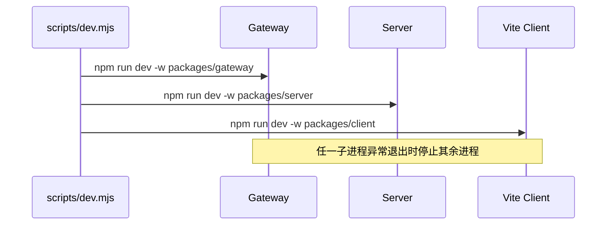
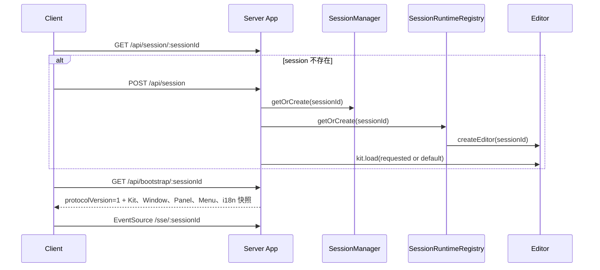
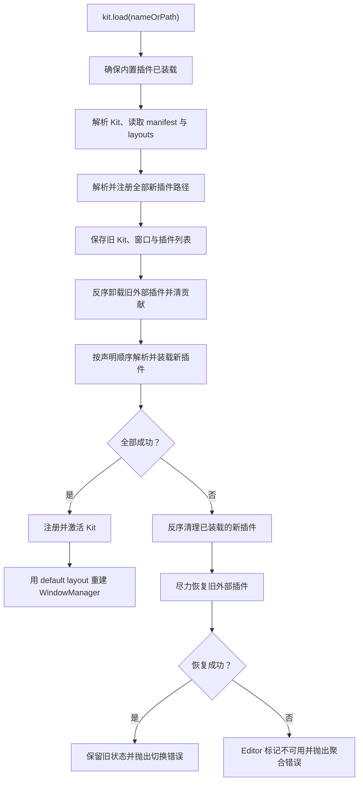

# 核心运行流程

本篇沿端到端路径描述各模块如何协作。接口字段可能继续演进，但状态所有权和清理边界
应保持与[核心原则](./core-principles.md)一致。

## 1. 开发栈启动

`--kit` 参数被写入 Server 的 `CE_DEFAULT_KIT` 环境变量。Gateway 默认监听 8080，
Server 监听 3000，Vite 监听 5173。日常访问始终从 Gateway 进入。

## 2. 会话创建与 bootstrap

Client 对 bootstrap 的 404 或 5xx 会尝试初始化 session 后重取一次。Server 只在
注册表中没有对应 session 时创建 Editor，并对并发初始化去重；SQLite session 行与内存
Editor 是两层不同状态。Client 在应用 bootstrap 前校验 `protocolVersion`，不支持的版本
会失败且不会污染现有会话投影。

失败边界：Kit 无法解析或装载时，session 创建请求返回错误，Client 不应假定存在可用
bootstrap。

## 3. Request

Panel 或 Client 将 `sessionId`、插件名、消息名和参数提交到
`POST /api/message/request`。

1. 路由找到 session 的 Editor。
2. MessageModule 先通知 server 侧的 `*` 观察路由；观察者失败被忽略。
3. 精确查找 `plugin:name`。不存在时 request 失败。
4. server route 直接执行 handler 并返回结果。
5. 带 `panel.*` method 的 route 将第一个参数解释为 panel key，再分发给 Panel。
6. browser-targeted route 必须声明 `panel.*` method；BrowserRequestBroker 生成 request ID，
   通过 SSE 派发，并等待 Client 经 `/api/message/result` 返回带 Session 归属的结果。

request 是一对一、有返回值的调用，不应使用 broadcast 模拟。

## 4. Broadcast 与 SSE

`POST /api/message/broadcast` 触发同 topic 的全部订阅者及 `*` 订阅者。

- server handler 以 fire-and-forget 方式执行；
- 一个 handler 抛错不会中止其余订阅；
- `panel.*` method 由 Editor 按插件名前缀找到对应 Panel；
- Server 通过 SSE 发送 `panel-dispatch`，Client 再把调用送入目标 iframe。

布局、菜单和 i18n 变化也使用 SSE，但事件类型分别是 `layout-changed`、
`menu-changed`、`locale-changed` 或 `messages-changed`。Client 收到后更新当前投影。

所有 SSE 数据 envelope 都带 `protocolVersion=1`。每个连接每 15 秒收到注释心跳；当
`write()` 返回背压时，业务事件按顺序缓冲，最多 64 条，心跳不排队。写异常、队列溢出、
请求/响应关闭会清理连接；某 Session 最后一个连接消失时，其未完成 browser request
立即失败。本轮不提供离线重放。

Panel iframe 执行结果只接受来自当前已渲染 iframe 的 `postMessage`。Client 把成功值或
序列化错误连同 Session 和 request ID 回传；错误 Session 返回 409，重复或迟到结果返回
404。Broker 默认 10 秒超时。

## 5. Kit 装载与切换

内置插件只装载一次并保持可用。切换成功后 WindowManager 以新 Kit 的 default layout
重新创建，因此旧 Kit 的窗口状态不会跨 Kit 自动继承。

## 6. 打开 Panel

1. 调用方提交 `panelName`。
2. Editor 从 PanelModule 获取约束和 `multiInstance`。
3. WindowManager 对单实例 Panel 先查找未关闭实例；找到则返回 `reuse`。
4. 否则创建 `opening` 状态的 PanelInstance 和 secondary WindowGroup。
5. Client/Electron 打开返回 URL 对应的窗口。
6. 窗口就绪后标记 WindowGroup 和 PanelInstance 为 `open`。
7. 若浏览器阻止新窗口，Client 可把实例转为 `floating`，删除临时 WindowGroup。

关闭最后一个 PanelInstance 会同时删除对应的 secondary WindowGroup；main window 不走
这一销毁规则。

## 7. 布局变化

Kit layout 在装载时标准化为 WindowDescriptor。`kit.applyLayout(name|LayoutNode)`
只重排 main window 的 layout，并通过 `onLayoutChanged` 发送 SSE。Client 接收后重新
投影结构。

Client 内部的 divider resize 与 tab drag 先在当前 DOM/布局控制器中处理。需要跨窗口或
持久化的结构变化应回到 Server 模型，避免产生两套权威状态。

## 失败处理摘要

| 场景 | 行为 |
| --- | --- |
| session 或参数缺失 | 路由返回 4xx |
| Kit/插件无法解析 | 装载失败并返回错误 |
| 新 Kit 部分装载失败 | 清理新插件，尽力恢复旧插件 |
| Kit 回滚也失败 | Editor 标记不可用，销毁 Session |
| request 无精确路由 | 明确抛错 |
| browser request 超时或断连 | 拒绝 Promise 并删除 pending 记录 |
| HTTP JSON 非法或超过 1 MiB | 返回稳定的 400/413 结构化错误 |
| broadcast handler 抛错 | 忽略该 handler，继续其他订阅者 |
| 单实例 Panel 已打开 | 返回已有实例，不重复创建 |
| 新窗口被阻止 | 转为 Client 内浮层承载 |

## 源码索引

- [开发栈](../../scripts/dev.mjs)
- [会话 API](../../packages/server/src/api/session.ts)
- [App 路由装配](../../packages/server/src/app.ts)
- [Client transport](../../packages/client/src/core/transport.ts)
- [Editor 与 Kit 切换](../../packages/server/src/editor/index.ts)
- [MessageModule](../../packages/server/src/framework/message/index.ts)
- [WindowManager](../../packages/server/src/framework/window/index.ts)
- [SSE channel](../../packages/server/src/sse/channel.ts)
- [Browser request broker](../../packages/server/src/framework/browser-request-broker.ts)
- [共享协议](../../packages/plugin-types/src/protocol/version.ts)
