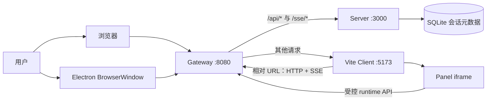
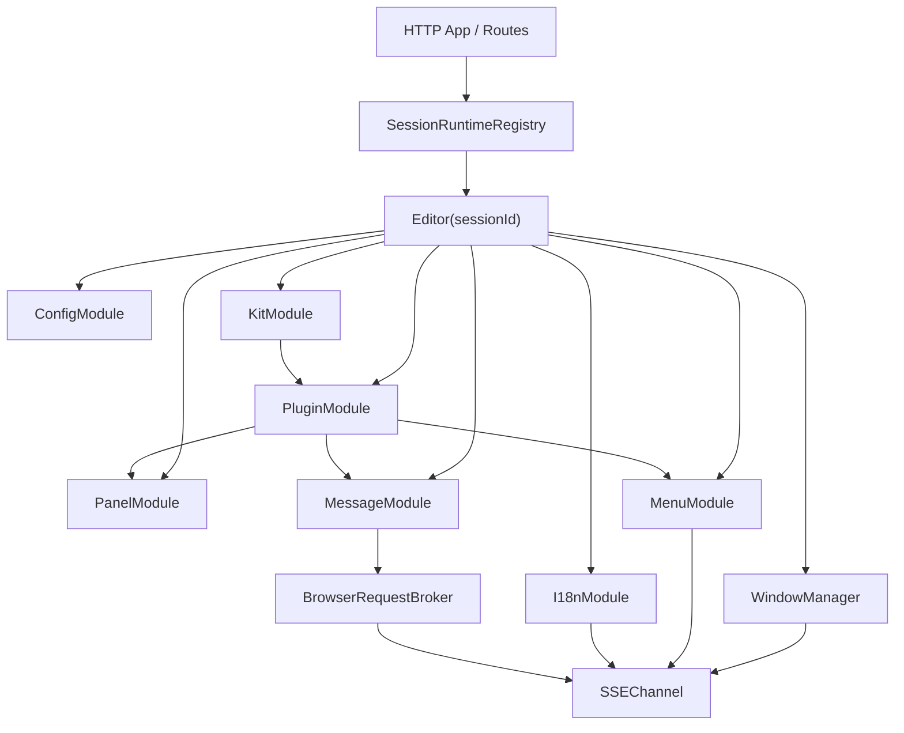

# 系统架构

ITHARBORS 将开发时入口、服务端运行时、浏览器工作台和桌面宿主分开。核心状态集中在
Server；Client 负责渲染与交互；Gateway 只做请求转发；Electron 是可选薄宿主。

## 运行拓扑

生产打包和部署策略尚未在仓库中固化；上图描述当前开发栈和 Electron 启动方式。

## Workspace 职责

| 路径 | 职责 | 不负责 |
| --- | --- | --- |
| `packages/gateway` | 在 8080 提供统一入口并按 URL 前缀反向代理 | 业务路由、认证、持久化 |
| `packages/server` | 会话、Editor 运行时、Kit/插件、消息、窗口、API、SSE、存储 | 具体 Panel UI |
| `packages/client` | 工作台、Web Components、布局交互、主题、HTTP/SSE 客户端 | 插件装载和权威窗口状态 |
| `packages/plugin-types` | 插件与 Panel 可见的共享 TypeScript 协议 | 运行时实现 |
| `plugins` | 始终可用的框架级插件：panel、message、menu、config | 具体 Kit 的产品能力 |
| `kits` | 会话可选择的插件集合、布局、主题和窗口入口 | Framework 通用实现 |
| `scripts` | 开发栈、Electron 宿主、插件构建与校验 | 运行时业务状态 |

## Server 内部装配

每个 session 的 Editor 由多个职责单一的模块组合：

`createApp` 通过 `SessionRuntimeRegistry` 在首次创建 session 时建立 Editor，订阅布局、
菜单和国际化变化并加载默认或请求指定的 Kit。注册表统一处理并发创建、销毁和只读查询。

## 依赖方向

稳定的依赖方向是：

1. 路由层依赖 Editor 公共接口，不直接操作 framework 模块内部 map。
2. Editor 装配层组合 framework 模块，并负责跨模块清理和回滚。
3. framework 模块不依赖具体 Kit 或产品插件。
4. Client 只依赖 HTTP/SSE 契约和共享可见数据，不导入 Server 实现。
5. 插件通过运行时对象访问能力，不导入 Editor 内部实例。

## 数据与状态归属

| 状态 | 权威位置 | 生命周期 |
| --- | --- | --- |
| session 元数据 | SQLite `sessions` 表 | 使用文件数据库时跨 Server 重启保存 |
| Editor 与当前 Kit | Server `SessionRuntimeRegistry` | Server 进程内 |
| 插件注册/装载状态 | 每个 Editor 的 PluginModule | session 内 |
| Window 与 PanelInstance | 每个 Editor 的 WindowManager | 当前 Kit/会话内 |
| 菜单、i18n、消息路由 | 每个 Editor 的对应模块 | session 内 |
| bootstrap 快照 | Client 内存副本 | 页面生命周期 |
| tab 拖动、临时 resize | Client DOM/控制器 | 当前页面交互 |

## Web 与 Electron

`npm run dev` 直接启动 Gateway、Server 和 Client。`npm run electron` 先启动同一开发栈，
等待 Gateway 可访问，再用 BrowserWindow 打开相同 URL。

Electron 额外提供：

- 将 Server/Client 生成的菜单树同步为原生菜单；
- 把原生菜单点击送回对应 session 的窗口；
- 只允许通过系统浏览器打开 `http:` 或 `https:` URL。

这些能力通过 context-isolated preload 暴露，不改变核心运行时边界。

## 源码索引

- [开发栈启动](../../scripts/dev.mjs)
- [Gateway 代理](../../packages/gateway/src/index.ts)
- [Server 入口](../../packages/server/src/server.ts)
- [HTTP App 与路由装配](../../packages/server/src/app.ts)
- [Editor 装配](../../packages/server/src/editor/index.ts)
- [Client 工作台入口](../../packages/client/src/components/editor-app.ts)
- [Client transport](../../packages/client/src/core/transport.ts)
- [Electron 宿主](../../scripts/electron.mjs)

关联阅读：[核心运行流程](./runtime-flows.md) ·
[Kit 与会话模型](./kit-and-session-model.md)
