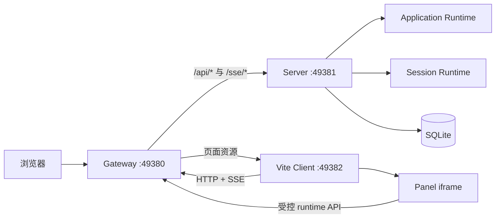
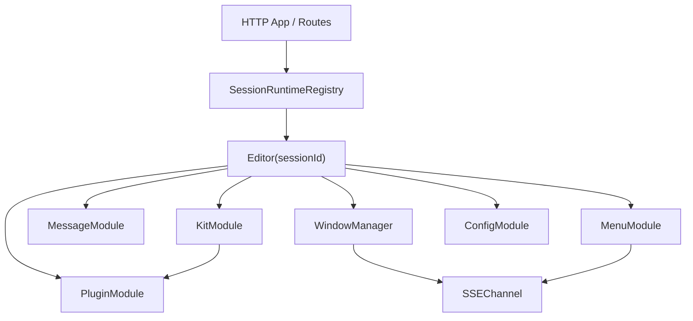

# 系统架构

ITHARBORS 采用单一 Web host。Server 持有运行时权威状态，Client 在浏览器中渲染工作台，Gateway 只在开发环境提供统一代理入口。仓库不包含 Electron 或桌面发行链。

## 运行拓扑

```mermaid
flowchart LR
    Browser["浏览器"] --> Gateway["Gateway :49380"]
    Gateway -- "/api/* 与 /sse/*" --> Server["Server :49381"]
    Gateway -- "页面资源" --> Client["Vite Client :49382"]
    Server --> AppRuntime["Application Runtime"]
    Server --> Sessions["Session Runtime"]
    Server --> DB[("SQLite")]
    Client --> Panel["Panel iframe"]
    Client -- "HTTP + SSE" --> Gateway
    Panel -- "受控 runtime API" --> Gateway
```

`pnpm run dev:web` 启动开发拓扑。`pnpm start` 则直接启动构建后的 Web Server，默认监听 `48381`，从 `kits/default` 装配内置 Kit，并把运行数据写入 `.data/`。

## Workspace 职责

| 路径 | 职责 |
| --- | --- |
| `packages/gateway` | 开发环境统一入口与反向代理 |
| `packages/server` | 会话、Editor、Kit/插件、消息、API、SSE 和存储 |
| `packages/client` | 浏览器工作台、Web Components、布局、主题和传输层 |
| `packages/plugin-types` | 插件和 Panel 可见协议 |
| `plugins` | 框架级内置插件 |
| `kits/default` | 内置 default Kit 的 descriptor、布局和插件组合 |
| `scripts` | 构建、检查、Task 与 Kit 制品工具 |

## Server 装配

```mermaid
flowchart TD
    Routes["HTTP App / Routes"] --> Registry["SessionRuntimeRegistry"]
    Registry --> Editor["Editor(sessionId)"]
    Editor --> Kit["KitModule"]
    Editor --> Plugin["PluginModule"]
    Editor --> Message["MessageModule"]
    Editor --> Menu["MenuModule"]
    Editor --> Window["WindowManager"]
    Editor --> Config["ConfigModule"]
    Window --> SSE["SSEChannel"]
    Menu --> SSE
    Kit --> Plugin
```

每个 session 拥有独立 Editor。Kit、插件、布局、菜单与消息路由的权威状态在 Server；Client 只保存渲染所需快照和短暂交互状态。

## 依赖方向

1. 路由只依赖 Editor 公共接口。
2. Editor 装配 framework 模块并负责回滚与清理。
3. framework 不依赖具体 Kit 或产品插件。
4. Client 只依赖 HTTP/SSE 契约。
5. Panel 通过受限 runtime API 通信。

## 源码索引

- [Web 开发栈](../../scripts/dev.mjs)
- [Web Server 入口](../../packages/server/src/start.ts)
- [Gateway](../../packages/gateway/src/index.ts)
- [Server](../../packages/server/src/server.ts)
- [Editor](../../packages/server/src/editor/index.ts)
- [Client](../../packages/client/src/components/editor-app.ts)
