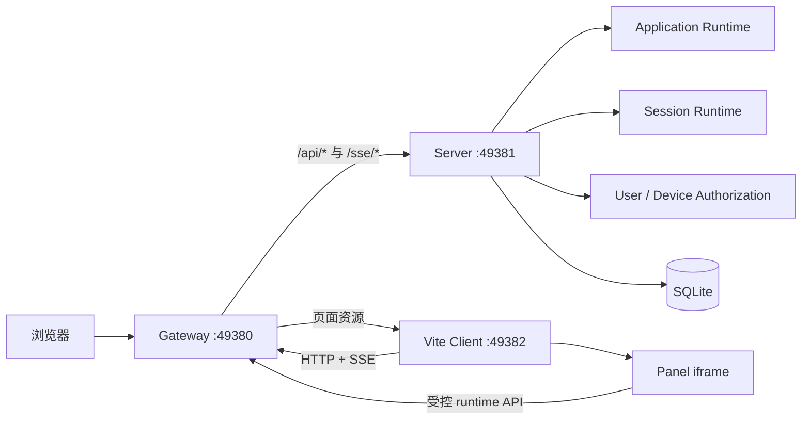
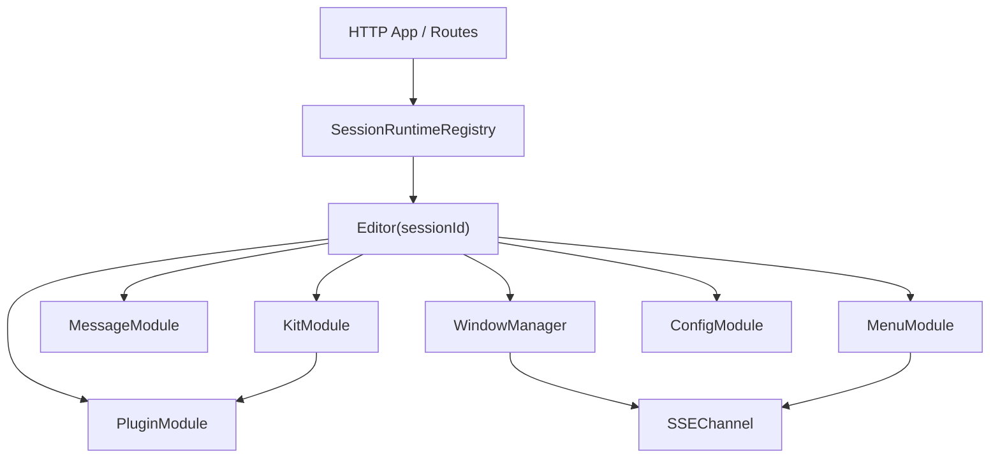

# 系统架构

ITHARBORS 采用单一 Web host。Server 持有运行时权威状态，Client 在浏览器中渲染工作台，Gateway 只在开发环境提供统一代理入口。仓库不包含 Electron 或桌面发行链。

## 运行拓扑

```mermaid
flowchart LR
    Browser["浏览器"] --> Gateway["Gateway :49380"]
    Gateway -- "/api/* 与 /sse/*" --> Server["Server :49381"]
    Gateway -- "页面资源" --> Client["Vite Client :49382"]
    Server --> AppRuntime["Application Runtime"]
    Server --> Sessions["Session Runtime"]
    Server --> Identity["User / Device Authorization"]
    Server --> DB[("SQLite")]
    Client --> Panel["Panel iframe"]
    Client -- "HTTP + SSE" --> Gateway
    Panel -- "受控 runtime API" --> Gateway
```

`pnpm dev` 启动 Gateway、Server 与 Client 三个开发进程：Gateway 和 Server 监听源码变化，Client 由 Vite 提供 HMR。`pnpm start` 启动单个 Web Server，直接提供预先构建好的 Client 资产，默认监听 `48381`；它自身不执行构建，也不启动开发代理、源码监听或 HMR。两个入口默认都把正式运行数据写入 `~/.harbors/`，也都支持 `--data-root <absolute-path>` 整体切换数据根，不以当前 cwd、checkout 或 worktree 推导位置。

三进程 Web Host 的网络边界是“Gateway 对外、上游回环”：Gateway 使用 IPv4 wildcard `0.0.0.0` 接受本机及局域网浏览器连接，Server 与 Vite Client 只监听 `127.0.0.1`。远程请求必须经过 Gateway 写入可信的单值 `X-Forwarded-For`，再由 Server 执行设备授权与 Session owner 检查；不得直接公开上游端口。IPv6 wildcard 不属于当前保证范围。

默认布局为：Server 状态使用 `~/.harbors/harbors.db`，Kit 配置使用 `~/.harbors/config.sqlite`，Plugin owner 私有数据使用 `~/.harbors/plugins/{data,cache,temp}/<owner-sha256>/`。启动只读取当前 data root，不扫描或导入项目内旧数据库和旧 Plugin data。

`HARBORS_DATA_ROOT` 是统一环境入口，CLI 参数优先；`DB_PATH` 与三个 `HARBORS_PLUGIN_*_ROOT` 只作为更高优先级的底层覆盖。数据根只控制文件数据：Credential profile 元数据随 SQLite 切换，真实 secret 仍在 OS Keychain；同一根同时只应由一个 Host 使用，当前是运维约束而非运行期文件锁。

## Workspace 职责

| 路径 | 职责 |
| --- | --- |
| `packages/gateway` | 开发环境统一入口与反向代理 |
| `packages/server` | 会话、Editor、Kit/插件、消息、API、SSE 和存储 |
| `packages/client` | 浏览器工作台、Web Components、布局、主题和传输层 |
| `packages/plugin-types` | 插件和 Panel 可见协议 |
| `plugins` | 框架级内置插件 |
| `kits/default` | 内置 default Kit 的 descriptor、布局和插件组合 |
| `kits/harness/plugins/agent-context-store` | Harness Conversation SQLite、状态投影和历史 Context 装配 |
| `scripts` | 构建、检查、Task 与 Kit 制品工具 |

## Server 装配

```mermaid
flowchart TD
    Routes["HTTP App / Routes"] --> Registry["SessionRuntimeRegistry"]
    Registry --> Editor["Editor(sessionId)"]
    Editor --> Kit["KitModule"]
    Editor --> Plugin["PluginModule"]
    Editor --> Message["MessageModule"]
    Editor --> Menu["MenuModule"]
    Editor --> Window["WindowManager"]
    Editor --> Config["ConfigModule"]
    Window --> SSE["SSEChannel"]
    Menu --> SSE
    Kit --> Plugin
```

每个 session 拥有独立 Editor。Kit、插件、布局、菜单与消息路由的权威状态在 Server；Client 只保存渲染所需快照和短暂交互状态。

Server 同时持有 User、授权设备和 Session owner 的权威关系。每个授权设备和 Session 都必须属于一个 User。所有携带基础或复合 runtime ID 的 HTTP/SSE 入口在访问 Editor 前经过同一 owner 策略；远程设备只获得绑定用户的公开摘要。Client 的裸入口按“用户 → Session → Kit”选择，持久 Session 只由 Workbench 的显式用户入口创建。

未授权远程设备先通过匿名授权入口读取仅含 `userId` 与 `displayName` 的精简用户目录；选择用户后，Client 显式提交“当前设备申请绑定该用户”的待审批请求。状态查询是纯读取，不会因刷新自动创建申请。审批前远程端不能读取 Kit、Session 或工作台上下文；本机批准后，Server 只能把设备绑定到申请中的用户，已授权设备不能再通过申请接口切换身份。

## 依赖方向

1. 路由只依赖 Editor 公共接口。
2. Editor 装配 framework 模块并负责回滚与清理。
3. framework 不依赖具体 Kit 或产品插件。
4. Client 只依赖 HTTP/SSE 契约。
5. Panel 通过受限 runtime API 通信。

## 源码索引

- [Web 开发栈](../../scripts/dev.mjs)
- [Web Server 入口](../../packages/server/src/start.ts)
- [Gateway](../../packages/gateway/src/index.ts)
- [Server](../../packages/server/src/server.ts)
- [Editor](../../packages/server/src/editor/index.ts)
- [Client](../../packages/client/src/components/editor-app.ts)
