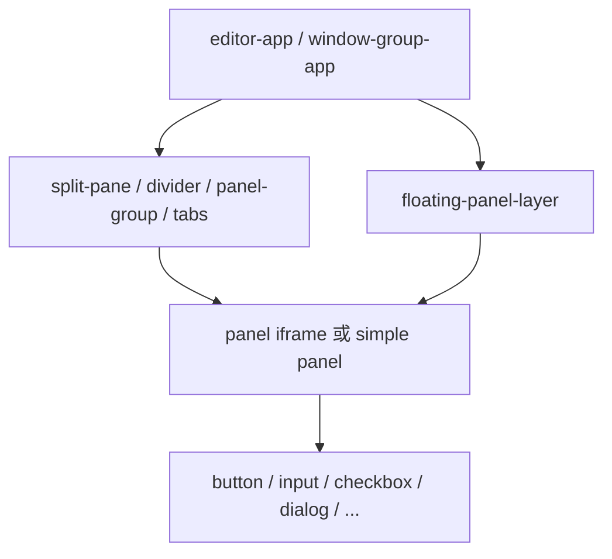

# UI 系统

Client 使用浏览器原生 Web Components 构建工作台与基础控件，不依赖大型 UI 框架。
Kit theme 通过 `--ce-*` CSS token 定制外观，Panel iframe 接收同一组 token 与基础样式。

## 组件层次

### 应用组件

- `editor-app`：创建/恢复 session，获取 bootstrap，连接 SSE，维护 Panel map、窗口布局、
  原生菜单同步和 floating panels。
- `window-group-app`：渲染 secondary window，对 WindowGroup 打开/关闭状态进行回报。
- `floating-panel-layer`：承载弹出窗口失败后降级的 floating PanelInstance。

### 布局组件

- `ce-split-pane` 与 `ce-divider`：方向、尺寸和拖拽调整。
- `ce-panel-group`：tab group 的容器和 drop target。
- `ce-tabs` / `ce-tab`：tab chrome 与激活状态。
- `ce-panel`：simple 内容或 iframe 资源的统一承载。

### 基础组件

`packages/client/src/ui/` 提供 badge、button、checkbox、context-menu、dialog、icon、
icon-button、input、label、progress、radio、select、textarea、toggle、tooltip 等原生
自定义元素。它们通过 CSS token 获取外观，不持有 Framework 业务状态。

## 启动与渲染

Client 入口注册自定义元素。`editor-app`：

1. 从 URL 读取 `session` 或 `sessionId`。
2. 获取或创建 session。
3. 获取 bootstrap，建立 panel descriptor map 与 layout projection。
4. 应用 Kit theme，并连接 SSE。
5. 根据事件更新菜单、i18n、layout 或向 Panel dispatch。

Bootstrap 是 Server 权威状态的页面投影；重新连接时应优先重新获取快照，而不是仅靠
本地 DOM 推断。

## 主题 token

`DEFAULT_THEME_TOKENS` 是 `Record<--ce-*, string>`，覆盖颜色、间距、圆角、字号、
阴影、工作台、Panel、tab、divider 和表单控件语义。

Kit 的 theme 与默认 token 合并后应用到工作台。组件应依赖语义 token，例如
`--ce-panel-bg`，而不是在多个组件中复制固定颜色。新增基础 token 时同时考虑：

- 工作台文档；
- Panel iframe；
- hover/active/focus/disabled 状态；
- 兼容旧 token 是否必要。

## Panel iframe

Panel HTML 由 Server 路由读取并注入 runtime。iframe 与宿主通过 postMessage、
BroadcastChannel、HTTP 和 SSE 协作：

- Panel ready 后通知宿主；
- 同目录 `index.js` 的默认导出提供 mount/unmount/methods；
- `panel-dispatch` 调用 definition methods，并可回传 request result；
- i18n snapshot 和变更同步到 iframe；
- public asset URL 由 runtime 生成，仍由 Server 做路径校验。

Panel 不应读取父页面私有对象，也不应假定存在 Electron/Node API。这样同一插件才能在
浏览器、主窗口、次窗口和 floating carrier 中运行。

## 国际化

Server 的 I18nModule 持有当前 locale、默认 locale、消息层与 version。Client i18n store
缓存可见快照；label、Panel title 和菜单等在变化时重绘。

Panel runtime 提供 `getLocale`、`t`、`setLocale` 与 `subscribe`。缺失 key 回退到默认
语言，再回退为 key 本身。

## Electron 边界

BrowserWindow 配置：

- `contextIsolation: true`；
- `nodeIntegration: false`；
- preload 只暴露 `syncMenu`、`onMenuAction`、`openExternalUrl`。

菜单 payload 为兼容现有协议仍携带 combined/application/kit 三棵树、Kit 根和菜单模式。
主进程会清洗 payload、限制菜单 role；当前所有 Electron Kit 窗口统一发送 `multi`，聚合
`APP` 与各 Kit root，并按 session 路由动作。外部 URL 只接受 HTTP(S)。页面和 Panel 仍通过
Web 接口工作，不直接导入 Electron。

## UI 变更准则

1. 结构变化先判断是否属于 LayoutNode/Window 状态。
2. 可复用交互放进聚焦的 Web Component；产品行为留在插件 Panel。
3. 颜色、间距和状态样式使用语义 token。
4. iframe 能力通过受限 runtime 增加，不读取宿主私有全局。
5. Electron 能力通过窄 preload API 增加，并在主进程校验输入。

## 源码索引

- [Client 入口](../../packages/client/src/index.ts)
- [EditorApp](../../packages/client/src/components/editor-app.ts)
- [WindowGroupApp](../../packages/client/src/components/window-group-app.ts)
- [FloatingPanelLayer](../../packages/client/src/components/floating-panel-layer.ts)
- [Panel element](../../packages/client/src/layout/panel.ts)
- [Layout projection](../../packages/client/src/layout/tab-layout.ts)
- [主题 token](../../packages/client/src/styles/theme.ts)
- [iframe 主题](../../packages/client/src/styles/iframe-theme.ts)
- [Panel runtime 注入](../../packages/server/src/routes/panel-asset.ts)
- [Electron preload](../../scripts/electron-preload.cjs)

关联阅读：[布局模型](./layout-model.md) ·
[插件运行时模型](./plugin-runtime-model.md)
