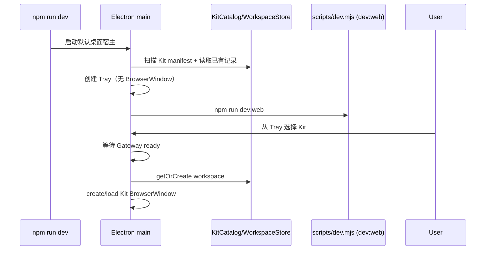

# Kit Lazy Launch Implementation Plan

> **For agentic workers:** REQUIRED SUB-SKILL: Use superpowers:subagent-driven-development (recommended) or superpowers:executing-plans to implement this plan task-by-task. Steps use checkbox (`- [ ]`) syntax for tracking.

**Goal:** 让无参数 Electron 启动只显示系统托盘，并通过托盘按需创建、打开或聚焦彼此隔离的 Kit 窗口。

**Architecture:** `scripts/electron.mjs` 保留 Electron 生命周期和状态所有权，`scripts/lib/electron-launcher.mjs` 提供可单测的启动编排、Tray 展示和并发窗口加载 helper。启动编排先创建 Tray，再启动 framework；只有显式 `--kit` 或 Tray 选择会进入统一的 `openKit()` 路径，该路径等待 Gateway readiness 并通过 `kitWindowLoads` 去重首次加载。

**Tech Stack:** Node.js 20、Electron 31、ES modules、Node test runner、npm workspaces。

## Global Constraints

- 无参数启动不得创建 workspace、session 或 `BrowserWindow`，不得调用 `loadURL()`。
- `--kit <name-or-path>` 代表用户已经选择，保留服务就绪后的直达行为。
- 每个 Kit 保持独立窗口、稳定 sessionId、bounds 和 Server runtime。
- Tray 必须早于 Gateway readiness 可见，未加载 Kit 不能为了应用菜单而预热。
- 同一 Kit 的并发首次选择只允许创建一个窗口；失败后必须允许重试。
- 不新增 renderer 页面、IPC channel、持久化格式、Server API 或依赖。
- 所有实现步骤执行 RED → GREEN → REFACTOR；提交标题使用 `[Bug]` 和简洁中文摘要。

## File Structure

- `scripts/lib/electron-launcher.mjs`：纯启动编排、Tray chooser 和窗口打开/聚焦并发去重。
- `scripts/lib/electron-launcher.test.mjs`：启动顺序、无默认 Kit、显式 Kit、Tray chooser、并发首次加载和失败重试的行为测试。
- `scripts/electron.mjs`：接线 framework readiness、Tray 生命周期、Kit registry 和 Electron events；删除预热函数。
- `readme.md`：面向用户说明启动后从 Tray 选择 Kit。
- `docs/guides/development-workflow.md`：更新开发启动和 `--kit` 行为。
- `docs/architecture/system-overview.md`：更新 Electron application scope 与窗口创建时机。
- `docs/architecture/runtime-flows.md`：更新 Electron 启动时序图。
- `docs/architecture/kit-and-session-model.md`：更新 catalog、workspace 和 session 的懒加载边界。

---

### Task 1: Tray-First Host Initialization

**Files:**
- Modify: `scripts/lib/electron-launcher.test.mjs`
- Modify: `scripts/lib/electron-launcher.mjs`
- Modify: `scripts/electron.mjs`

**Interfaces:**
- Produces: `initializeKitHost(options, adapters) -> Promise<void>`，其中 adapters 精确包含 `createTray()`, `startFramework()`, `registerIpc()`, `openKit(kitName)`。
- Produces: `showKitChooser(tray) -> boolean`，Tray 可用时调用 `popUpContextMenu()` 并返回 `true`，否则返回 `false`。
- Consumes: 现有 `parseElectronOptions()` 返回的 `{ mode, requestedKit }`。

- [ ] **Step 1: Write failing initialization and chooser tests**

在 `scripts/lib/electron-launcher.test.mjs` 的 import 中加入 `initializeKitHost` 和
`showKitChooser`，并添加：

```js
test('initializes the Tray host without opening a default Kit', async () => {
  const calls = [];
  await initializeKitHost({ mode: 'multi', requestedKit: null }, {
    createTray: async () => { calls.push('tray'); },
    startFramework: () => { calls.push('framework'); },
    registerIpc: () => { calls.push('ipc'); },
    openKit: async (kitName) => { calls.push(`open:${kitName}`); },
  });

  assert.deepEqual(calls, ['tray', 'framework', 'ipc']);
});

test('opens only an explicitly requested Kit after host services start', async () => {
  const calls = [];
  await initializeKitHost({ mode: 'single', requestedKit: '@itharbors/kit-sqlite' }, {
    createTray: async () => { calls.push('tray'); },
    startFramework: () => { calls.push('framework'); },
    registerIpc: () => { calls.push('ipc'); },
    openKit: async (kitName) => { calls.push(`open:${kitName}`); },
  });

  assert.deepEqual(calls, [
    'tray',
    'framework',
    'ipc',
    'open:@itharbors/kit-sqlite',
  ]);
});

test('shows the Kit chooser without selecting a default Kit', () => {
  let popupCount = 0;
  const tray = {
    isDestroyed: () => false,
    popUpContextMenu: () => { popupCount += 1; },
  };

  assert.equal(showKitChooser(tray), true);
  assert.equal(popupCount, 1);
  assert.equal(showKitChooser(null), false);
  assert.equal(showKitChooser({ isDestroyed: () => true }), false);
});
```

- [ ] **Step 2: Run the focused test and verify RED**

Run:

```bash
node --test scripts/lib/electron-launcher.test.mjs
```

Expected: FAIL because `initializeKitHost` and `showKitChooser` are not exported.

- [ ] **Step 3: Implement the pure host helpers**

在 `scripts/lib/electron-launcher.mjs` 添加：

```js
export async function initializeKitHost(options, adapters) {
  await adapters.createTray();
  adapters.startFramework();
  adapters.registerIpc();
  if (options.requestedKit) {
    await adapters.openKit(options.requestedKit);
  }
}

export function showKitChooser(tray) {
  if (!tray || tray.isDestroyed?.()) return false;
  tray.popUpContextMenu();
  return true;
}
```

- [ ] **Step 4: Wire Tray-first startup and remove prewarming**

在 `scripts/electron.mjs`：

1. import `initializeKitHost` 和 `showKitChooser`；增加 `let frameworkReadyPromise`。
2. 用以下编排替换 `waitForUrl()`、`prewarmKitWindows()`、`createApplicationTray()` 的旧顺序：

```js
await initializeKitHost(electronOptions, {
  createTray: createApplicationTray,
  startFramework: startFrameworkAndTrackReadiness,
  registerIpc() {
    registerMenuIpc();
    registerOpenExternalUrlIpc();
  },
  openKit,
});
```

3. 添加 readiness owner，并确保 rejection 有观察者且会退出失效的宿主：

```js
function startFrameworkAndTrackReadiness() {
  frameworkProcess = startFramework();
  frameworkReadyPromise = waitForUrl(startUrl);
  void frameworkReadyPromise.catch((error) => {
    console.error(error.message);
    app.quit();
  });
}
```

4. 在 `openKit()` 的 `try` 内第一行加入 `await frameworkReadyPromise`，使启动早期的 Tray 点击等待服务。
5. 删除 `prewarmKitWindows()`。将 `app.activate` 改为 `showKitChooser(tray)`，Tray `click` 事件在所有平台调用相同 helper，不再包含默认 Kit 选择。

- [ ] **Step 5: Run focused tests and inspect the startup contract**

Run:

```bash
node --test scripts/lib/electron-launcher.test.mjs
rg -n "prewarmKitWindows|defaultKit|visibleWindow" scripts/electron.mjs
```

Expected: all tests PASS；`rg` 不输出旧预热或默认 Kit 自动打开路径。

- [ ] **Step 6: Commit the Tray-first startup fix**

```bash
git add scripts/lib/electron-launcher.test.mjs scripts/lib/electron-launcher.mjs scripts/electron.mjs
git diff --cached --check
git commit -m "[Bug] 修正 Electron 托盘启动流程"
```

---

### Task 2: Deduplicated Lazy Kit Window Loading

**Files:**
- Modify: `scripts/lib/electron-launcher.test.mjs`
- Modify: `scripts/lib/electron-launcher.mjs`
- Modify: `scripts/electron.mjs`

**Interfaces:**
- Changes: `openOrFocusKitWindow(kitName, registry, pendingLoads, createWindow) -> Promise<BrowserWindowLike>`。
- Produces: `kitWindowLoads: Map<string, Promise<BrowserWindowLike>>` owned by Electron main process。
- Preserves: existing window path performs restore when minimized, then show and focus without `createWindow()`。

- [ ] **Step 1: Update the existing test call and write concurrent-load tests**

给现有 `openOrFocusKitWindow` 测试传入 `new Map()` 作为第三个参数，并在
`scripts/lib/electron-launcher.test.mjs` 添加：

```js
test('deduplicates concurrent first opens of the same Kit', async () => {
  const registry = new Map();
  const pendingLoads = new Map();
  let createCount = 0;
  let finishCreate;
  const createdWindow = {
    isDestroyed: () => false,
    isMinimized: () => false,
    show() {},
    focus() {},
  };
  const createWindow = async () => {
    createCount += 1;
    return new Promise((resolve) => { finishCreate = () => resolve(createdWindow); });
  };

  const first = openOrFocusKitWindow('sqlite', registry, pendingLoads, createWindow);
  const second = openOrFocusKitWindow('sqlite', registry, pendingLoads, createWindow);
  assert.equal(createCount, 1);
  assert.equal(pendingLoads.size, 1);

  finishCreate();
  const [firstWindow, secondWindow] = await Promise.all([first, second]);
  assert.equal(firstWindow, createdWindow);
  assert.equal(secondWindow, createdWindow);
  assert.equal(registry.get('sqlite'), createdWindow);
  assert.equal(pendingLoads.size, 0);
});

test('clears a failed Kit load so the next selection can retry', async () => {
  const registry = new Map();
  const pendingLoads = new Map();
  let createCount = 0;
  const createdWindow = {
    isDestroyed: () => false,
    isMinimized: () => false,
    show() {},
    focus() {},
  };

  await assert.rejects(
    openOrFocusKitWindow('sqlite', registry, pendingLoads, async () => {
      createCount += 1;
      throw new Error('load failed');
    }),
    /load failed/,
  );
  const retried = await openOrFocusKitWindow(
    'sqlite',
    registry,
    pendingLoads,
    async () => {
      createCount += 1;
      return createdWindow;
    },
  );

  assert.equal(retried, createdWindow);
  assert.equal(createCount, 2);
  assert.equal(pendingLoads.size, 0);
});
```

- [ ] **Step 2: Run the focused test and verify RED**

Run:

```bash
node --test scripts/lib/electron-launcher.test.mjs
```

Expected: FAIL because the existing helper interprets `pendingLoads` as `createWindow` or creates twice.

- [ ] **Step 3: Implement pending-load deduplication**

将 `scripts/lib/electron-launcher.mjs` 的 helper 改为：

```js
export async function openOrFocusKitWindow(kitName, registry, pendingLoads, createWindow) {
  let window = registry.get(kitName);
  if (!window || window.isDestroyed()) {
    let pending = pendingLoads.get(kitName);
    if (!pending) {
      pending = Promise.resolve(createWindow(kitName))
        .then((createdWindow) => {
          registry.set(kitName, createdWindow);
          return createdWindow;
        })
        .finally(() => {
          pendingLoads.delete(kitName);
        });
      pendingLoads.set(kitName, pending);
    }
    window = await pending;
  }
  if (window.isMinimized()) window.restore();
  window.show();
  window.focus();
  return window;
}
```

- [ ] **Step 4: Wire the pending registry into Electron**

在 `scripts/electron.mjs` 的 `kitWindows` 旁创建：

```js
const kitWindowLoads = new Map();
```

并把调用更新为：

```js
return await openOrFocusKitWindow(
  kitName,
  kitWindows,
  kitWindowLoads,
  async () => {
    const kit = kitCatalog.find((candidate) => candidate.name === kitName);
    if (!kit) throw new Error(`Kit "${kitName}" is unavailable`);
    const workspace = await workspaceStore.getOrCreate(kit);
    return createKitWindow(kit, workspace);
  },
);
```

- [ ] **Step 5: Run focused and related persistence tests**

Run:

```bash
node --test scripts/lib/electron-launcher.test.mjs scripts/lib/workspace-store.test.mjs scripts/lib/kit-catalog.test.mjs
```

Expected: all tests PASS, including one create call for concurrent first opens and successful retry after failure.

- [ ] **Step 6: Commit the lazy-load race fix**

```bash
git add scripts/lib/electron-launcher.test.mjs scripts/lib/electron-launcher.mjs scripts/electron.mjs
git diff --cached --check
git commit -m "[Bug] 去重 Kit 懒加载窗口"
```

---

### Task 3: User Guidance, Architecture, and Acceptance Verification

**Files:**
- Modify: `readme.md`
- Modify: `docs/guides/development-workflow.md`
- Modify: `docs/architecture/system-overview.md`
- Modify: `docs/architecture/runtime-flows.md`
- Modify: `docs/architecture/kit-and-session-model.md`

**Interfaces:**
- Documents: `npm run dev` 无参数只驻留 Tray；Tray 选择 Kit；`--kit` 显式直达；首次选择才创建 session/window/runtime。
- Verifies: the complete repository behavior without introducing new runtime interfaces。

- [ ] **Step 1: Update user-facing launch and switch instructions**

在 `readme.md` 和 `docs/guides/development-workflow.md` 明确写出：

```text
无参数启动后应用只显示系统托盘图标，不自动打开默认 Kit。单击或右键托盘图标，从列表选择
Default、SQLite 或 MySQL；首次选择会按需加载，之后再次选择只会打开或聚焦已有窗口。
```

保留 `npm run dev -- --kit <kit>` 示例，并说明它是显式选择，因此会在服务就绪后直接打开。

- [ ] **Step 2: Update architecture ownership and flow**

在 `docs/architecture/system-overview.md` 的 “Web 与 Electron” 段落写入：

```text
Electron 启动时只扫描合法 Kit 的静态 manifest 并创建系统 Tray，不创建 Kit workspace、session
或 BrowserWindow。用户从 Tray 首次选择 Kit 时，Electron 才创建或恢复该 Kit 的稳定 workspace，
等待 Gateway ready 并加载独立 BrowserWindow；之后再次选择只打开或聚焦已有窗口。
```

在 `docs/architecture/runtime-flows.md` 用以下启动时序替换旧的“每 Kit 创建窗口”时序：



在 `docs/architecture/kit-and-session-model.md` 的 Electron catalog 段落写入：

```text
Electron 默认通过 KitCatalog 扫描 `kits/*`，但启动时只保留静态目录并读取已有 workspace 记录。
首次从 Tray 选择 Kit 时才调用 `WorkspaceStore.getOrCreate()`，创建或恢复稳定 sessionId 并加载
对应窗口；未选择的 Kit 不创建新 workspace、Server session 或运行时。`--kit <name-or-path>`
代表显式选择，因此只对指定 Kit 进入同一按需加载路径。
```

- [ ] **Step 3: Check documentation consistency**

Run:

```bash
rg -n "预热全部|首个窗口可见|其余窗口预热|每 Kit 创建独立 BrowserWindow" readme.md docs/architecture docs/guides
git diff --check
```

Expected: `rg` 不输出描述旧启动行为的当前文档；`git diff --check` exits 0。历史
`docs/superpowers/specs/2026-07-21-electron-multi-kit-design.md` 保留为历史决策记录，不机械改写。

- [ ] **Step 4: Run focused Electron acceptance tests**

```bash
node --test scripts/lib/electron-launcher.test.mjs scripts/lib/workspace-store.test.mjs scripts/lib/kit-catalog.test.mjs
```

Expected: all tests PASS with zero failures.

- [ ] **Step 5: Run repository verification**

```bash
npm run check
git diff --check
git status --short
```

Expected: `npm run check` and `git diff --check` exit 0；status 只包含本任务的五个文档，随后提交后为空。

- [ ] **Step 6: Commit the documentation update**

```bash
git add readme.md docs/guides/development-workflow.md docs/architecture/system-overview.md docs/architecture/runtime-flows.md docs/architecture/kit-and-session-model.md
git diff --cached --check
git commit -m "[Bug] 更新 Kit 托盘切换文档"
```

- [ ] **Step 7: Audit every acceptance requirement and finish the change**

Confirm against `docs/superpowers/specs/2026-07-21-kit-lazy-launch-design.md`:

```text
1. Tray menu is the explicit Kit switcher.
2. No-argument startup has no BrowserWindow/default Kit creation path.
3. First selection creates one Kit; other Kits remain unloaded.
4. Existing and concurrent selections do not create duplicate windows.
5. Closing and reopening retains WorkspaceStore sessionId/bounds behavior.
6. Explicit --kit still opens only the requested catalog entry.
7. Failed first load clears pending state and can retry.
```

Then inspect:

```bash
git log --oneline --decorate origin/main..HEAD
git status --short
git diff origin/main...HEAD --stat
```

Expected: focused `[Bug]` commits, a clean worktree, and only the designed code/docs changes.
