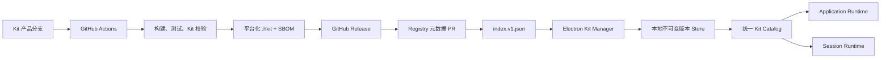
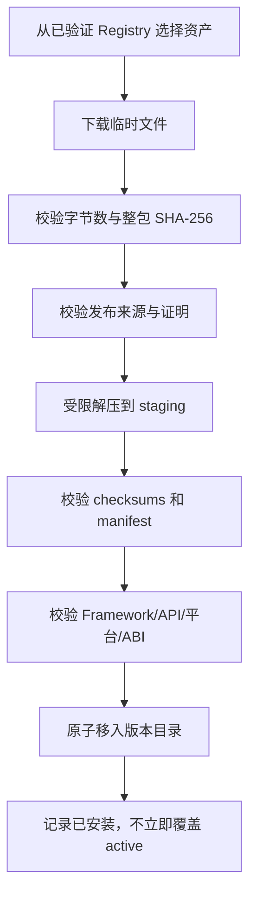

# Kit 独立发布与市场设计

> 后续架构决策：Kit 产品分支与逐版本 `kit-registry` 提交模型已由
> [Harbors 单分支多 Kit 目录设计](./2026-07-24-kit-monorepo-consolidation-design.md)取代。
> 本文关于 `.hkit`、校验、下载、安装、激活、回滚和审计的协议仍然有效。

## 背景

Harbors 已经以插件作为功能扩展单元，并以 Kit 组合单个 Session 的插件、
布局、窗口入口和主题。当前 Electron 与 Server 会扫描仓库内的 `kits/*`，也能通过
`--kit <path>` 加载显式外部目录，但 Kit 源码、构建产物和 Framework 仍在同一条
`main` 发布线上。新增或更新业务 Kit 时，通常需要修改并重新发布主框架。

本设计将 Kit 的开发、构建和发布从 Framework 中拆分。Kit 在独立产品分支中开发，
GitHub Actions 生成可验证的 `.hkit` 制品并发布到 GitHub Release，受控 Registry
提供市场索引，Harbors 中通用的 Kit Manager 负责发现、校验、安装、更新和回滚。

与本设计相关的现有约束是：

- Framework 保持通用，产品能力优先进入 Kit 插件。
- Session 是普通 Kit 插件的运行时隔离边界。
- `startup.plugins` 属于 application scope，并在 Session 创建前装载。
- 插件 main entry 是拥有 Node.js 权限的可执行代码；远程 Kit 不是静态主题包。
- 现有 Electron 与 Server 分别实现 Kit Catalog，发现结果存在潜在分歧。

## 目标

1. Kit 可在 `kit/<name>` 产品分支中独立开发和测试。
2. Kit 分支推送后自动发布 Preview，Kit 版本 Tag 推送后自动发布 Stable。
3. 发布产物是可验证、可移植、可回滚的 `.hkit` 制品，而不是 Git 源码快照。
4. Harbors 可从受控 Registry 扫描可用 Kit，按本机环境与 API 兼容性过滤后下载。
5. Kit 安装、更新和激活不直接覆盖旧版本，装载失败时可恢复上一个可用版本。
6. 业务 Kit 在同一 Kit API 大版本内迭代时，不要求重新发布 Framework。
7. Agent 通过仓库级 `kit-workflow` Skill 从正确 Kit 基线创建分支和隔离 worktree，
   并将 PR 提交到正确 Kit 产品分支。
8. 迁移过程不中断现有 Default、SQLite、MySQL 和 Notifications Kit 的可用性。

## 非目标

- 不承诺 Framework 永不升级；Kit API 大版本、安全修复和新宿主能力仍可以触发
  Framework 发布。
- 第一版不扫描 GitHub 全站或任意用户分支，不把 GitHub Search API 当作市场索引。
- 第一版不将权限声明解释为已实现的安全沙箱。
- 第一版不允许未审核的第三方 Kit 自动激活 `startup.plugins`。
- 不在运行中的 Session 内热替换 Kit main entry；版本激活以安全重启为边界。
- 不用长期合并 `main` 到 Kit 分支的方式维持兼容。

## 需求摘要

| 编号 | 需求 |
| --- | --- |
| R1 | Framework 与业务 Kit 使用独立发布线 |
| R2 | Kit 分支推送生成 Preview，Tag 生成 Stable |
| R3 | 主框架自动扫描市场元数据并发现兼容 Kit |
| R4 | 用户可下载、安装、更新、卸载和回滚 Kit |
| R5 | 下载和安装必须校验制品完整性、来源和兼容性 |
| R6 | 市场或网络不可用时，已安装 Kit 继续工作 |
| R7 | 包含原生依赖的 Kit 按平台、架构和 Node ABI 发布 |
| R8 | Agent 本地开发必须从目标 Kit 分支创建隔离 worktree |
| R9 | 迁移必须先建立安装闭环，再从 `main` 移除业务 Kit |
| R10 | 装载失败的新版本不得反复进入启动循环 |

## 现状

### 发现与装载

Electron 的 `scripts/lib/kit-catalog.mjs` 扫描仓库 `kits/*`，显式 `--kit`
路径可以临时追加到 Catalog。Server 的 `packages/server/src/assembly/kit-catalog.ts`
另行扫描 `builtinKitsDir` 与 `kitsDir`。两端分别解析和校验 manifest，不共享
唯一的 Kit 身份与版本选择结果。

Assembly 配置当前只表达单一 built-in 目录和单一外部 Kit 目录，没有已安装版本、
激活指针、制品摘要、来源或失败状态。

### 构建与依赖

`scripts/ce-plugin.mjs` 负责生成和校验插件 `dist/`，但没有 Kit 级的收集、封装和
离线验证。Panel 代码会打包，main entry 仍保留 Node.js 模块导入，因此发布制品必须
同时收集运行时依赖。SQLite Kit 依赖 `better-sqlite3`，MySQL Kit 依赖 `mysql2`，
并且两者都引用仓库内 contracts 包。

### CI 与发布

`.github/workflows/ci.yaml` 在 push、pull request 和 merge group 上执行 `npm run check`。
当前没有 Kit 分支发布、Release 资产、Registry 更新、SBOM 或制品来源证明。

### 本地开发流程

现有 `change-workflow` 只从锁定的 `origin/main` 创建 `<type>/<slug>` worktree，
并将 PR 目标固定为 `main`。它明确不处理 release branch，不能直接复用为 Kit 产品线流程。

## 方案比较

### 方案 A：GitHub Release + 受控 Registry（采用）

Kit 制品由 GitHub Release 托管，中央 Registry 只发布可审核的索引和不可变制品引用。
主框架只访问 Registry 和被选中的 Release 资产。该方案符合用户对 GitHub 自动发布的
预期，同时为兼容过滤、审核、撤回和镜像保留稳定边界。

代价是需要维护 `.hkit` 协议、Registry 生成器和下载端信任链。

### 方案 B：npm registry

把每个 Kit 发布成 npm package，利用 npm 的 SemVer 和依赖解析。该方案对纯 JavaScript
包简单，但 Panel 静态资产、多平台原生依赖、权限声明、撤回状态和市场展示仍需自建协议。
安装时运行 npm 也引入生命周期脚本、网络可重现性和凭据管理风险，因此不作为桌面端安装协议。

### 方案 C：主框架直接扫描 GitHub 分支和 Release

主框架通过 GitHub API 搜索约定名称的 Release。它省去 Registry，但无法可靠地确立发布者身份、
审核和撤回状态，并且受 API 限额、私有仓库认证和搜索结果不稳定影响。不采用。

## 总体架构



关键边界：

- Git 分支是开发基线，GitHub Release 才是分发单元。
- Registry 是可用版本和信任状态的权威投影，不是制品存储。
- Local Store 是运行时唯一允许的远程 Kit 来源，运行时不直接从 URL 加载代码。
- Electron main process 是安装控制面；普通网页不能直接触发远程代码安装。
- 每次运行只使用已激活的唯一 Kit 版本，不依赖目录扫描顺序解决冲突。

## 分支与仓库模型

### 第一阶段：同仓库独立产品分支

```text
main
kit/notifications
kit/sqlite
kit/mysql
kit-registry
gh-pages
```

- `main` 保留 Framework、Kit API、Kit CLI、Kit Manager 和最小 Default Kit。
- `kit/<name>` 是长期 Kit 产品线，不包含 Framework 源码，不周期合并 `main`。
- Kit 分支采用独立历史，包含自身源码、测试、锁定依赖和发布 workflow caller。
- 每个 Kit 分支都包含一份版本化的 `.agents/skills/kit-workflow`，使完成脚本在独立历史的
  linked worktree 中仍然可用；该副本由 Kit 模板升级，不在运行时从 `main` 注入。
- `kit-registry` 保存经审核的市场源数据，`gh-pages` 由 CI 生成，不接受手工提交。
- Kit 开发分支使用 `kit-change/<kit>/<type>/<slug>`，PR base 是 `kit/<kit>`。

Git 不允许同时存在 `kit/mysql` 和 `kit/mysql/feature/x` 引用，因此开发分支不以
`kit/<name>/...` 开头。

### 第二阶段：每个 Kit 独立仓库

协议和发布闭环稳定后，`kit/<name>` 可以原样迁移为独立仓库。Kit ID、Tag 命名、
`.hkit` 协议、Release URL 和 Registry 数据结构不改变，主框架不感知源码仓库的分拆。

## Kit 发布协议

### 制品命名

```text
<kit-slug>-<version>-any-any.hkit
<kit-slug>-<version>-darwin-arm64-node<abi>.hkit
<kit-slug>-<version>-darwin-x64-node<abi>.hkit
<kit-slug>-<version>-win32-x64-node<abi>.hkit
<kit-slug>-<version>-linux-x64-node<abi>.hkit
```

纯 JavaScript Kit 可使用 `any-any`。含原生模块的 Kit 必须使用明确的 `platform`、`arch`
和 `nodeAbi`，不允许安装端本地编译未审核源码作为默认降级。

### 归档结构

```text
kit.json
package.json
layout.json
main.html
secondary.html
plugins/
  <plugin>/
    package.json
    main/dist/
    panel.*/dist/
node_modules/
checksums.json
sbom.spdx.json
```

归档根目录不再包含随文件名变化的外层目录。包内不允许绝对路径、`..` 逃逸、
符号链接、设备文件、未声明可执行文件或超出配额的解压结果。

### `kit.json`

```json
{
  "schemaVersion": 1,
  "id": "@itharbors/kit-mysql",
  "version": "1.2.0",
  "channel": "stable",
  "publisher": "itharbors",
  "requires": {
    "harbors": ">=1.0.0 <2.0.0",
    "kitApi": ">=1.0.0 <2.0.0",
    "protocolVersion": 1
  },
  "target": {
    "platform": "darwin",
    "arch": "arm64",
    "nodeAbi": "127"
  },
  "permissions": ["network", "filesystem", "native-code"],
  "entry": "package.json"
}
```

规则：

- `id` 必须与运行时 `package.json.name` 相同。
- `version` 使用 SemVer，Preview 使用 prerelease 段。
- `schemaVersion` 控制归档协议，`kitApi` 控制宿主扩展 API，`protocolVersion`
  控制 Client/Server/Panel 消息协议，三者不互相替代。
- `permissions` 第一版用于展示、审核和政策判定，不宣称已经约束 Node.js 进程。
- 含 `startup.plugins` 的 Kit 必须额外声明 `application-startup`。

### `checksums.json`

`checksums.json` 列出归档内除自身外每个文件的相对路径、SHA-256 和字节数。
Release manifest 再记录整个 `.hkit` 的 SHA-256 和字节数。安装端先校验外层制品，
解压后再校验内层文件，两层都成功才进入安装目录。

## Registry 设计

### 索引

Registry 的公开入口是可缓存的 `index.v1.json`：

```json
{
  "schemaVersion": 1,
  "generatedAt": "2026-07-23T10:00:00Z",
  "kits": [
    {
      "id": "@itharbors/kit-mysql",
      "label": "MySQL",
      "publisher": "itharbors",
      "summary": "MySQL database workbench",
      "channels": {
        "stable": {
          "version": "1.2.0",
          "releaseManifestUrl": "https://github.com/itharbors/kit-mysql/releases/download/kit%2Fmysql%2Fv1.2.0/release.json",
          "permissions": ["network", "filesystem", "native-code"]
        },
        "preview": {
          "version": "1.3.0-preview.a1b2c3d",
          "releaseManifestUrl": "https://github.com/itharbors/kit-mysql/releases/download/preview%2Fmysql%2Fa1b2c3d/release.json",
          "permissions": ["network", "filesystem", "native-code"]
        }
      }
    }
  ],
  "revocations": []
}
```

Registry 索引只存放摘要和不可变 release manifest URL。`release.json` 列出完整兼容范围、
平台资产、摘要、来源仓库、Commit SHA、Workflow 身份和 SBOM URL。

### 发布审核

- Preview 可自动更新 Registry preview 投影，默认客户端不展示。
- Stable 发布向 `kit-registry` 提交元数据 PR，必须通过 schema、唯一性、下载、
  摘要、兼容性和发布者政策校验后合并。
- 已发布 Stable 资产不得覆盖；有问题时发布更高版本或增加 revocation。
- revocation 包含 Kit ID、版本、受影响摘要、原因代码和建议动作，不从用户磁盘静默删除代码。

### 客户端刷新

Kit Manager 启动后延迟刷新，之后最多每 6 小时自动刷新一次。请求使用 ETag/
`If-None-Match`，设置连接、首字节和整体超时，并对响应大小设上限。刷新失败使用
上一份已验证缓存；没有缓存时只隐藏远程市场，不影响 built-in 和已安装 Kit。

“自动扫描并下载”分为两类：

- 新上架 Kit 自动出现在市场，但不默认下载所有可执行代码；用户选择安装后下载。
- 已安装官方 stable Kit 默认 `autoUpdate=true`，发现兼容更新后可在后台自动下载为
  pending 版本；不在用户不知情时自动激活。Preview、自定义源和第三方 Kit 默认
  `autoUpdate=false`。

## Kit Manager 与本地存储

### 所有权

Kit Manager 位于 Electron application scope，由 main process 拥有。Preload 只暴露受限 IPC：

```ts
interface KitManagerBridge {
  list(): Promise<KitMarketSnapshot>;
  refresh(): Promise<KitMarketSnapshot>;
  install(input: { id: string; version: string; channel: "stable" | "preview" }): Promise<InstallResult>;
  activate(input: { id: string; version: string }): Promise<ActivationResult>;
  rollback(id: string): Promise<ActivationResult>;
  uninstall(input: { id: string; version?: string }): Promise<UninstallResult>;
}
```

Renderer 不能提交任意 URL、文件路径、摘要或发布者身份。`install` 的 ID 和版本必须解析为
当前已验证 Registry snapshot 中的唯一资产。Web-only 宿主第一版只提供读取目录，
不暴露远程安装接口。

### 目录结构

```text
<userData>/kit-store/
  registry/
    index.v1.json
    metadata.json
  downloads/
  staging/
  installed.json
  audit.ndjson
  kits/
    <encoded-kit-id>/
      1.1.0/
      1.2.0/
```

- `downloads` 和 `staging` 只保存可清理中间态。
- `kits/<id>/<version>` 在安装后不可变，同一版本摘要不同视为攻击或仓库错误。
- `installed.json` 采用临时文件、`fsync` 和同目录 rename 更新，它记录 active、previous、
  channel、digest、source、installedAt、autoUpdate 和 badVersions。
- 安装状态不依赖符号链接，保持 Windows 兼容。

### 安装事务



任一步失败都删除当次临时数据并记录审计事件，不修改 active 版本。同一 Kit 的
安装、激活、回滚和卸载操作串行化，不同 Kit 可并行下载。

### 激活与回滚

第一版将“安装”与“激活”分开：

1. 安装只写入不可变版本目录。
2. 激活前检查是否存在运行中 Session 或 application startup plugin。
3. 无运行时可直接更新 `installed.json`；有运行时标记 pending activation 并提示重启。
4. 下次启动将旧 active 保存为 previous，然后尝试新版本。
5. Catalog 校验或首次装载失败时，将新版本加入 badVersions，恢复 previous 并重启一次。
6. 同一 bad 版本不再自动激活，用户只能手工重试或选择新版本。

为避免无限重启，恢复尝试每个 pending activation 最多一次。previous 也不可用时，
禁用该 Kit 并保留 Default Kit 与 Kit Manager。

## 统一 Kit Catalog

新增共享的 Kit manifest 解析与来源投影，消除 Electron 和 Server 各自决定有效性的情况：

```ts
type KitSourceKind = "builtin" | "installed" | "explicit";

interface ResolvedKitSource {
  kind: KitSourceKind;
  id: string;
  version: string;
  directory: string;
  digest?: string;
  trusted: boolean;
}
```

Provider 顺序不用于隐式覆盖：

- built-in ID 是保留身份，远程 Kit 不能覆盖。
- installed 只从 `installed.json` 的 active 记录读取，不在版本目录中任意挑选。
- explicit 只用于开发 `--kit <path>`，不写入 Store，也不伪装为已安装市场 Kit。
- 任何 ID、`menuRoot.id` 或实路径冲突都在 Framework 启动前拒绝。

Electron 解析完整 Catalog 后将不含隐私路径的投影传给托盘和 Client，并将已解析的
Store 配置传给 Server。Server 仍在信任边界内重新校验 manifest 与实路径，但不再
重新做版本选择。

## GitHub Actions 发布流程

### 触发规则

```text
push kit/mysql                       -> Preview
tag  preview/mysql/<run>-<sha>       -> Preview Release
tag  kit/mysql/v1.2.0                -> Stable Release
```

Kit 产品分支包含很薄的 workflow caller，调用固定大版本的组织级 reusable workflow。
工具链使用不可变 `kit-publish-v1` 引用或版本化 `@itharbors/kit-cli`，不在每次 Kit
构建时追踪 `main` 最新 Commit。

### 作业步骤

1. checkout 当前 Kit 分支或 Tag。
2. 安装锁定依赖，禁止锁文件漂移。
3. 执行 Kit 单元测试、集成测试、`kit-cli validate` 和权限政策检查。
4. 按 target matrix 构建 main entry、Panel 与原生依赖。
5. 生成 `.hkit`、`release.json`、SHA-256 和 SPDX SBOM。
6. 在干净目录解压制品，用当前 Kit API 合同执行离线装载验证。
7. 为 `.hkit` 和 release manifest 生成 GitHub Artifact Attestation。
8. 创建 prerelease 或 stable Release，上传所有资产。
9. Preview 更新 preview 投影；Stable 向 Registry 创建审核 PR。
10. Preview 保留最近 10 份，清理更旧 prerelease 和对应 preview Tag，不触及 Stable。

Stable 的 `(kit id, version, target)` 是不可变键。已存在时 workflow 失败，不替换 Release 资产。

## `kit-workflow` Skill

### 职责分离

- `change-workflow` 继续处理 Framework 变更，基线和 PR base 均为 `origin/main`。
- `kit-workflow` 处理指定 Kit 的开发与发布准备，基线和 PR base 均为 `origin/kit/<kit>`。
- 两者不通过允许任意 `--base` 合并成一个宽松脚本，避免将 Kit PR 误投到 `main`。

### 开始变更

```bash
start-kit-change.sh <kit> <type> <slug>
```

脚本：

1. 要求从 primary worktree 发起，获取并锁定 `origin/kit/<kit>` SHA。
2. 校验 Kit 名称与 slug，拒绝本地分支、远程分支、路径和已注册 worktree 冲突。
3. 创建 `kit-change/<kit>/<type>/<slug>` 和 `.worktrees/kit-<kit>-<type>-<slug>`。
4. 检查 Kit manifest、Node/npm 版本和 Kit CLI 兼容范围，然后执行锁定安装。
5. 输出 `KIT`、`TARGET_BRANCH`、`BRANCH`、`WORKTREE_PATH` 和 `BASE_COMMIT`。

脚本不 stash、pull、merge、rebase、hard reset、force push 或自动删除 worktree。

### 完成变更

```bash
finish-kit-change.sh <kit> <summary> <body-file>
```

脚本验证当前 worktree、分支类型、Kit 身份、提交标签、干净状态、测试、
`kit-cli validate` 和 dry-run pack，使用普通 push，并创建 base 为 `kit/<kit>` 的已验证开放 PR。

### 稳定发布准备

```bash
release-kit.sh <kit> <version>
```

该入口要求显式的发布意图，校验当前 Commit 已在 `origin/kit/<kit>`、版本一致、
工作区干净、完整检查通过且 `kit/<kit>/v<version>` 不存在。创建和推送 Tag 是发布动作，
Skill 必须在执行前向当前用户展示 Kit、版本、Commit 和将触发的 Stable Release。

## 安全与信任

### 威胁模型

远程 Kit main entry 可以访问当前 Node.js 进程能力，因此主要风险包括：

- 恶意或被接管的发布者执行任意代码。
- Registry、Release 或下载路径被篡改。
- 制品与审核过的源 Commit 不一致。
- 压缩包路径穿越、解压炸弹、符号链接和资源耗尽。
- 被撤回的版本持续自动更新或反复启动。
- 普通网页跨站触发本地 Kit 安装。

### 第一版信任政策

- 默认只启用内置的官方 Registry URL，自定义源必须显式添加。
- 官方 stable 可选择自动下载，不默认自动激活。
- 第三方 Kit 安装前必须展示发布者、源仓库、版本、权限、原生代码与来源校验状态。
- 未建立进程隔离前，非官方 `application-startup` 制品被政策拒绝。
- SHA-256 只证明下载内容与 Registry 声明一致，不单独证明发布者可信。
- GitHub Artifact Attestation 用于验证制品、源仓库、Commit 与受信 workflow 的关系。

### 审计

`audit.ndjson` 记录 Registry 刷新、安装请求、摘要失败、来源失败、激活、自动回滚、
卸载和 revocation 命中。日志不记录凭据、请求头或用户文件路径，按大小轮转并保留
最近 30 天。

## 可靠性与失败处理

| 场景 | 行为 |
| --- | --- |
| Registry 超时或非法 | 使用上一份已验证缓存，不修改本地 Kit |
| Release 下载中断 | 失败并清理临时文件；有限次指数退避重试 |
| 大小或摘要不符 | 立即拒绝，不重试相同 Registry snapshot |
| 归档路径或文件超限 | 拒绝制品并记录安全审计事件 |
| 兼容性不匹配 | 展示为不可安装，不下载 |
| 新版本首次装载失败 | 标记 bad，恢复 previous，最多自动重启一次 |
| previous 也失败 | 禁用该 Kit，保留 Default Kit 和 Kit Manager |
| 启动时发现不完整 staging | 删除 staging，不影响 active |
| 已安装版本被撤回 | 阻止自动激活并显示警告；紧急阻止需要明确政策理由 |

## 性能与容量

- 市场首页只下载索引，不预取全部 release manifest 和 `.hkit`。
- 索引默认上限 5 MiB，单个 release manifest 默认上限 1 MiB。
- 单个 `.hkit` 下载和解压大小由 Registry 政策限制，初始分别为 512 MiB 和 1 GiB。
- 下载流式写盘并同时计算摘要，不把制品整体保留在内存。
- 同一 Kit 只保留 active、previous 和一个待激活版本；其他版本由用户或空间策略清理。
- Registry 刷新不阻塞 Electron 就绪、托盘显示或已安装 Kit 打开。

## 可观测性

本地指标：

- Registry 刷新次数、延迟、HTTP 状态和缓存命中。
- 下载字节数、持续时间、重试和失败阶段。
- 摘要、来源、兼容性和归档安全校验失败。
- 安装、激活、回滚、bad version 和 revocation 状态。
- Catalog 中 built-in、installed、explicit 的数量与冲突诊断。

CI/Registry 指标：

- 每个 Kit/target 的构建、测试、封装、attestation 和 Release 结果。
- Stable 制品从 Tag 到 Registry 可见的耗时。
- Registry PR 校验失败原因、重复版本和不可达资产。

第一版不向远程上报用户安装列表或本地路径。

## 测试计划

### 单元测试

- `kit.json`、Registry index、release manifest 和 `installed.json` schema。
- SemVer、Kit API、protocol、platform、arch 和 Node ABI 兼容过滤。
- 路径规范化、ID 编码、摘要、大小限制和归档条目校验。
- Store 原子写入、并发串行化、pending、previous 和 badVersions 转移。
- Registry ETag 缓存、超时、无效缓存和 revocation 处理。
- IPC 输入白名单与任意 URL/路径拒绝。
- `kit-workflow` 合法类型、Kit 基线、冲突、提交标签和 PR base。

### 集成测试

- 从本地 HTTP Registry 下载测试 `.hkit`，安装后 Electron 与 Server 解析相同 Kit。
- 篡改整包、内层文件、来源声明、平台、ABI 和兼容范围后安装被拒绝。
- 安装中断、磁盘写入失败和进程退出后 active 仍保持不变。
- 新版本装载失败后回滚 previous，bad 版本不重复自动激活。
- 含 startup plugin 的官方 Kit 在重启后进入 Application Runtime，未信任来源被拒绝。
- 无网络时 built-in 和已安装 Kit 正常创建 Session。

### 制品与 workflow 测试

- 同一源码、工具链和 target 产生相同文件列表与内层摘要。
- Preview 与 Stable 触发器、Tag/manifest 一致性和 Stable 不可覆盖。
- Registry PR 生成、schema 校验、重复 ID/版本拒绝和 Pages 投影。
- macOS ARM64/x64、Windows x64 和 Linux x64 制品至少执行安装及离线装载 smoke test。

### 手工验收

- 旧 Harbors 二进制在不重新打包 Framework 的情况下发现和安装新 Kit 版本。
- Tray 和 Kit Picker 展示一致的 built-in/installed 投影。
- 更新、pending restart、回滚、卸载、离线和 revocation 界面状态可理解。
- Agent 能通过 `kit-workflow` 一次命令创建正确 Kit worktree，并生成以对应
  `kit/<name>` 为 base 的 PR。

## 迁移与发布计划

### 阶段 1：协议、封装与本地 Store

- 新增共享 Kit 发布类型、schema 校验和兼容算法。
- 新增 `kit-cli validate/pack/inspect`，先支持纯 JavaScript 测试 Kit。
- 新增 Installed Kit Store 与统一 manifest parser，保留现有本地 Catalog 行为。
- 用本地 fixture Registry 打通下载、校验、安装、激活和回滚测试。

### 阶段 2：Registry、Kit Manager 与发布 workflow

- 新增 Registry client、ETag 缓存、Electron IPC 和 Kit Manager 界面。
- 新增 Preview/Stable reusable workflow、Release 资产、SBOM 和 attestation。
- 建立 `kit-registry`/`gh-pages` 投影与 Stable 审核流程。
- 用 Notifications Kit 进行第一次端到端试发布，但暂不从 `main` 删除内置副本。

### 阶段 3：Kit 开发流程与产品分支

- 实现、测试并文档化 `kit-workflow` Skill。
- 建立 Notifications、SQLite 和 MySQL 独立产品分支，发布锁定的 Preview。
- 将 Kit 内部 contracts 移入各自产品线，将 `relationship-graph` 作为版本化共享依赖。
- 在同一主框架版本上完成三个外部 Kit 的安装和回滚验收。

### 阶段 4：切换与第三方准入

- 在外部版本通过全平台验收后，分别从 `main` 移除 SQLite、MySQL 和 Notifications 业务源码。
- 主框架继续包含最小 Default Kit、Kit Manager 和必要宿主 API。
- 开放自定义 Registry 与第三方发布者审核；非官方 startup plugin 仍保持禁用，
  直到有可验证的进程隔离设计。

### 回退计划

- 阶段 1–2 保留现有 built-in Kit，新路径可通过 feature flag 关闭。
- 每个业务 Kit 独立切换，不使用一次性全量删除。
- 切换后至少保留一个 Framework 小版本的 built-in 恢复开关和对应运行手册。
- Registry 故障不要求 Framework 回退；客户端固定使用已安装 active 版本。

## 风险与权衡

| 风险 | 影响 | 缓解 |
| --- | --- | --- |
| 远程 main entry 拥有 Node.js 权限 | 供应链攻击可接管用户环境 | 官方默认源、来源证明、权限展示、第三方 startup 禁用，后续进程隔离 |
| 长期 Kit 分支管理成本 | 工具链和权限难以独立 | 同仓库只作为迁移阶段，协议稳定后一 Kit 一仓库 |
| 原生依赖对 ABI 敏感 | 不同 Harbors 运行时无法共用制品 | 显式 target matrix，安装前过滤，不现场编译 |
| Registry 成为中央信任点 | 错误元数据影响全部客户端 | 受保护审核、schema/asset/provenance 检查、缓存和 revocation |
| 两套 Catalog 迁移产生分歧 | Tray 和 Server 展示不同 Kit | 先提取共享 parser 和 resolved source contract，再引入远程 Store |
| 自动更新造成启动循环 | 应用不可用 | pending/previous/badVersions 状态机与最多一次自动恢复 |
| 功能范围过大 | 无法在单个可审查变更中安全完成 | 按协议/Store、Registry/Manager、Workflow/分支、迁移/准入四阶段交付 |

## 需求覆盖矩阵

| 产品需求 | 技术覆盖 | 状态 | 说明 |
| --- | --- | --- | --- |
| R1 独立发布线 | 分支与仓库模型、`kit-workflow` | Covered | 同仓库独立历史后可迁移到独立仓库 |
| R2 Preview/Stable | GitHub Actions 触发与作业步骤 | Covered | Push 与 Tag 分开，Stable 不可覆盖 |
| R3 自动发现 | Registry 索引、客户端刷新 | Covered | 只扫描受控索引，不扫描 GitHub 全站 |
| R4 安装与回滚 | Kit Manager、Local Store、激活状态机 | Covered | 安装与激活分离 |
| R5 完整性、来源、兼容性 | 两层摘要、attestation、compatibility | Covered | 失败不修改 active |
| R6 离线可用 | Registry 缓存与失败降级 | Covered | 市场不是运行时强依赖 |
| R7 原生依赖 | target matrix、Node ABI 匹配 | Covered | 不在用户机器默认编译 |
| R8 Skill 分支治理 | `kit-workflow` 开始/完成/发布准备 | Covered | 与 `change-workflow` 隔离 |
| R9 安全迁移 | 四阶段迁移与回退计划 | Covered | 先双轨验证再移除 built-in |
| R10 防止启动循环 | pending/previous/badVersions | Covered | 每个待激活版本最多恢复一次 |

## 验收标准

1. Push 到 `kit/notifications` 可以在无 Framework 重新发布的情况下产生 Preview `.hkit`。
2. `kit/notifications/v1.0.0` Tag 产生不可覆盖 Stable Release 和可审核 Registry 更新。
3. 不包含该 Kit 源码的 Harbors 安装能发现、下载、校验、安装并在重启后打开它。
4. 同一 Kit API 大版本内的新 Kit 版本不需要修改或重新发布 Framework。
5. 不兼容 Framework、Kit API、protocol、platform、arch 或 Node ABI 的资产不能安装。
6. 被篡改、来源不匹配、路径穿越、超限或被撤回的制品被明确拒绝。
7. 新版本首次装载失败时自动恢复 previous，且不进入重启循环。
8. Registry 不可用时，Default 和已安装 Kit 仍可以创建 Session。
9. SQLite 原生制品在每个声明 target 上完成安装与连接 smoke test。
10. `kit-workflow` 从 `origin/kit/<name>` 创建隔离 worktree，完成流程只能创建以该 Kit 分支为 base 的 PR。
11. 在外部 Notifications、SQLite 和 MySQL 都通过双轨验收前，`main` 不删除对应 built-in 实现。

## 已确定的假设与决策

- 默认发布语义是“Kit 产品分支 push 发 Preview，版本 Tag 发 Stable”。
- 第一版使用 GitHub Release + 受控 Registry，不使用 GitHub 全站扫描。
- 先支持同仓库 Kit 产品分支，协议稳定后迁移到独立仓库。
- Framework 和 Kit 分别使用 `change-workflow` 与 `kit-workflow`。
- 市场自动刷新元数据；第一版不默认静默激活新下载代码。
- 业务 Kit 解耦的成功标准是兼容 Kit API 内不更新 Framework，而不是 Framework 永不升级。

## 开放问题

这些问题不阻塞阶段 1，但必须在对应外部发布节点前由维护者确认：

| 问题 | 默认方案 | 确认节点 |
| --- | --- | --- |
| 官方 Registry 最终 URL 和自定义域名 | 先使用当前 GitHub Pages 仓库 URL，协议不依赖自定义域名 | 阶段 2 首次 Pages 发布前 |
| Stable Registry PR 的审批人和 GitHub Environment | 使用仓库维护者 + `kit-stable` 受保护环境 | 阶段 2 开启 stable workflow 前 |
| 第一批正式 target matrix | 实现所有 target contract，先将当前可实机验收的 target 标记为 stable | 阶段 3 SQLite/MySQL 发布前 |
| 第三方进程隔离机制 | 本设计期间保持非官方 startup plugin 禁用 | 阶段 4 开放第三方 startup 之前 |

## 实施拆分

本设计覆盖四个交付阶段，每个阶段必须有独立计划、聚焦提交和可运行验收点。
第一份实施计划从“协议、封装与本地 Store”开始，但后续阶段仍属于同一目标，
不把第一阶段通过解释为完整 Kit 市场已交付。
