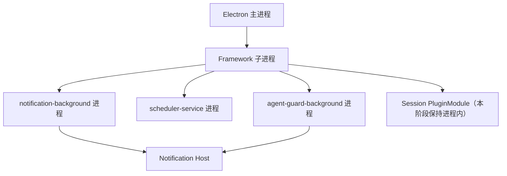
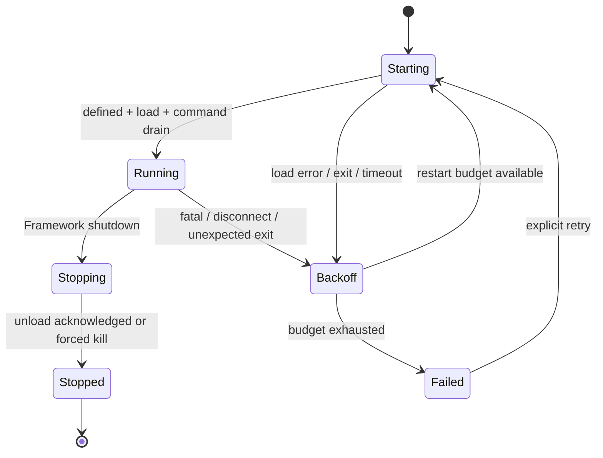

# Application Plugin 进程隔离与自恢复设计

## 目标

将每个 application startup/background plugin 的 server-side main 放入独立操作系统进程。单个插件的未捕获异常、未处理 Promise 拒绝、主动退出或原生模块进程级故障，只能使该插件暂时不可用；Framework、Electron、其他插件和现有 Kit 窗口继续运行。Framework 清理故障插件拥有的资源，并在受限预算内只重启该插件。

第一阶段覆盖所有 application startup plugin，包括 Notifications、Scheduler 和 Agent Guard。内部协议与 supervisor 不绑定具体 Kit，后续可以复用于 Session server-side plugin，但本阶段不迁移 Session plugin。

## 非目标

- 本阶段不是权限沙箱。插件子进程仍拥有与当前 Framework 插件相同的操作系统用户权限；manifest 权限与 runtime capability 仍由 Framework 校验和授予。
- 不按 Kit 共享进程。一个 Kit 内的两个 startup plugin 也必须各自拥有进程，避免同 Kit 故障扩散。
- 不使用 `worker_threads` 作为故障边界。Worker 与 Framework 共享地址空间，无法隔离原生 addon 崩溃、`process.abort()` 或进程级内存破坏。
- 不用插件重启替代 Framework 热重载。Kit 安装、启用、回滚和删除仍使用既有 Framework generation 事务。
- 不保证插件内存状态跨崩溃恢复。插件必须从 owner data 或其他持久化状态重新构造服务。

## 当前问题

ApplicationRuntime 目前在 Framework 子进程内创建一个 `PluginModule`，再通过动态 `import()` 将每个插件 main 装入同一全局 Node 运行时。`lifecycle.load()` 的正常拒绝可以按 owner 回滚并把应用标记为 `degraded`，但加载完成后的未捕获异常会终止整个 Framework。Electron 观察到 Framework 异常退出后当前会退出整个应用。

现有 owner 清理、application bootstrap、Framework generation 热重载和 Session 到 application 的异步 `application.request()` 桥可以复用。缺失的是可撤销的跨进程 runtime bridge、单插件 supervisor 和故障状态机。

## 方案选择

采用“Framework supervisor + 每 application plugin 一个 Node/Electron run-as-node 子进程”。Framework 保持所有权、路由与策略中心；插件子进程只保存插件 definition、生命周期函数和方法实现。

不采用以下方案：

- **Framework 捕获全局异常后进程内 reload**：无法卸载已经污染的模块缓存、原生状态、计时器和全局副作用，也不能从原生崩溃中恢复。
- **每 Kit 一个进程**：实现较简单，但同 Kit 中一个损坏插件仍会杀死其他插件，隔离粒度与故障单元不一致。
- **第一步迁移全部 Session plugin**：需要同时重构 Panel、Window、Session menu、credentials lease 和插件间同步调用，扩大首个可验证增量。本设计先建立可扩展协议，并用最窄的 application runtime 验证完整故障闭环。

## 进程拓扑



插件子进程不是 Electron renderer，不创建 BrowserWindow，也不直接监听网络端口。桌面打包运行时使用当前 Electron executable 并设置 `ELECTRON_RUN_AS_NODE=1`；Web/普通 Node host 使用当前 Node executable。spawn 适配器由 Framework 注入，测试可以提供受控 fake child。

## 组件边界

### ApplicationPluginSupervisor

ApplicationRuntime 为每个 `ApplicationPluginSpec` 创建一个 supervisor。Supervisor 独占以下状态：

- plugin identity、真实 entry path、runtime paths、permissions 和 host mode；
- 当前 generation、child handle、pending RPC、stdout/stderr 尾部；
- 状态、最近故障、重启时间窗和 backoff timer；
- 本 generation 已在 Framework 注册的 menu、message 和 service owner 资源。

Supervisor 不解析 Kit manifest、不决定权限、不直接修改其他插件状态。所有身份和 capability 都来自 ApplicationRuntime 已验证的 spec。

### Application Plugin Runner

Runner 是 Framework 自带的固定入口，不来自 Kit。它完成：

1. 校验 host 发来的单次 `initialize` 消息和协议版本；
2. 临时安装只允许一次调用的 `globalThis.editor.plugin.define()` bridge；
3. 动态导入已解析的插件 main entry，在 `finally` 中移除 bridge；
4. 保存 definition 和 methods，但不把函数发送给 Framework；
5. 构造跨进程 `ApplicationPluginRuntime` facade 并执行 `lifecycle.load()`；
6. 接受 method、attach、detach、unload 与 runtime snapshot 命令；
7. 将未捕获异常和未处理拒绝尽力报告为 `fatal`，随后以非零状态退出。

Runner 只接受 initialize 中的固定 entry path，插件不能通过 IPC 请求加载其他磁盘路径。

### ApplicationRuntime

ApplicationRuntime 继续拥有 application menu、message routes、service registry、bootstrap 和事件流。它不再通过自己的 `PluginModule` 执行 startup plugin JavaScript，而是：

- 从 manifest contribution 建立 host-side 路由；
- 将路由调用代理到对应 supervisor；
- 接收插件 runtime command，并强制 owner 为当前 plugin name；
- 在 generation 退出时一次性清理该 owner；
- 将 supervisor 状态投影到 `ApplicationBootstrap`。

Session `application.request(plugin, method, ...args)` 已经是 Promise API，因此调用方不需要知道目标方法位于另一个进程。

## IPC 协议

### 传输

使用 Node child-process IPC channel 和 advanced serialization。每条 envelope 包含：

```ts
interface PluginProcessEnvelope {
  protocol: 1;
  generation: string;
  kind: string;
  requestId?: string;
  payload?: unknown;
}
```

两端对 envelope 做 exact-field、类型、generation 和 payload 校验。业务 payload 只允许 structured-cloneable data；禁止函数、symbol、原型实例和循环引用。单条消息序列化后上限为 1 MiB，嵌套深度上限为 32，单 child 同时未完成请求上限为 256。违反协议立即终止对应插件 generation，不影响 Framework。

`requestId` 在单 generation 内单调生成。进程退出、disconnect 或 generation 替换时，所有 pending request 统一拒绝：

```ts
{
  code: 'APPLICATION_PLUGIN_UNAVAILABLE',
  plugin: string,
  retryable: boolean,
  retryAfterMs?: number
}
```

客户端只能得到稳定 code 和清理后的 message。插件 stack、entry path 和 stderr 只进入本机诊断日志，不跨浏览器接口返回。

### Host 到 Runner

- `initialize`：entry、plugin identity、runtime paths、host mode、授予的 capabilities、只读 runtime snapshots；
- `invoke`：调用 definition method；
- `attach` / `detach`：通知其他 application plugin contribution 变化；
- `runtime-snapshot`：更新 plugin/menu/service 的只读同步快照；
- `unload`：执行 lifecycle unload 并退出；
- `shutdown`：尚未 load 成功时直接终止 generation。

### Runner 到 Host

- `defined`：definition 是否包含 lifecycle，以及 method 名称列表；
- `loaded` / `unloaded`：生命周期完成；
- `result` / `error`：RPC 结果；
- `runtime-command`：menu、message、service 或 notification capability 操作；
- `broadcast`：application message broadcast；
- `fatal`：尽力报告的未捕获故障。

Runner 报告的 method 名称必须与 manifest contribution 引用的方法一致。函数本身永不离开子进程。

## Runtime facade 兼容策略

ApplicationPluginRuntime 中异步能力直接映射为 RPC：

- `host.notifications.*`；
- `message.request()`；
- `plugin.callPlugin()`，跨进程目标返回 Promise；
- definition method 调用。

现有同步读取能力使用 host 下发的不可变快照：

- `plugin.getInfo/listLoaded/listRegistered`；
- `menu.getState`；
- `service.get`。

现有返回 `void` 的注册能力先写入 runner 的 pending command 队列：

- `menu.attach/detach`；
- `message.register*/unregister*`；
- `message.broadcast`；
- `service.register/unregister`。

`lifecycle.load()` 只有在其 Promise 完成且 pending command 队列全部被 host 确认后，Runner 才报告 `loaded`。加载期间任何 command 失败都使整个 generation 加载失败并触发 owner rollback。运行期间 command 失败视为协议一致性故障，Runner 报告 fatal 并退出，避免 child 与 host 各自认为自己持有不同资源。

Service value 必须可 structured-clone。Framework 在每个 generation 启动前下发当前 service snapshot，并在 owner 变化后广播新 snapshot。该模型保持同步读取 API，但跨插件变更是按 host 确认顺序更新的快照，不允许插件依赖同一 JavaScript tick 内的跨进程可见性。

第一阶段三个官方 startup plugin 只依赖 `paths`、`host.mode`、notifications 和 definition methods；它们不依赖跨插件 service 对象或同步函数传递。Scheduler 必须从 `runtime.paths.data` 读取 owner data，不再从 `HARBORS_DATA_ROOT` 拼接 Kit 私有路径。

## 生命周期与故障状态机



启动与停止规则：

- definition capture 与 `lifecycle.load()` 总超时 30 秒；
- 优雅 `unload` 超时 10 秒，超时后先 `SIGTERM`，2 秒后仍存活则 `SIGKILL`；
- Framework shutdown、Kit generation replacement 和显式 disable 属于预期停止，不消耗重启预算；
- method RPC 不设置统一业务超时，由上层请求生命周期决定；child 退出仍会立即拒绝 pending RPC。

故障处理顺序固定为：

1. 原子地将 generation 标记为 unavailable，拒绝新请求；
2. 拒绝该 generation 的 pending RPC；
3. 清理 Framework 中该 owner 的 menu、message、service 和 method route；
4. 更新 bootstrap 状态并发事件；
5. 终止残留 child；
6. 根据预算安排仅该插件重启。

旧 generation 的迟到消息通过 generation ID 丢弃，绝不能重新注册 owner 资源。

## 重启预算与熔断

每个插件独立计算 unexpected failure：

- 初次故障后最多自动重启 3 次；
- backoff 依次为 250 ms、1 s、4 s；
- 60 秒滚动窗口内发生第 4 次故障时进入 `failed`，不再自动重启；
- 连续稳定运行 5 分钟后清空故障窗口；
- Framework 提供 `retryPlugin(name)`，显式重试清空熔断并创建新 generation；
- 同一插件任意时刻只允许一个 child 和一个 restart timer。

Application plugin 状态扩展为：

```ts
type ApplicationPluginStatus =
  | 'pending'
  | 'starting'
  | 'running'
  | 'restarting'
  | 'failed'
  | 'stopping'
  | 'stopped';
```

Bootstrap 额外投影 `restartCount`、`lastFailureAt`、稳定 error code 和可选 `retryAfterMs`。Application phase 只要存在非 running plugin 就为 `degraded`；其他 running plugin 继续服务。

## Agent Guard 安全不变量

Agent Guard 的 detached watchdog 仍是暂停恢复的最后防线，不能依赖 supervisor 重启：

- Agent Guard plugin generation 意外退出导致 stdin 关闭时，watchdog 必须先验证 pid、start time 与 executable identity，再只发送 `SIGCONT`；
- Supervisor 不继承或接管 Agent Guard control ledger，不尝试代发进程信号；
- 新 generation 启动时沿用现有持久化 ledger recovery，成功恢复后才清空 ledger；
- 如果 watchdog 自身不可用，Agent Guard 的 pause 操作继续 fail closed；进程隔离不得把该错误转换成成功。

## 安全与资源边界

- Host 从已验证 spec 绑定 plugin identity、entry、paths 和 permissions；Runner 提交的 owner 字段被忽略或拒绝。
- 子进程继承维持现有功能所需的 `PATH`、用户目录和运行时环境，但移除 Framework application token、credential transport secret、notification owner token 和其他 host-only secret。
- Notification capability 只通过 host RPC 暴露；child 不获得 Notification Host owner token。
- 子进程 stdio 不继承终端。Framework 为每个 generation 保留最多 64 KiB stdout 和 64 KiB stderr 尾部，并使用 plugin name 前缀写本机日志。
- 每个 generation 仅可访问自己的 runtime paths facade；路径由 host 解析后下发并冻结。
- IPC disconnect 被视为 terminal failure。Supervisor 不复用 child、pending request 或 runtime facade。

本阶段是故障隔离，不声称阻止恶意插件读取同一用户可访问的文件或发起网络请求。权限沙箱需要单独设计 OS sandbox/profile。

## Framework 与 Electron 的关系

插件子进程崩溃不再触发 `observeFrameworkProcess()`，因为 Framework 本身仍存活。Electron 无需重载窗口。

如果 Framework 自身异常退出，仍走现有 Electron 故障路径；本阶段不把所有 Framework 故障都归因于插件，也不自动无限重启 Framework。Kit Manager 的受控 Framework generation 热重载保持不变。

桌面 shutdown 顺序为：停止接收新 application request，停止所有 plugin supervisor，等待 owner 清理，再停止 Session、HTTP 和 Framework。插件进程不得在 Framework 退出后成为孤儿；Framework 还要在 `exit`/signal 最终清理中终止已知 child。

## 可观察性与操作

Application bootstrap 和事件流展示每个插件的 process-isolated 状态。日志至少包含：

- plugin name、generation、pid；
- start、loaded、unexpected exit、restart scheduled、fused、explicit retry、stopped；
- exit code/signal、稳定错误 code 和 stderr tail 摘要。

不记录 RPC payload、凭据、通知正文、Agent Guard 历史内容或用户文件路径。

第一阶段提供 Framework 内部 `retryPlugin(name)` 与受 application control token 保护的固定 HTTP control route。Kit Manager 可以据 bootstrap 状态显示“重新启动插件”，但 UI 接入可以作为同一功能的后置任务；即使没有打开 Manager，自动重启与熔断也必须完整工作。

## 测试与验收

### 协议与 Runner

- 拒绝错误 protocol、未知字段、错误 generation、超限 payload、函数/原型实例和超过 256 个 pending request；
- definition 只能注册一次，entry 越界、未 define 和 method mismatch 均使 generation 失败；
- runtime command 必须强制当前 owner，host-only secret 不进入 child env；
- load command drain、unload timeout 和 stale result 行为确定。

### Supervisor

- 正常 start/invoke/stop；
- 未捕获异常、unhandled rejection、`process.exit(42)`、IPC disconnect 和 spawn error 都只影响目标插件；
- pending request 得到 `APPLICATION_PLUGIN_UNAVAILABLE`；
- owner 资源在安排 restart 前已清理；
- backoff 为 250 ms、1 s、4 s，第 4 次故障熔断；稳定 5 分钟或 explicit retry 重置预算；
- shutdown/Kit reload 不触发 restart，迟到 generation 消息无效。

### ApplicationRuntime 集成

- 一个真实 fixture startup plugin 崩溃时，Sibling plugin 仍可 request，application phase 为 degraded，HTTP server 继续响应；
- 目标 plugin 自动重启后重新注册贡献并恢复 request；
- 启动失败不阻止后续 plugin 启动；
- menu、message、service snapshot 和 bootstrap generation 一致；
- application control token 才能触发显式 retry。

### 官方 Kit

- Notifications、Scheduler、Agent Guard startup plugin 均在独立 pid 运行；
- Notification capability 通过 host RPC 工作；Scheduler 使用 owner runtime data path；
- Agent Guard child 被强制终止时 detached watchdog 恢复已暂停 fixture，新 generation 从 ledger 恢复；
- 每个受影响 Kit 的官方 `kit:check` 通过。

### Host 验收

- 使用 `npm run dev:web` 验证共享 Framework 行为和真实子进程故障注入；
- 使用 Electron 验证 `ELECTRON_RUN_AS_NODE` runner、插件 pid 隔离、窗口不刷新、托盘继续工作和应用退出无孤儿进程；
- Framework、Client、desktop 与全部受影响 Kit 检查通过。

## 交付边界

本功能完成必须同时具备：协议校验、Runner、Supervisor、ApplicationRuntime 接入、三个官方 startup plugin 迁移、自动重启与熔断、显式 retry control、bootstrap 状态、真实故障集成测试、Web 验收和 Electron 验收。只捕获 `uncaughtException`、只重启整个 Framework、只隔离 Agent Guard 或保留 application plugin 的静默进程内 fallback 都不算完成。

后续迁移 Session plugin 时复用 envelope、Runner、Supervisor 和 generation 语义，但另行设计 Session capability、Panel/Window 代理、credentials lease 与 Kit switch 事务；不得在本阶段用未验证的通用抽象提前改变 Session 行为。
