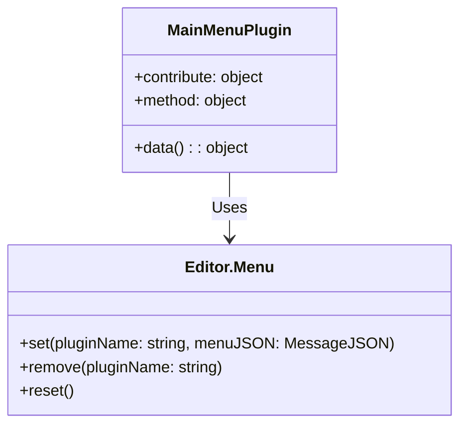
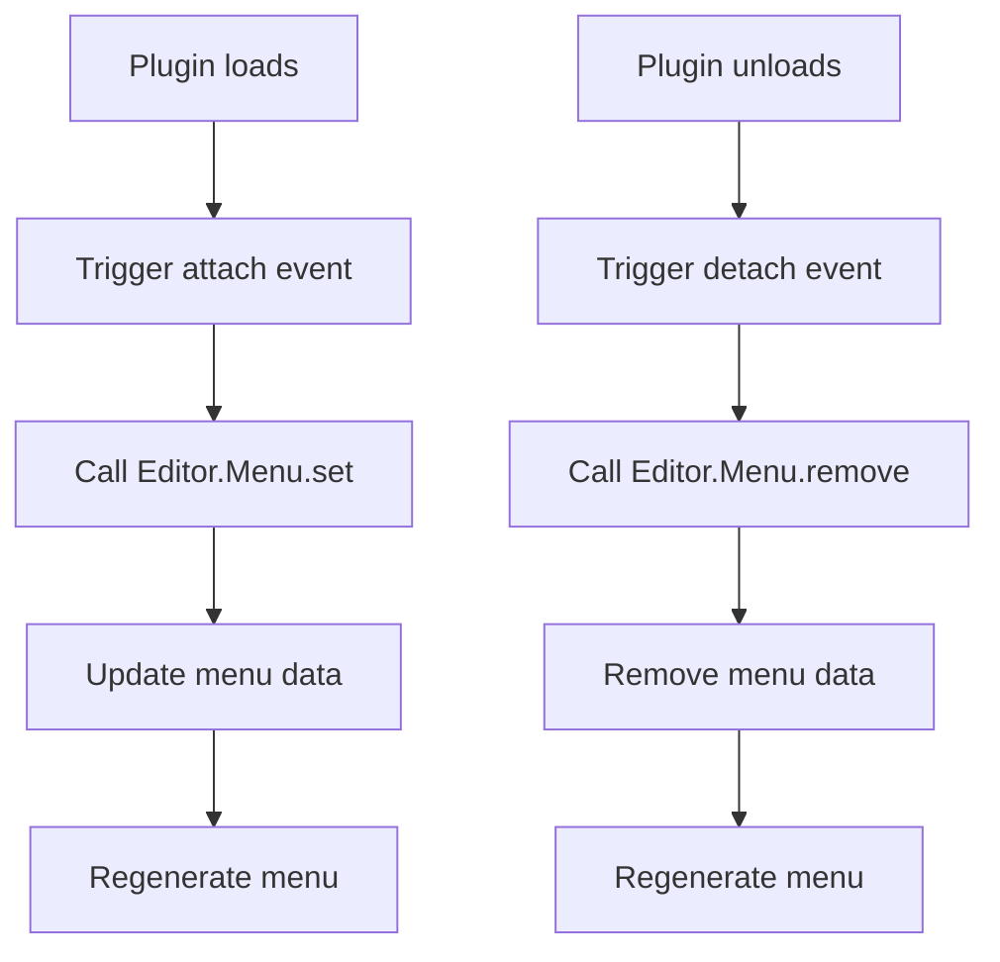

# Main Menu Plugin Design Document

## File Information
- **Source File Path**: `plugin/main-menu/main/source/`
- **Module/Class Name**: `main-menu`
- **Function**: Main menu management plugin, responsible for managing the application's menu system, handling menu registration, update, and removal

## Module/Class Structure Diagram



## Flowchart

### Menu Contribution Flowchart



## Data Structures

### Menu Contribution Data Structure

```typescript
interface MenuContribute {
    'main-menu': {
        [menuName: string]: {
            method: string[];
        };
    };
}
```

**Description**: Menu contribution data structure, defines the menu items and corresponding methods contributed by the plugin

## Main Methods

### attach

**Function**: Handle menu contribution when other plugins load

**Parameters**:
- `pluginInfo`: Loaded plugin information
- `contributeInfo`: Menu data contributed by the plugin

**Process**:
1. Receive menu data contributed by the plugin
2. Call `Editor.Menu.set` method to register menu
3. Menu system updates and generates new menu

### detach

**Function**: Remove corresponding menu contribution when other plugins unload

**Parameters**:
- `pluginInfo`: Unloaded plugin information
- `contributeInfo`: Menu data contributed by the plugin

**Process**:
1. Receive notification of plugin unload
2. Call `Editor.Menu.remove` method to remove menu
3. Menu system updates and generates new menu

### test

**Function**: Test method, used to verify the plugin is working properly

**Process**:
1. Output test log to console

## Dependencies

- Dependency: `@type/editor` - Type definitions
- Dependency: `Editor.Menu` - Menu management module

## Usage Example

### Menu Contribution Example

```typescript
// Other plugins contribute menus
export default Editor.Module.registerPlugin({
    contribute: {
        data: {
            'main-menu': {
                'File': {
                    method: ['new', 'open', 'save']
                },
                'Edit': {
                    method: ['cut', 'copy', 'paste']
                }
            }
        }
    }
});
```

## Notes

1. Menu plugin receives menu contributions from other plugins through the `contribute` mechanism
2. When a plugin loads, the `attach` method is automatically called to handle menu registration
3. When a plugin unloads, the `detach` method is automatically called to handle menu removal
4. Menu system updates in real-time to ensure menu state is consistent with plugin state
5. Supports multiple plugins contributing menus simultaneously, menu system merges all contributions
