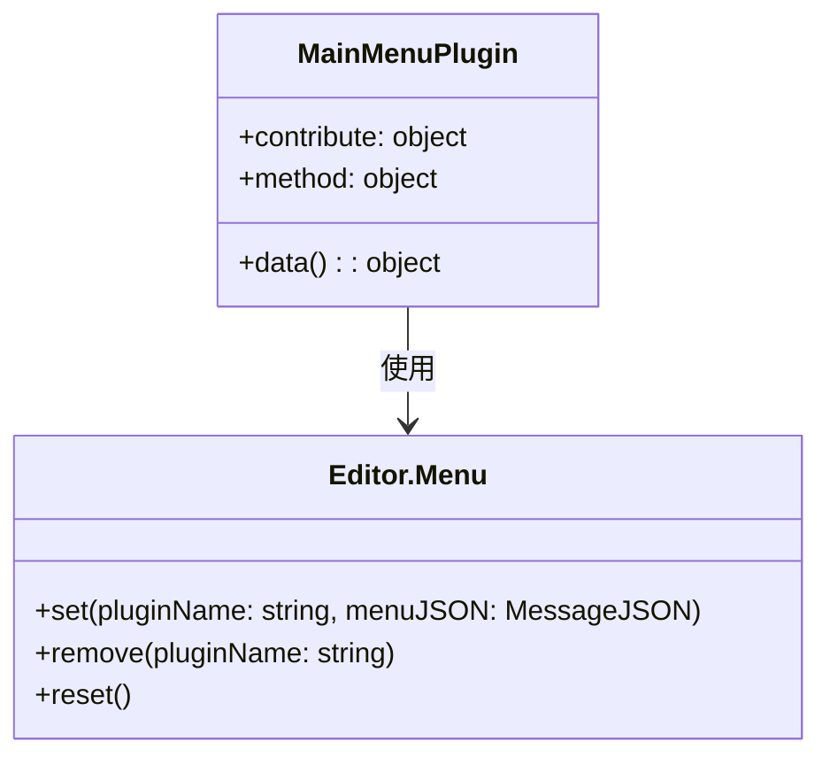
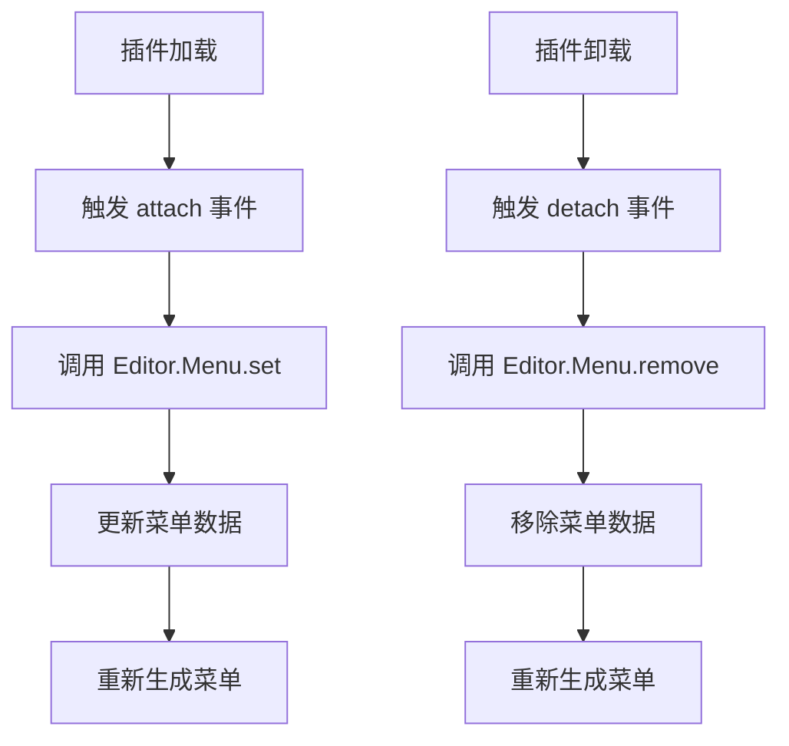

# Main Menu 插件设计文档

## 文件信息
- **源文件路径**: `plugin/main-menu/main/source/`
- **模块名/类名**: `main-menu`
- **功能**: 主菜单管理插件，负责管理应用程序的菜单系统，处理菜单的注册、更新和卸载

## 模块/类结构图



## 流程图

### 菜单贡献流程图



## 数据结构

### 菜单贡献数据结构

```typescript
interface MenuContribute {
    'main-menu': {
        [menuName: string]: {
            method: string[];
        };
    };
}
```

**说明**: 菜单贡献数据结构，定义了插件要贡献的菜单项和对应的方法

## 主要方法

### attach

**功能**: 当其他插件加载时，处理菜单贡献

**参数**:
- `pluginInfo`: 加载的插件信息
- `contributeInfo`: 插件贡献的菜单数据

**流程**:
1. 接收插件贡献的菜单数据
2. 调用 `Editor.Menu.set` 方法注册菜单
3. 菜单系统更新并生成新的菜单

### detach

**功能**: 当其他插件卸载时，移除对应的菜单贡献

**参数**:
- `pluginInfo`: 卸载的插件信息
- `contributeInfo`: 插件贡献的菜单数据

**流程**:
1. 接收插件卸载的通知
2. 调用 `Editor.Menu.remove` 方法移除菜单
3. 菜单系统更新并生成新的菜单

### test

**功能**: 测试方法，用于验证插件是否正常工作

**流程**:
1. 输出测试日志到控制台

## 依赖关系

- 依赖: `@type/editor` - 类型定义
- 依赖: `Editor.Menu` - 菜单管理模块

## 使用示例

### 贡献菜单示例

```typescript
// 其他插件贡献菜单
export default Editor.Module.registerPlugin({
    contribute: {
        data: {
            'main-menu': {
                'File': {
                    method: ['new', 'open', 'save']
                },
                'Edit': {
                    method: ['cut', 'copy', 'paste']
                }
            }
        }
    }
});
```

## 注意事项

1. 菜单插件通过 `contribute` 机制接收其他插件的菜单贡献
2. 当插件加载时，会自动调用 `attach` 方法处理菜单注册
3. 当插件卸载时，会自动调用 `detach` 方法处理菜单移除
4. 菜单系统会实时更新，确保菜单状态与插件状态一致
5. 支持多个插件同时贡献菜单，菜单系统会合并所有贡献
