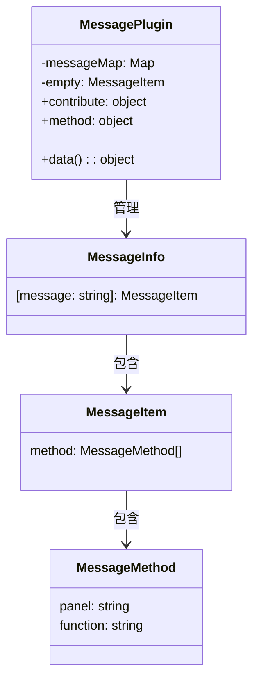
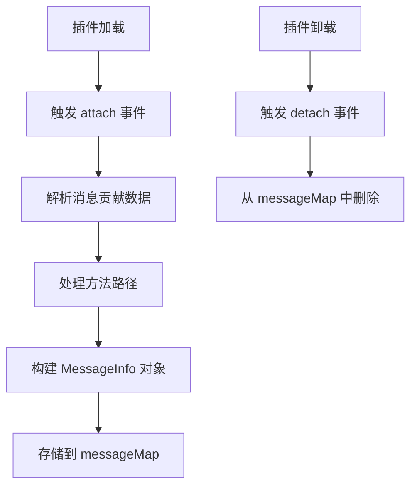

# Message 插件设计文档

## 文件信息
- **源文件路径**: `plugin/message/main/source/`
- **模块名/类名**: `message`
- **功能**: 消息管理插件，负责管理插件间的消息通信，处理消息的注册、查询和管理

## 模块/类结构图



## 流程图

### 消息注册流程图



## 数据结构

### MessageInfo

```typescript
interface MessageInfo {
    [message: string]: MessageItem;
}
```

### MessageItem

```typescript
interface MessageItem {
    method: MessageMethod[];
}
```

### MessageMethod

```typescript
interface MessageMethod {
    panel: string;
    function: string;
}
```

## 主要方法

### attach

**功能**: 当其他插件加载时，处理消息贡献

**参数**:
- `pluginInfo`: 加载的插件信息
- `contributeInfo`: 插件贡献的消息数据

**流程**:
1. 接收插件贡献的消息数据
2. 解析消息数据，处理方法路径
3. 构建 `MessageInfo` 对象
4. 存储到 `messageMap` 中

### detach

**功能**: 当其他插件卸载时，移除对应的消息贡献

**参数**:
- `pluginInfo`: 卸载的插件信息
- `contributeInfo`: 插件贡献的消息数据

**流程**:
1. 接收插件卸载的通知
2. 从 `messageMap` 中删除对应的消息信息

### queryMessage

**功能**: 查询某条消息的注册信息

**参数**:
- `plugin`: 插件名称
- `message`: 消息名称

**返回值**: `MessageItem` - 消息项信息

**流程**:
1. 从 `messageMap` 中获取插件的消息信息
2. 返回对应的消息项，如果不存在返回空消息项

## 依赖关系

- 依赖: `@type/editor` - 类型定义

## 使用示例

### 贡献消息示例

```typescript
// 其他插件贡献消息
export default Editor.Module.registerPlugin({
    contribute: {
        data: {
            message: {
                'query-message': {
                    method: ['testMethod', 'panel1.otherMethod']
                }
            }
        }
    }
});
```

### 查询消息示例

```typescript
import { instance as Plugin } from '@framework/plugin';

// 查询消息注册信息
const messageInfo = await Plugin.execture('callPlugin', 'message', 'queryMessage', 'test-plugin', 'query-message');
console.log(messageInfo);
// 输出: { method: [{ panel: '', function: 'testMethod' }, { panel: 'panel1', function: 'otherMethod' }] }
```

## 注意事项

1. 消息插件通过 `contribute` 机制接收其他插件的消息贡献
2. 支持方法路径格式，如 `panel.method` 或直接 `method`
3. 当插件加载时，会自动处理消息注册
4. 当插件卸载时，会自动清理消息注册
5. 提供 `queryMessage` 方法用于查询消息注册信息
6. 对于未找到的消息，返回空消息项，确保调用安全