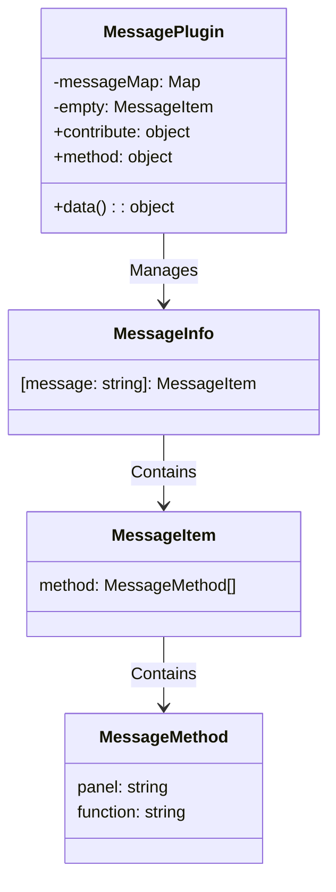
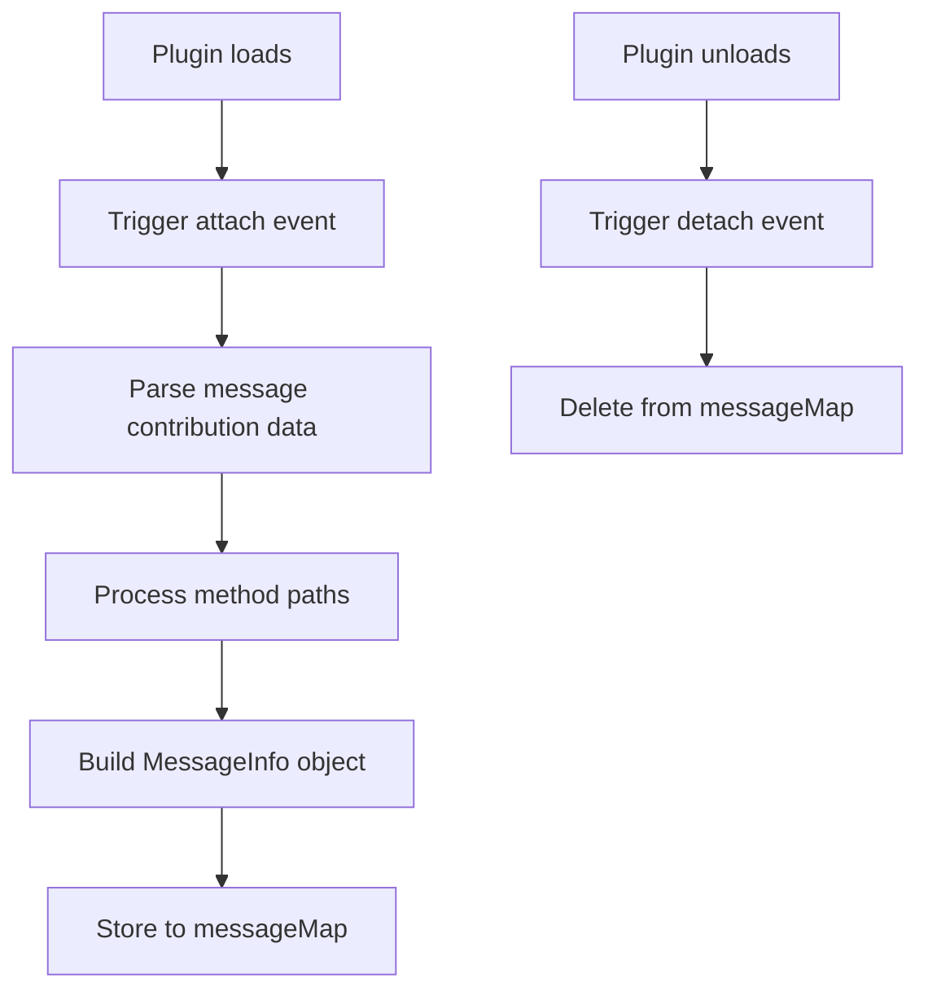

# Message Plugin Design Document

## File Information
- **Source File Path**: `plugin/message/main/source/`
- **Module/Class Name**: `message`
- **Function**: Message management plugin, responsible for managing inter-plugin message communication, handling message registration, querying, and management

## Module/Class Structure Diagram



## Flowchart

### Message Registration Flowchart



## Data Structures

### MessageInfo

```typescript
interface MessageInfo {
    [message: string]: MessageItem;
}
```

### MessageItem

```typescript
interface MessageItem {
    method: MessageMethod[];
}
```

### MessageMethod

```typescript
interface MessageMethod {
    panel: string;
    function: string;
}
```

## Main Methods

### attach

**Function**: Handle message contribution when other plugins load

**Parameters**:
- `pluginInfo`: Loaded plugin information
- `contributeInfo`: Message data contributed by the plugin

**Process**:
1. Receive message data contributed by the plugin
2. Parse message data, process method paths
3. Build `MessageInfo` object
4. Store to `messageMap`

### detach

**Function**: Remove corresponding message contribution when other plugins unload

**Parameters**:
- `pluginInfo`: Unloaded plugin information
- `contributeInfo`: Message data contributed by the plugin

**Process**:
1. Receive notification of plugin unload
2. Delete corresponding message info from `messageMap`

### queryMessage

**Function**: Query registration info for a message

**Parameters**:
- `plugin`: Plugin name
- `message`: Message name

**Return Value**: `MessageItem` - Message item information

**Process**:
1. Get plugin's message info from `messageMap`
2. Return corresponding message item, or empty message item if not found

## Dependencies

- Dependency: `@type/editor` - Type definitions

## Usage Example

### Message Contribution Example

```typescript
// Other plugins contribute messages
export default Editor.Module.registerPlugin({
    contribute: {
        data: {
            message: {
                'query-message': {
                    method: ['testMethod', 'panel1.otherMethod']
                }
            }
        }
    }
});
```

### Query Message Example

```typescript
import { instance as Plugin } from '@framework/plugin';

// Query message registration info
const messageInfo = await Plugin.execute('callPlugin', 'message', 'queryMessage', 'test-plugin', 'query-message');
console.log(messageInfo);
// Output: { method: [{ panel: '', function: 'testMethod' }, { panel: 'panel1', function: 'otherMethod' }] }
```

## Notes

1. Message plugin receives message contributions from other plugins through the `contribute` mechanism
2. Supports method path formats like `panel.method` or just `method`
3. When a plugin loads, message registration is automatically processed
4. When a plugin unloads, message registration is automatically cleaned up
5. Provides `queryMessage` method for querying message registration info
6. For messages not found, returns empty message item to ensure safe calls
