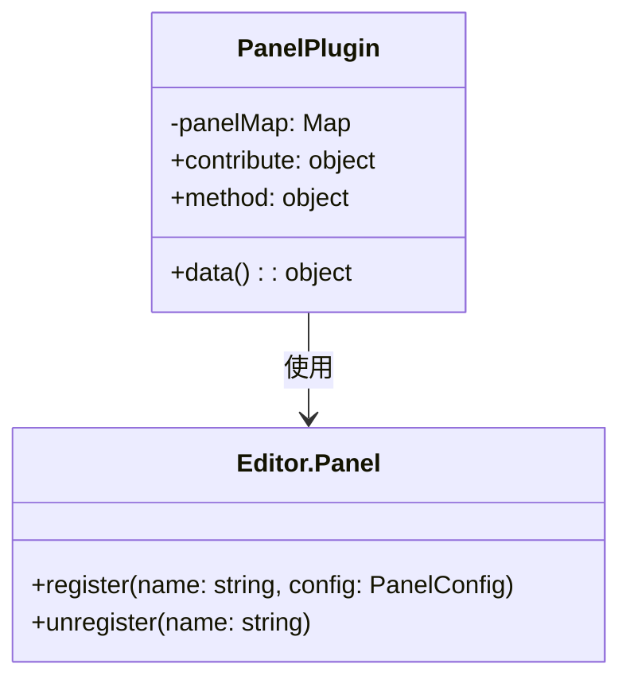
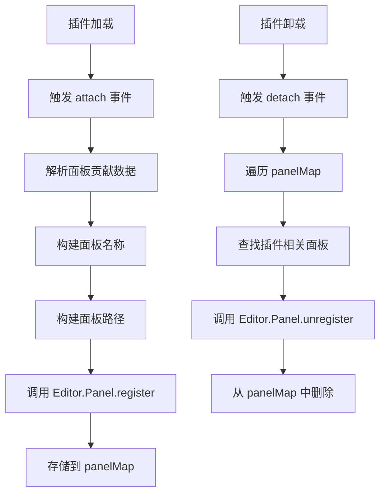

# Panel 插件设计文档

## 文件信息
- **源文件路径**: `plugin/panel/main/source/`
- **模块名/类名**: `panel`
- **功能**: 面板管理插件，负责管理应用程序的面板系统，处理面板的注册、路径查询和管理

## 模块/类结构图



## 流程图

### 面板注册流程图



## 数据结构

### 面板贡献数据结构

```typescript
interface PanelContribute {
    message: {
        'query-path': {
            method: string[];
        };
    };
}
```

### 面板配置结构

```typescript
interface PanelConfig {
    module: string;
    width: number;
    height: number;
}
```

## 主要方法

### attach

**功能**: 当其他插件加载时，处理面板贡献

**参数**:
- `pluginInfo`: 加载的插件信息
- `contributeInfo`: 插件贡献的面板数据

**流程**:
1. 接收插件贡献的面板数据
2. 遍历面板数据，构建面板名称和路径
3. 调用 `Editor.Panel.register` 注册面板
4. 存储面板信息到 `panelMap`

### detach

**功能**: 当其他插件卸载时，移除对应的面板贡献

**参数**:
- `pluginInfo`: 卸载的插件信息
- `contributeInfo`: 插件贡献的面板数据

**流程**:
1. 接收插件卸载的通知
2. 遍历 `panelMap` 查找插件相关的面板
3. 调用 `Editor.Panel.unregister` 卸载面板
4. 从 `panelMap` 中删除面板信息

### queryPath

**功能**: 查询一个面板的路径

**参数**:
- `name`: 面板名称

**返回值**: `string` - 面板模块的路径

**流程**:
1. 从 `panelMap` 中获取面板路径
2. 如果找到返回路径，否则返回面板名称

## 依赖关系

- 依赖: `path` - 路径处理模块
- 依赖: `Editor.Panel` - 面板管理模块

## 使用示例

### 贡献面板示例

```typescript
// 其他插件贡献面板
export default Editor.Module.registerPlugin({
    contribute: {
        data: {
            'panel-host': {
                'my-panel': 'source/panel.js'
            }
        }
    }
});
```

### 查询面板路径示例

```typescript
import { instance as Plugin } from '@framework/plugin';

// 查询面板路径
const panelPath = await Plugin.execture('callPlugin', 'panel', 'queryPath', 'test-plugin.my-panel');
console.log(panelPath);
// 输出: /path/to/test-plugin/source/panel.js
```

## 注意事项

1. 面板插件通过 `contribute` 机制接收其他插件的面板贡献
2. 面板名称格式为 `plugin-name.panel-name`，确保唯一性
3. 面板路径会自动转换为绝对路径
4. 当插件加载时，会自动处理面板注册
5. 当插件卸载时，会自动清理面板注册
6. 提供 `queryPath` 方法用于查询面板路径
7. 对于未找到的面板，返回面板名称，确保调用安全