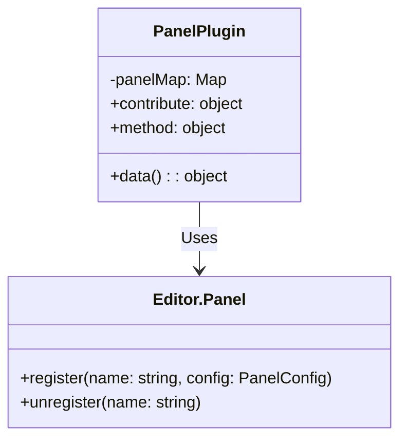
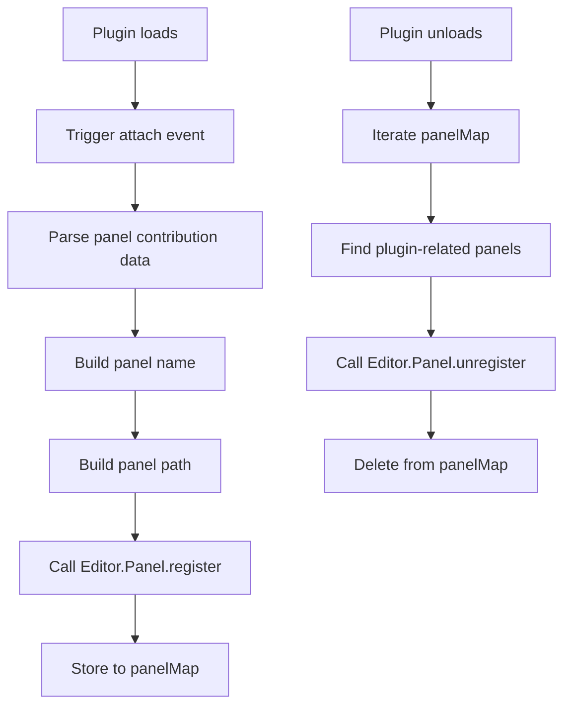

# Panel Plugin Design Document

## File Information
- **Source File Path**: `plugin/panel/main/source/`
- **Module/Class Name**: `panel`
- **Function**: Panel management plugin, responsible for managing the application's panel system, handling panel registration, path querying, and management

## Module/Class Structure Diagram



## Flowchart

### Panel Registration Flowchart



## Data Structures

### Panel Contribution Data Structure

```typescript
interface PanelContribute {
    message: {
        'query-path': {
            method: string[];
        };
    };
}
```

### Panel Config Structure

```typescript
interface PanelConfig {
    module: string;
    width: number;
    height: number;
}
```

## Main Methods

### attach

**Function**: Handle panel contribution when other plugins load

**Parameters**:
- `pluginInfo`: Loaded plugin information
- `contributeInfo`: Panel data contributed by the plugin

**Process**:
1. Receive panel data contributed by the plugin
2. Iterate through panel data, build panel name and path
3. Call `Editor.Panel.register` to register panel
4. Store panel info to `panelMap`

### detach

**Function**: Remove corresponding panel contribution when other plugins unload

**Parameters**:
- `pluginInfo`: Unloaded plugin information
- `contributeInfo`: Panel data contributed by the plugin

**Process**:
1. Receive notification of plugin unload
2. Iterate through `panelMap` to find plugin-related panels
3. Call `Editor.Panel.unregister` to unregister panels
4. Delete panel info from `panelMap`

### queryPath

**Function**: Query the path of a panel

**Parameters**:
- `name`: Panel name

**Return Value**: `string` - Path to the panel module

**Process**:
1. Get panel path from `panelMap`
2. Return path if found, otherwise return panel name

## Dependencies

- Dependency: `path` - Path handling module
- Dependency: `Editor.Panel` - Panel management module

## Usage Example

### Panel Contribution Example

```typescript
// Other plugins contribute panels
export default Editor.Module.registerPlugin({
    contribute: {
        data: {
            'panel-host': {
                'my-panel': 'source/panel.js'
            }
        }
    }
});
```

### Query Panel Path Example

```typescript
import { instance as Plugin } from '@framework/plugin';

// Query panel path
const panelPath = await Plugin.execute('callPlugin', 'panel', 'queryPath', 'test-plugin.my-panel');
console.log(panelPath);
// Output: /path/to/test-plugin/source/panel.js
```

## Notes

1. Panel plugin receives panel contributions from other plugins through the `contribute` mechanism
2. Panel name format is `plugin-name.panel-name` to ensure uniqueness
3. Panel paths are automatically converted to absolute paths
4. When a plugin loads, panel registration is automatically processed
5. When a plugin unloads, panel registration is automatically cleaned up
6. Provides `queryPath` method for querying panel paths
7. For panels not found, returns panel name to ensure safe calls
